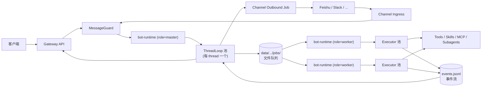
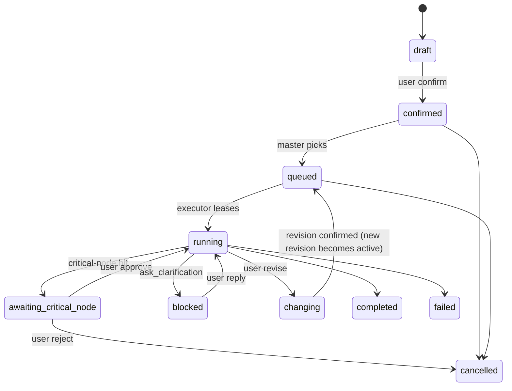

# AI 自动工作流系统精进设计 v0.3

版本：0.3
日期：2026-04-28
状态：精进稿（覆盖 design.md v0.2 / requirement.md v0.3 的 12 类漏洞）
原始文档：`design.md` (v0.2)、`requirement.md` (v0.3) 不变更，作为参考快照保留
产出方式：本文档由一次结构化 brainstorming 沉淀，方案对比与决策依据完整保留

---

## 0. 阅读指南

- 第 1–2 章：背景与漏洞盘点（为什么要精进）。
- 第 3 章：11 项决策一览（结论速查）。
- 第 4 章：方案对比与决策依据（思考过程）。**所有设计选择都以这里的对比表为准**。
- 第 5 章：精进后的架构（设计实体）。
- 第 6–8 章：工程默认、v1 验收、待确认与后续。

第 4 章和第 5 章可以独立阅读：第 4 章面向"为什么"，第 5 章面向"是什么"。

---

## 1. 背景与精进目标

`design.md` v0.2 与 `requirement.md` v0.3 已经完成对 `claude-code-analysis`、`deer-flow`、`xuedian` 三套参考系统的吸收，并搭建出 AI 员工 / `bot-runtime` / Channel 子系统的基本骨架。但作为"v1 可演示、可生产、可恢复"的实施依据，仍存在 12 类漏洞，主要集中在：

- 产品语义：身份、确认权、并发、变更流转
- 工程可靠性：故障恢复、流式协议、沙箱、观测
- 一致性：术语、双写、列队同步
- 自治边界：什么情况下打断员工

本文档的精进目标：

1. 把 12 类漏洞补全为可决策的内容。
2. 引入 `ThreadLoop`（thread 主循环，早期对话中曾叫 ThreadAgent）/ `Executor`（task 执行循环）的内部分层，给"边干边聊"和跨机部署一个干净的解。
3. 把"AI 员工高自治 + 关键节点拦截"的产品原则结构化为可扩展机制。
4. 保留对话过程中的方案对比，方便未来回溯决策依据。

精进**不**做的事：

- 不重写架构总图。原 design.md 第 3 章总体架构仍然适用，本文是差量补丁。
- 不引入新参考系统，仍然只复用 claude-code-analysis / deer-flow / xuedian 三家。
- 不扩展非目标（企业权限、DAG 编排、计费等仍按原文 v0.3 第 13 章处理）。

---

## 2. 漏洞盘点（精进入口）

| # | 类别 | 一句话问题 |
|---|---|---|
| 1 | 身份与权限 | 全文没有 User / Tenant / Operator 模型；"谁有权确认 task/plan"未定义；飞书 operatorOpenId → 系统用户的映射没建模 |
| 2 | 确认门禁的细节 | 群聊里谁能确认？多人冲突？连续两次"确认"幂等？确认超时？都没说 |
| 3 | active task 并发与排队 | 一 thread 是否允许多个 active task 没收敛；群聊多人同时提任务的并发模型未定义 |
| 4 | 变更（changing）流转 | plan revision 是 patch 还是 full rewrite、旧 artifact 归档/删除规则、变更的变更链都没规则 |
| 5 | Runtime 故障恢复 | `.lock` 失效窗口、fencing token、in-flight tool call 半写状态、stale runtime 抢占 task 都没设计 |
| 6 | TaskList ↔ TaskQueue 同步 | 两个概念都用，但 confirmed→queued 触发者、失败重试是否退回 queued、谁是 single source of truth 没定 |
| 7 | 消息守卫成本/降级 | 每条群消息都过 LLM 太贵，规则短路策略缺；guard 服务挂了的 fallback 缺 |
| 8 | 客户端流式协议与续传 | SSE / WS 选型未定；断线后从哪个 event cursor 续；events.jsonl ↔ 内存广播的一致性未说 |
| 9 | 观测/审计/脱敏 | transcript vs log 边界、跨进程 trace、Secret 与 PII 脱敏策略、tenantId 日志规范都没写 |
| 10 | Skill / Tool 安全沙箱 | bash tool 沙箱方案空白；任意 skill 加载的 prompt-injection 信任模型缺；MCP 权限边界缺 |
| 11 | 多 channel/多绑定语义 | thread 是否能同时绑定飞书 + Slack？`notify_bound_channel` 多 binding 时怎么选？目录结构和数据模型不一致 |
| 12 | 测试与评测 | 全文没提单元 / 集成 / 端到端 / agent eval；消息守卫、确认门禁、变更状态机这种关键路径没有 verification 计划 |

附加发现：术语不统一（LarkBot vs Feishu Provider、master vs control plane、Channel Gateway vs Ingress）、模型预算 / token 上限缺、prompt 版本化缺、数据保留策略缺、第一版验收标准漏"幂等"和"crash 恢复"两条。

---

## 3. 决策汇总

> 这一节是结论速查。每条对应第 4 章一个详细对比小节。

| # | 决策点 | 收敛结果 | 第 4 章索引 |
|---|---|---|---|
| 1 | 身份模型 | **User 单层**（不引入 Org / Tenant / Workspace） | 4.1 |
| 2 | 群聊确认权 | **仅发起者本人** | 4.2 |
| 3 | active running 并发 | **严格 1 个**；其余 confirmed 任务排队 | 4.3 |
| 4 | TaskList vs TaskQueue | **只维护 TaskList**，Queue 是 master 从 List 投影出的运行视图 | 4.4 |
| 5 | bot-runtime 形态 | **通用服务 + 配置化角色**（master / worker / hybrid） | 4.5 |
| 6 | 进程内分层 | **拆开**：thread loop（常驻轻量）+ per-task Executor（短命） | 4.6 |
| 7 | 变更后旧 plan/artifact | **归档可查**，主视图不展示，"变更历史"面板可恢复 | 4.7 |
| 8 | 多 channel 绑定 | **允许多绑定**（跨 provider），`notify_bound_channel` 必须传 target | 4.8 |
| 9 | 消息守卫策略 | **规则短路 + 重点过 LLM**（已绑群只在 @bot/回复 bot/slash/pending confirmation 时走 LLM） | 4.9 |
| 10 | 自治原则 | **任务确认 → 自主 → 关键节点 → 结果确认**；bash / skill / MCP 默认全开 | 4.10 |
| 11 | v1 关键节点默认清单 | **空清单 + 扩展点**（policy / hook / skill 注入） | 4.11 |

工程默认值（不单独决策，详见第 7 章）：

- Executor 中断：graceful + 超时强杀
- thread loop ↔ Executor 通信：文件队列 `jobs/` + `events.jsonl` 流式回写 + per-thread 内存事件总线
- 客户端流式：SSE 主通道，断线用 event cursor 续传
- 故障恢复：`.lock` + fencing token + 重启扫描 `jobs/locked`
- 观测：结构化日志 + OTel trace（跨 master/worker），Secret/PII 在 transcript 写入前脱敏
- 测试：消息守卫 / 确认门禁 / 变更状态机 三条关键路径强制有 agent eval

---

## 4. 方案对比与决策依据（思考过程）

> 每个小节按"问题 → 选项对比 → 推荐 → 选择 → 影响"的结构组织，方便后续回溯。

### 4.1 身份与权限模型 — 选 User 单层

**问题**：v0.3 全文没有 User、Org、Tenant 实体。Lark `operatorOpenId` 提到了但没建模到系统用户。所有"谁有权确认"、"谁拥有 thread"、"多服务器部署用户怎么对齐"都无法表达。

**对比**：

| 选项 | 优 | 劣 |
|---|---|---|
| **User 单层（选）** | 引入 `User` 实体，覆盖 90% 产品场景；Lark `operatorOpenId` 映射到 `User.id`；threads/tasks 都有 `ownerUserId` | 多公司/多租户隔离表达不了 |
| User + Workspace | 增加"我的项目"语义 | v1 收益小、复杂度高 |
| User + Org + Workspace | 完整企业化 | v1 严重偏题 |
| 单机/无身份 | 最简 | 群聊多人、多服务器场景表达不了 |

**为什么不是更弱方案**：requirement.md 第 3 章明确写"runtime 可以多服务器部署"，没有 User 模型连"哪条消息属于哪个用户"都对不齐。

**为什么不是更强方案**：v0.3 第 13 章把"完整企业级权限系统"明确列为非目标。

**影响**：

- 数据模型新增 `User`。
- `Thread`、`Task`、`Plan`、`PlanRevision`、`GuardDecision` 增加 `ownerUserId`、`confirmedByUserId` 等字段。
- Channel 配置内的 `operatorOpenId` 映射到 `User.id`。
- API 鉴权：v1 用简单的 `Authorization: Bearer <user-token>`；token → user 由配置或单点登录服务解析；不做 RBAC。

### 4.2 群聊确认权 — 仅发起者本人

**问题**：群聊里 A 提任务、B 发"确认"、C 发"算了"，谁的话作数？v0.3 没说。

**对比**：

| 选项 | 优 | 劣 |
|---|---|---|
| **仅发起者本人（选）** | 语义最清晰，避免抢夺 | 发起者不在线时阻塞 |
| 发起者 + 预设 operator | 运营/客成场景实用 | v1 不需要 |
| 群里任何人 | 实现简，灵活 | 上下文易污染 |
| 发起者 + operator 双签 | 高风险变更友好 | v1 交互负担重 |

**影响**：

- `Task.confirmedByUserId` 必须等于 `Task.ownerUserId`。
- 群聊中其他用户发的"确认"信号被消息守卫识别为 `irrelevant` 或 `chat`，不进入确认门禁。
- 数据模型新增 `Task.ownerUserId`（= 发起消息所属 User）。

### 4.3 active task 并发 — 严格 1 个 active running

**问题**：一个 thread 同时 running 几个 task？v0.3 第 15 章问题 #9 没收敛。

**对比**：

| 选项 | 优 | 劣 |
|---|---|---|
| **严格 1 个 active running（选）** | "AI 员工"语义最自然，上下文不互染 | 需要排队 |
| 默认 1 个、显式声明可并行 | 灵活 | 复杂、用户要懂"并行" |
| 多个 active 完全并行 | 能力强 | 上下文/变更边界难管 |

**影响**：

- `Thread.activeTaskId` 是 0..1，不是数组。
- 其余 confirmed 任务在 TaskList 里以 `queued` 状态等待。
- Master 调度策略：从 thread 视角依次取 `queued` task。

### 4.4 TaskList vs TaskQueue — 只维护 TaskList

**澄清要点**：用户在 brainstorming 中明确指出"维护一个 TaskList 就够了，TaskQueue 不应是独立数据"。这与 v0.3 第 4.5 节的两套概念存在双写一致性风险。

**结论**：

- TaskList 是**唯一权威数据**，存在 `tasks/<task-id>/task.json`。
- 不再单独维护 TaskQueue 文件 / 表。
- Master 调度时，从 TaskList 按规则筛选（`status = confirmed | queued` 且 `assignedRuntimeId` 为空）形成"运行视角的队列",这是**视图**，不写盘。
- "TaskQueue" 这个词只作为口语 / 调度文档术语，不再是数据实体。

**对 v0.3 的修订**：

- 删除 `data/instances/<runtime-id>/state/queue/` 这种独立队列目录。
- `task.json` 是 single source of truth，重启后扫描即可重建队列视图。
- 失败重试不"退回 queued"，而是把 `task.status` 改回 `confirmed`，调度器下次扫到自然重排。

**影响**：

- 调度逻辑写一次 SQL/扫描函数即可，无需双写。
- 故障恢复简化：只需扫 `tasks/`，不用对账 `queue/`。

### 4.5 bot-runtime 形态 — 通用服务 + 配置化角色

**用户原始问题**："如果 master 正在执行任务，飞书用户发消息怎么办？我理解我们应该需要一个需求收集者。是 master 的职责？那就需要 master 下发任务且能够建立 master 和其他 bot 的通信。而且飞书消息和主子 bot 消息同时发送这种场景怎么办？"

**澄清要点**：用户进一步强调"bot-runtime 服务是个通用的，master 以及其他子 bot 通过配置化实现"。

**对比**（早期方案，最终被"统一服务+配置化"统筹）：

| 模型 | 谁接消息 | 多路并发 |
|---|---|---|
| A 当前设计：runtime 一体化 | runtime 自己 | 内部 race，复杂 |
| B master 当需求收集者 | master 接、派活 | master 单点 |
| C 每 thread 一个 ThreadAgent | thread 自己代表 | 每 thread 单线程消费事件队列 |
| D 消息总线无中心 | 总线分发 | 复杂 |

**最终选择（统筹）**：

- **bot-runtime 是单一二进制 / 单一服务**，启动时按配置切角色：
  - `role: master` — 进程内只跑 thread loop 池（对话/澄清/确认/状态），不跑 Executor。
  - `role: worker` — 进程内只跑 Executor 池（拉 task、执行工具调用），不跑 thread loop。
  - `role: hybrid` — 同进程内两类都跑，v1 单机部署默认。
- master 角色与 worker 角色之间通过文件队列 `jobs/` + 事件流 `events.jsonl` 协调，不需要直接 RPC。
- 跨进程通信走持久化层：master 写"分配 task" job，worker 拉去执行；worker 写事件，master 投影到 thread loop。

**为什么这个设计能解决用户的两个具体场景**：

1. *master 在干活时飞书用户发消息*：master 角色的 bot-runtime 进程里 thread loop 是常驻的，飞书 inbound 走 channel ingress → guard → 对应 thread 的事件队列；当时 master 即使在派活也不会阻塞此入口。
2. *飞书消息和主子 bot 消息同时到*：每个 thread 的 thread loop 是单线程消费它的事件队列（飞书入站、客户端入站、Executor 上报、master 通知都进同一队列）；天然串行，不需要锁。

**影响**：

- 删除 v0.3 第 4.1 节的 `bot-runtime-master` 作为"独立组件"的描述，改为"角色"。
- 新增配置项 `BOT_RUNTIME_ROLE`，取值 `master` / `worker` / `hybrid`。
- 删除"master ↔ runtime"双向 RPC 假设；改为"master 角色与 worker 角色通过共享 `data/instances/<runtime-id>/state/jobs/` 协作"。
- v1 单机：`role: hybrid` 一键起。
- v2 多机：master 一台、worker N 台，通过共享存储（NFS / S3 / 网络盘）协调；或更进一步用 RPC 替换文件队列（接口不变）。

### 4.6 进程内分层 — 拆开 thread loop + per-task Executor

**问题**：在一个 bot-runtime 进程内，"对话/状态" 与 "重活执行" 是同一个对象还是分两类？

**对比**：

| 维度 | A 拆（选） | B 不拆 / 单 loop | C 不拆 + sub-agent (deer-flow lead_agent + task_tool) |
|---|---|---|---|
| 一个 thread 内部对象 | thread loop + per-task Executor | 一个统一 loop | thread loop（执行时调子 agent） |
| LLM 上下文窗口 | thread ctx 与 task ctx 各一份 | 全混，长任务会爆 | thread + sub-agent 各一份 |
| 用户中途发消息 | thread loop 一直在听，立刻处理 | 单 loop 在跑工具，要插"消息处理点" | thread loop 在等 sub-agent 返回，期间能处理 |
| Executor 崩了 | thread loop 还在，task 标记 blocked 重排 | 整 thread 死 | sub-agent 失败，thread loop 还在 |
| 跨进程（master/worker） | 天然支持 | 不好拆 | sub-agent 可远程，但 thread loop 仍单点 |
| 飞书 + 主子 bot 消息并发 | thread loop 单线程串行 | 抢锁 | 串行（sub-agent 阻塞 thread loop） |
| 类比 | xuedian + master/worker | xuedian 当前 | deer-flow lead_agent |
| 代码复杂度 | 中（要协议） | 低 | 中 |
| 上下文压缩负担 | 自然分离 | 主动压缩 | sub-agent 自然产生摘要 |

**推荐 A** 的最强理由：用户提的两个并发场景在 A 模型下天然成立，不需要靠"打断 LLM"或"分布式锁"。

**A 的代价**：要明确 thread loop ↔ Executor 协议（详见 5.4）。

**影响**：

- bot-runtime 进程内引入两类对象：`ThreadLoop`（thread 维度）和 `Executor`（task 维度）。
- task 上下文与 thread 上下文文件分离：`tasks/<task-id>/context/` 单独存。
- task 完成后 Executor 写"task summary"回 thread，长 transcript 不必倒灌。
- thread loop 始终在线接消息，Executor 短命可崩可重启。

**与 4.5 的组合**：master 角色进程只起 ThreadLoop 池；worker 角色进程只起 Executor 池；hybrid 角色都起。

### 4.7 变更后旧 plan/artifact — 归档可查

**问题**：task 已经 running 了 20 分钟，写了 3 个文件、调了 8 次工具，用户突然变更。旧 plan 和旧 artifact 怎么处置？

**对比**：

| 选项 | 优 | 劣 |
|---|---|---|
| **归档可查（选）** | 主视图清爽、变更历史可审计、可恢复 | 实现要落 archive 目录 |
| 标 superseded、保留可见 | 信息全 | 主视图混乱（同主题多产物） |
| 直接删 + transcript 留事件 | 实现最简 | 不可恢复，"AI 员工悄悄丢东西" |
| 完全保留不动 | 适合微调 | 应付不了"推倒重来" |

**影响 / 落地细节**：

- `tasks/<task-id>/plan-revisions/<revision-id>.json` — 旧 plan revision 全量保存。
- `tasks/<task-id>/user-data/outputs/_archive/<revision-id>/` — 旧 artifact 移入此处，原位置删除（或软链接）。
- 客户端默认主视图只展示当前 active revision 的产物；"变更历史"面板可查阅旧 revision 与产物。
- 数据模型 `PlanRevision`：`{revisionId, planId, supersededAt, archivedArtifactPaths[], reason, sourceMessageId}`。

**附加规则**（默认值）：

- Plan revision 形态：默认 full rewrite（写一份新 plan），但保留 patch 优化空间（v2 再说）。
- 变更链：线性（每次变更产生新 revisionId，按时间编号）；不允许从历史 revision 分支。
- 变更的变更：合法，链上多了一个 revision 而已。

### 4.8 多 channel 绑定 — 允许多绑定

**问题**：一个 thread 是否可以同时绑定飞书群 + Slack 频道？`notify_bound_channel` 怎么选？

**结论**：

- thread 可以同时绑定 N 个 binding（同 provider 多个、跨 provider 都允许）。
- `notify_bound_channel` 必须传 target：
  - `target: 'all'` — 通知所有 active binding。
  - `target: { provider: 'feishu' }` — 只通知该 provider 的所有 binding。
  - `target: { bindingId: '...' }` — 精确指定。
- 默认值（如果 LLM 没指定）：`target: 'all'`，但工具描述里建议显式声明。

**数据模型**：

- `Thread.channelBindingIds: string[]`（多绑定，详见 5.2 数据模型与 ChannelBinding 关联）。原 design.md `Thread.channelRefs: ChannelRef[]` 是同一概念，本文档统一改名以避免歧义。
- `ChannelBinding.id` 全局唯一，由 (provider, externalConversationId) 派生但保持稳定。
- `chat-claims/<channel-type>/<external-chat-id>` 仍然防止"同一外部 chat 被多 thread 占用"，**反向不防**——一个 thread 可以有多个外部 chat。

### 4.9 消息守卫策略 — 规则短路 + 重点过 LLM

**问题**：飞书群每分钟 50 条消息，全过 LLM 不现实。

**结论（选项 A）**：

- 已绑群消息：默认 `ignore`（写 transcript，不进上下文，不调 LLM）。仅在以下条件之一时进入下一阶段：
  - `@bot` 提及
  - 回复一条 bot 出站消息
  - slash 命令（如 `/confirm`、`/cancel`、`/status`）
  - 当前 thread 处于 `waiting_confirmation` 状态且发送者是 task ownerUser
- 未绑群消息：完全 ignore（除非来自 Guardian 的"创建/绑定"流程命令）。
- 飞书私聊：默认进入 LLM 守卫（私聊就是工作沟通入口）。
- 客户端：默认进入 LLM 守卫（客户端不应有闲聊噪声）。

**LLM 守卫挂了的 fallback**：

- 退化为只走规则：能识别为 `confirm_task` / `confirm_plan` / `cancel_task` 这类显式信号的就走，否则全部标 `chat` 入 transcript。
- 系统状态广播一条 `guard_degraded` 事件，客户端提示"AI 员工的意图识别暂时不可用，建议显式发送 /confirm /cancel 等命令"。

**与 v0.3 第 11.1 节的两阶段判断兼容**，本节是对"何时进入第二阶段"的细化。

### 4.10 自治原则 — 高自治 + 关键节点

**用户原话**：

> "我希望我的员工确认任务后完全自主决策，直至结果确认。除了非常关键节点需要人工确认。要给予足够权限和基础能力。"

**结构化为产品原则**：

```
[任务草稿] → user 确认 → [自主执行] → 命中关键节点 → user 审批 → 继续 → [结果] → user 确认 → done
```

**v1 默认能力授权**：

- `bash` 工具：默认启用，限定执行目录在 `tasks/<task-id>/user-data/workspace/`（thread 工作区根），不限命令白名单。
- Skills：默认全量加载（local + public），不过 trust list；只过 schema 校验。
- MCP 服务器：默认可启用（启动时按配置加载），权限继承本地 bash。
- 网络访问：默认开放（HTTP/HTTPS），不过白名单。

**v1 默认拦截**：无（用户选择空清单 + 扩展点）。

**对 design.md v0.2 第 12.2 节"第一版内置工具"的影响**：

- 删去"`bash`（可配置，默认谨慎启用）"中的"谨慎启用"，改为"默认启用"。
- 增加 `confirm_critical_node` 工具：Executor 命中关键节点策略时调用，挂起 task 等待用户审批。

### 4.11 v1 关键节点 — 空清单 + 扩展点

**用户决策**：v1 不强制任何关键节点拦截；保留扩展能力，由用户在实际跑起来后按需加。

**扩展机制**（设计要点）：

- 数据模型 `CriticalNodePolicy`：
  ```ts
  type CriticalNodePolicy = {
    id: string
    scope: "global" | "user" | "thread" | "skill"
    matcher: NodeMatcher    // 见下
    action: "require_approval" | "block" | "log_only"
    ownerUserId: string
    enabled: boolean
    createdAt: string
  }

  type NodeMatcher =
    | { kind: "tool", toolName: string, argMatch?: Record<string, unknown> }
    | { kind: "external_io", direction: "outbound", provider?: string }
    | { kind: "filesystem", op: "delete" | "overwrite", minCount?: number }
    | { kind: "budget_overflow", dim: "time" | "tokens" | "subagents" | "cost" }
    | { kind: "out_of_scope", planRevisionId: string }
  ```
- 加载顺序：global → user → thread → skill，后者覆盖前者。
- 注入点：Executor 在 tool dispatch 之前评估所有 policy，命中即按 action 执行。
- v1 默认值：空数组。

**示意：用户在 v1 后想加"对外发消息走审批"时**，只需在客户端配置：

```json
{
  "id": "policy-001",
  "scope": "user",
  "matcher": { "kind": "external_io", "direction": "outbound" },
  "action": "require_approval",
  "ownerUserId": "user-1"
}
```

不需要改代码，不需要发版。

---

## 5. 精进后的架构设计

### 5.1 核心概念更新

在 v0.3 既有概念基础上引入：

| 名称 | 维度 | 数量级 | 角色 |
|---|---|---|---|
| `bot-runtime` | OS 进程 / 二进制 | 1～若干 | 通用宿主，按角色配置切 |
| `BotRuntimeRole` | 配置枚举 | — | `master` / `worker` / `hybrid` |
| `ThreadLoop`（即 ThreadAgent） | 进程内 actor，per thread | 与活跃 thread 同量级 | 接消息、维护 thread 状态、对话/澄清/确认门禁、向 Executor 派活 |
| `Executor` | 进程内对象或子进程，per task | 与 running task 同量级 | 执行 agent loop、调工具、写 artifact |
| `User` | 数据实体 | 与系统用户同量级 | 身份与权限主体 |
| `CriticalNodePolicy` | 数据实体 | 与策略数同 | 关键节点扩展点 |

### 5.2 数据模型更新（diff over design.md v0.2 第 6 章）

#### 新增 `User`

```ts
type User = {
  id: string
  displayName: string
  channelIdentities: {
    feishu?: { openId: string; tenantKey?: string }
    slack?: { userId: string; teamId: string }
    email?: string
  }
  createdAt: string
  updatedAt: string
}
```

#### `Thread` 增加字段

```diff
 type Thread = {
   id: string
+  ownerUserId: string
   title: string
   status: ...
   taskListId: string
   activeTaskId?: string
   draftTaskId?: string
   draftPlanId?: string
-  channelRefs: ChannelRef[]
+  channelBindingIds: string[]    // 多绑定，详见 ChannelBinding
   contextSummary?: string
   createdAt: string
   updatedAt: string
 }
```

#### `Task` 增加字段

```diff
 type Task = {
   id: string
   threadId: string
+  ownerUserId: string             // 等于发起者 User
+  confirmedByUserId?: string      // 必须等于 ownerUserId
   title: string
   description: string
   status: ...
   sourceMessageIds: string[]
   planId?: string
   activePlanRevisionId?: string
   assignedRuntimeId?: string
+  assignedExecutorId?: string     // worker 角色进程内的 executor 实例 id
+  budget?: TaskBudget             // 见下
   artifactIds: string[]
   changeRecordIds: string[]
+  archivedRevisionIds: string[]   // 历史 plan revision
   createdAt: string
   updatedAt: string
 }

 type TaskBudget = {
   maxDurationMs?: number
   maxTokens?: number
   maxSubagents?: number
   maxCostUsd?: number
 }
```

#### 新增 `PlanRevision`

```ts
type PlanRevision = {
  id: string
  planId: string
  taskId: string
  status: "active" | "superseded"
  fullPlan: Plan          // 完整快照（v1 不做 patch）
  reason: string          // 为什么变更
  sourceMessageId: string
  archivedArtifactPaths: string[]   // _archive/<rev>/ 下文件
  supersededAt?: string
  createdAt: string
}
```

#### `ChannelBinding` 增加字段

```diff
 type ChannelBinding = {
   id: string
   threadId: string
   provider: string
   externalConversationId?: string
   externalConversationType: "dm" | "group" | "topic"
   status: "binding" | "bound" | "unbinding" | "failed" | "disabled"
   createdBy: "client" | "guardian" | "runtime" | "admin"
+  enabled: boolean
+  notifyDefault: boolean   // notify target=all 时是否包含
   createdAt: string
   updatedAt: string
 }
```

#### 新增 `CriticalNodePolicy`

见 4.11 节的 ts 定义。

#### `GuardDecision` 增加字段

```diff
 type GuardDecision = {
   id: string
   messageId: string
   threadId: string
+  fromUserId?: string
   source: "client" | "lark_private" | "lark_group" | "slack" | ...
   intent: ...
   targetTaskId?: string
   targetPlanId?: string
+  shortCircuited: boolean    // 是否走规则短路（未过 LLM）
+  ruleHits: string[]         // 命中的规则 id
   confidence: number
   requiresUserConfirmation: boolean
   reason: string
   createdAt: string
 }
```

### 5.3 系统拓扑（角色视角）



**单机部署（v1 推荐）**：`role: hybrid`，上图所有方框落到一个进程内，`jobs/` 退化为同进程文件传递（仍然走文件以便恢复）。

**多机部署（v2）**：master 一台、worker N 台，共享 `data/instances/<runtime-id>/state/`（NFS / S3FS / 共享卷），`jobs/` 是真正的跨进程协调点。

### 5.4 thread loop ↔ Executor 通信协议

#### 派活：master → worker

文件位置：`data/instances/<runtime-id>/state/jobs/pending/<job-id>.json`

```ts
type ExecuteTaskJob = {
  id: string
  type: "execute_task"
  taskId: string
  threadId: string
  planRevisionId: string
  assignedAt: string
  fencingToken: number     // master 单调递增
  budget?: TaskBudget
}
```

worker 拉取 → 移到 `jobs/locked/<job-id>.json` 并写 `lockHolder`、`lockedAt`、`leaseExpireAt`。

#### 事件回流：worker → master

文件位置：`data/instances/<runtime-id>/state/threads/<thread-id>/tasks/<task-id>/events.jsonl`（append-only）

事件类型：

```ts
type ExecutorEvent =
  | { kind: "executor_started", executorId, fencingToken, at }
  | { kind: "tool_call", toolName, argsRef, at }
  | { kind: "tool_result", toolName, resultRef, at }
  | { kind: "plan_step_updated", stepId, status, at }
  | { kind: "subagent_spawned", subagentId, parentStepId, at }
  | { kind: "subagent_completed", subagentId, summaryRef, at }
  | { kind: "critical_node_hit", policyId, action, at }
  | { kind: "executor_paused", reason, at }
  | { kind: "executor_finished", outcome: "completed" | "failed" | "cancelled", summaryRef, at }
  | { kind: "executor_heartbeat", at }
```

ThreadLoop 用 inotify / fs polling / lease watcher 监听新事件，更新 thread state、push 给客户端 / channel。

#### 中断信号：master → worker

文件位置：`data/instances/<runtime-id>/state/threads/<thread-id>/tasks/<task-id>/control.json`（mutable）

```ts
type TaskControl = {
  signal?: "pause" | "resume" | "cancel" | "revise"
  revisionId?: string         // signal=revise 时
  signalAt: string
  signalFencingToken: number
}
```

Executor 在每次工具调用前后检查 `control.json`，按 graceful 策略响应：

- `pause`：完成当前 tool call → 写 `executor_paused` 事件 → 释放 lock 但保留 lease。
- `cancel`：完成当前 tool call → 写 `executor_finished{outcome: cancelled}` → 释放 lock。
- `revise`：完成当前 tool call → 加载新 revision → 重新进入 loop。
- 强杀（超时回退）：master 在等待 graceful stop 超过 N 秒（默认 60s）后，把 job 标记 `failed_timeout`、强制释放 lock，等下次重排。

### 5.5 文件系统结构（精进版）

```text
data/
  instances/
    <runtime-id>/
      .lock                              # 单进程独占（v1 hybrid 模式）
      .runtime-info.json                 # role, version, startedAt, fencingTokenSeed
      state/
        users/<user-id>.json
        threads/
          <thread-id>/
            thread.json
            transcript.jsonl
            guard-decisions.jsonl
            context/
              THREAD.md
              SUMMARY.md
              MEMORY.md
            drafts/
              task-draft.json
              plan-draft.json
            tasks/
              <task-id>/
                task.json
                plan.json                # = activeRevision 的快照
                plan-revisions/
                  <revision-id>.json
                events.jsonl             # Executor 写、ThreadLoop 读
                control.json             # ThreadLoop 写、Executor 读
                logs/
                context/                 # task 级上下文，独立于 thread context
                user-data/
                  workspace/             # bash 默认工作目录
                  uploads/
                  outputs/
                    _archive/<revision-id>/   # 旧 artifact 归档
        bindings/
          <thread-id>/<channel-type>/<binding-id>/
            active.json
            history/
        chat-claims/<channel-type>/<external-chat-id>
        channels/<channel-type>.json
        channel-messages/<channel-type>/_idx
        critical-node-policies/
          <policy-id>.json
        jobs/
          pending/<job-id>.json
          locked/<job-id>.json           # 含 lockHolder, leaseExpireAt
          done/<job-id>.json
          failed/<job-id>.json
          dedupe/<dedupe-key>            # idempotency
        webhooks/<channel-type>/<event-id>.json
        _index/                          # 重建索引时落盘
      workspace/                         # runtime 级公共 workspace（罕用）
  skills/
    public/
    custom/
```

**对比 design.md v0.2 第 5 章**，差异：

- 新增 `users/`、`critical-node-policies/`、`tasks/<task-id>/control.json`、`tasks/<task-id>/context/`、`outputs/_archive/`。
- `bindings/<thread-id>/<channel-type>/` 改为多绑定结构 `<binding-id>/`。
- `taskList`、`taskQueue` 这两个独立目录删除（4.4 决策）。

### 5.6 状态机更新

#### Task 状态（增加 `awaiting_critical_node`）



#### Thread 状态：保持 v0.3 第 7.3 节定义不变。

#### Plan 状态：保持，新增 `revision` 概念（每次变更 = 新 PlanRevision，旧 revision.status = `superseded`）。

### 5.7 工作流补丁（针对 v0.3 第 6 章）

#### 6.1 新消息进入 — 增加规则短路

```
inbound → channel ingress (verify, idempotency, normalize)
       → MessageGuard
            ├─ 阶段1: 确定性规则
            │    - 已绑群 + 非 @bot/非回复 bot/非 slash/非 pending → ignore (写 transcript)
            │    - 未绑群 → Guardian or ignore
            │    - 私聊 / 客户端 → 进阶段2
            ├─ 阶段2: LLM 结构化分类（同 v0.3）
            └─ 输出 GuardDecision (含 shortCircuited 标记)
       → ThreadLoop 事件队列
```

#### 6.4 执行中变更 — 走 PlanRevision

```
guard intent=task_update / plan_update
  → ThreadLoop 写 control.json signal=pause
  → Executor 完成当前工具调用 → 写 executor_paused
  → ThreadLoop 生成新 PlanRevision (full plan rewrite)
  → 把旧 active artifact 移到 outputs/_archive/<oldRevisionId>/
  → 走 task confirmation 门禁（owner user 确认）
  → 用户确认 → ThreadLoop 写 control.json signal=revise + revisionId
  → Executor 加载新 revision、重置 task ctx → 继续 loop
```

#### 6.5 关键节点拦截（新增）

```
Executor 工具 dispatch 前
  → 评估 CriticalNodePolicy 列表（global → user → thread → skill）
  → 命中且 action=require_approval：
        - 写 critical_node_hit 事件
        - task.status → awaiting_critical_node
        - 中止本次 tool call
        - 等 control.json signal=resume / cancel
  → 命中 action=block：写事件、跳过本次 tool call、继续 loop
  → 命中 action=log_only：写事件、继续 tool call
```

### 5.8 客户端流式协议

- **主通道**：SSE，路径 `/api/threads/{id}/events?cursor=<lastEventId>`。
- **备用通道**：WebSocket（v2 再上）。
- **事件源**：直接读 `tasks/<task-id>/events.jsonl` + thread 级广播事件，按时间戳合并。
- **断线续传**：客户端发起请求时带 `cursor=<lastEventId>`；服务端从该 id 之后的事件回放（events.jsonl 提供 fileOffset 索引）。
- **事件分类**（沿用 v0.3 第 17.1.5 的三分类）：
  - `messages`：对话 token 流
  - `values`：thread/task/plan 状态快照
  - `custom`：业务事件（task_started / plan_revised / guard_decision / critical_node_hit ...）

### 5.9 故障恢复

#### `.lock` 与 fencing token

- v1 hybrid 模式：进程启动时获取 `.lock`（`flock` 或类似机制），读取或写入 `.runtime-info.json` 中的 `fencingTokenSeed`，每次派 job 时 `++fencingToken`。
- 进程崩溃后：`.lock` 自然释放；下一个进程启动检测 `.runtime-info.json` 的 `lastSeenAt`，超过 lease（默认 30s）则视为前任已死，递增 `fencingTokenSeed` 起新一轮。
- 多机模式：`.lock` 由共享存储（NFS lock / Redis lock / etcd lease）实现；fencing token 防止 stale worker 写入。

#### 重启扫描

```
on bot-runtime startup:
  1. 锁定 .lock，加载 .runtime-info.json
  2. 扫 jobs/locked/，对每个 job：
        - 若 leaseExpireAt 已过 → 标 failed_timeout 移到 failed/，task.status 回 confirmed
        - 否则保留（worker 还在跑）
  3. 扫 webhooks/<channel-type>/，超过 N 天的 dedupe 记录清理
  4. 扫 chat-claims/，对每条对应的 binding 校验 thread/task 是否存在；不存在 → 标 orphan
  5. 扫 tasks/，对 status=running 但无活跃 lease 的 task → 标 blocked
  6. 启动 ThreadLoop / Executor 池（按 role）
```

#### in-flight tool call

- Executor 在每次 tool call 前后写 events.jsonl（call、result）。
- 崩溃后下一任 Executor 加载 events.jsonl：
  - 最后一条是 `tool_call` 但没有匹配 `tool_result` → 视为 in-flight；按 tool 的幂等性策略处理：
    - 只读工具：直接重做。
    - 写工具：检查目标文件是否已修改（哈希对比 / 状态读取），有变化则跳过、无变化则重做。
    - 不可幂等（如对外发消息）：标 task.status=blocked，等用户介入。

### 5.10 安全与沙箱

#### bash 工具

- 默认启用，工作目录 = `tasks/<task-id>/user-data/workspace/`。
- 不限命令白名单（用户授权高自治）。
- 通过环境变量 + `chdir` 限制；不上 docker / firejail（v1 选择简单方案）。
- 写入限制：默认只能写 `tasks/<task-id>/user-data/workspace/` 与 `outputs/`；试图写 `tasks/` 之外的路径时由文件系统层拒绝（通过包装的 fs API，不靠 OS 权限）。

#### Skill 加载

- 默认全量加载 `skills/public/` 与 `skills/custom/`。
- 加载时只过 schema 校验（`SKILL.md` frontmatter）。
- 不做 trust list / 沙箱执行；Skill 可读取 `references/` 下任意文件。
- 如果未来要做 trust：加 CriticalNodePolicy `kind: skill, action: require_approval` 即可。

#### MCP

- 默认可启用，配置写在 `instances/<runtime-id>/state/mcp/<mcp-id>.json`。
- 启动时按配置 spawn / connect。
- 权限继承本地进程，不做 sandbox。

#### Secret 与 PII 脱敏

- transcript / events.jsonl 写入前过 `sanitize()` 函数：
  - 检测 Lark token / Slack token / API key / email / phone 模式 → 替换为 `<redacted:secret>` / `<redacted:pii>`。
  - 不影响内存中的 LLM 上下文（LLM 需要原文工作）。
- HTTP 日志 / 控制台日志默认脱敏。

### 5.11 观测与审计

- **日志**：结构化 JSON 日志，字段 `runtimeId, role, threadId, taskId, executorId, fencingToken, eventKind, durationMs, ...`。
- **Trace**：OpenTelemetry，跨 master/worker 的 trace 通过 `traceparent` 透传到 `jobs/<job-id>.json`。
- **指标**：
  - `task_created_total`、`task_confirmed_total`、`task_completed_total`、`task_failed_total`
  - `executor_active_count`（gauge）
  - `guard_short_circuit_ratio`（counter / counter）
  - `critical_node_hit_total`（labeled by policy）
  - `tool_call_duration_ms`（histogram, labeled by tool）
- **审计文件**：`guard-decisions.jsonl` + `events.jsonl` + `task.json` 的版本历史共同构成审计依据。

### 5.12 测试与评测策略

#### 单元 / 集成

- 数据模型 schema validation：100% 覆盖。
- 文件系统状态库 read/write/index：覆盖正常 + 并发 + 部分写入。
- ChannelProvider 接口：每个 provider 必须有正常 + 错误 + 幂等 + 限流测试。
- 状态机：每条转移路径必须有测试。

#### 端到端（E2E）

- 用 mock 飞书 webhook 触发完整 inbound → guard → confirm → execute → outbound 流。
- runtime 重启恢复测试：注入"杀进程"后启动新进程，断言 task 继续。

#### Agent eval（必须）

三条关键路径：

1. **MessageGuard eval**：固定 200 条消息样本（含模糊确认、无关闲聊、变更请求、查询进度等），LLM 输出与人工标注的 intent 一致率 ≥ 90%。
2. **TaskConfirmation eval**：模拟 50 条候选 task draft，验证 owner 用户的"确认 / 拒绝 / 修改"信号能正确驱动状态机。
3. **PlanRevision eval**：模拟 30 个变更场景（小修、大改、推倒重来），验证 plan revision 生成合理、旧 artifact 正确归档。

eval 用 deer-flow 的 evals 模式参考；结果落 `tests/evals/results/<date>/`。

---

## 6. v1 验收标准（更新版）

在 v0.3 第 16 章 9 条基础上新增 3 条：

10. 同一 webhook event id 重复投递时，inbound 幂等保证只产生一次 GuardDecision。
11. bot-runtime 进程被强杀（kill -9）后重启，已确认任务在不超过 60 秒内自动恢复执行（in-flight tool call 按幂等策略处理）。
12. CriticalNodePolicy 配置生效不需要重启服务；新增一条 `kind: external_io, action: require_approval` policy 后，下一次外发动作自动走审批。

---

## 7. 工程默认值清单（不再单独决策）

| 项 | 默认值 |
|---|---|
| Executor 中断方式 | graceful（等当前工具完成）+ 60s 超时强杀 |
| ThreadLoop ↔ Executor 通信 | 文件队列 `jobs/` + `events.jsonl` 流 + per-thread 内存事件总线 |
| 客户端流式 | SSE，cursor 续传 |
| Lock | flock（v1 hybrid）/ NFS lock 或 Redis lease（v2 多机） |
| Lease 时长 | Executor 30s 心跳，60s 失效 |
| Fencing token | 单调递增整数，源于 `.runtime-info.json` |
| 模型预算 task 默认 | maxDurationMs=4h, maxTokens=1M, maxSubagents=8 |
| 双重确认幂等 | confirmation 携带 nonce + 状态机检查（已 confirmed 状态忽略二次 confirm） |
| 确认超时 | v1 不超时，由用户主动取消 |
| Plan revision 形态 | full rewrite |
| Plan revision 链 | 线性，按时间编号 |
| Notify target 默认 | `target: 'all'`，但 LLM prompt 鼓励显式选 |
| MessageGuard LLM | 结构化 JSON 输出，温度 0；fallback：模型不可用时退化为纯规则 + 全部标 `chat` |
| transcript 脱敏 | 写入前 regex sanitize（Lark / Slack token、API key、email、phone） |
| 日志格式 | JSON，带 runtimeId / role / threadId / taskId / fencingToken |
| Trace 透传 | OTel traceparent 写进 `jobs/<job-id>.json` |
| 测试覆盖 | 数据模型 schema 100%；状态机每条转移；三条关键路径强制 agent eval |

---

## 8. 待确认与后续

### 8.1 v0.3 第 15 章原 10 条待确认问题的处置

| 原问题 | 本次处置 |
|---|---|
| #1 第一版是否多 runtime | 单 runtime（hybrid），但接口预留多 worker 注册 |
| #2 taskList vs taskQueue 拆不拆 | 不拆，只 TaskList |
| #3 用户确认形式 | 文本 + 按钮都支持，按 channel 能力适配 |
| #4 LarkBot v1 是否必须接入 | 必须（产品价值在远程沟通入口） |
| #5 workspace 是否暴露 | 客户端只展示 outputs/ 与摘要 |
| #6 skill 第一版加载 | 本地文件夹 |
| #7 消息守卫规则 + LLM | 规则短路 + 重点过 LLM（4.9） |
| #8 旧 artifact 是否标废 | 归档（4.7） |
| #9 多 active task | 严格 1（4.3） |
| #10 task 完成自动下一个 | 否，需要用户确认（保持 v0.3 默认） |

### 8.2 v0.4 / v1.x 候选项

- 多机部署（master / worker 物理分离 + 共享存储 / RPC）。
- Plan revision 支持 patch（小变更不全量重写）。
- 关键节点策略图形化配置（客户端面板）。
- 多 active task（在 4.3 决策证伪后再考虑）。
- Skill trust list / 签名 / 沙箱（在 4.10 / 5.10 暴露问题后考虑）。
- Agent eval 自动化 CI（与 GitHub Actions 集成）。

### 8.3 仍未在本轮覆盖的话题

- 数据保留与清理策略（GDPR / 磁盘满）—— 待 v0.4。
- prompt 版本化（系统 prompt 与用户 prompt 优先级）—— 待 v0.4。
- 模型路由 / fallback / 速率限制 —— 待 v0.4。
- 国际化（zh / en）—— 待 v0.4。

---

## 9. 命名一致性约定（修订术语）

| 旧术语 | 新术语 | 说明 |
|---|---|---|
| LarkBot（产品概念） | LarkBot（保留） | 仅作产品概念词，不出现在工程代码 |
| LarkBot（工程术语） | Feishu Provider | 工程层面统一叫 provider |
| bot-runtime-master | bot-runtime (role=master) | 不再是独立组件，是角色 |
| bot-runtime（执行面）| bot-runtime (role=worker) 或 hybrid | 角色化 |
| Channel Gateway | Channel Ingress | 与 Outbound 对偶 |
| Control Plane | master role 的 ThreadLoop 池 | 同义合并 |
| TaskQueue（数据） | （删除） | 改为 master 投影视图，不写盘 |
| TaskQueue（口语） | "调度视角的任务队列" | 仍可用作口语 |
| ThreadAgent（早期讨论用语） | ThreadLoop | 实现层正式命名 |

---

## 附录 A — 决策卡片速查

> 用于快速回看每个决策的关键论据。

**4.1 身份**：v1 用 User 单层即可；Org/Tenant 是非目标。

**4.2 群聊确认**：仅发起者；其他人发"确认"按 chat 处理；防上下文污染。

**4.3 active 并发**：严格 1；其余 confirmed 任务 queued；AI 员工语义最自然。

**4.4 List/Queue**：只 List，Queue 是投影；防双写陷阱。

**4.5 bot-runtime 形态**：通用服务 + role 配置；master/worker 通过文件队列 + 事件流协调；解决"用户随时插话"和"多路并发"。

**4.6 thread loop ↔ executor**：拆开；thread loop 常驻轻量、执行 executor 短命；用户两个具体场景在拆开模型下天然成立。

**4.7 变更 archive**：归档可查；主视图清爽；变更历史面板可恢复；AI 员工不偷偷丢东西。

**4.8 多 channel 绑定**：允许多绑定；notify 必须传 target。

**4.9 守卫降级**：规则短路 + 重点过 LLM；防群聊噪声 + 控成本；LLM 挂走纯规则。

**4.10 自治原则**：高自治 + 关键节点；bash/skill/MCP 全开。

**4.11 关键节点 v1**：空清单 + 扩展点（CriticalNodePolicy）；用户跑起来再加。

---

## 附录 B — 与原文档的差异速查

- `requirement.md` v0.3 → 推荐升 v0.4，引用本文档作为权威设计。
- `design.md` v0.2 → 仍可读，但所有冲突点以本文档为准。
- 本文档**不**替换 v0.2 / v0.3 的全部内容；它只覆盖 12 类漏洞 + 11 项决策的差量。原文档中关于参考项目分析、整体架构图、middleware pipeline 等内容仍然适用。

读取顺序建议：

1. 先读 `requirement.md`（产品与边界） → 2. 再读 `design.md`（整体架构） → 3. 最后读本文档（精进与决策）。
