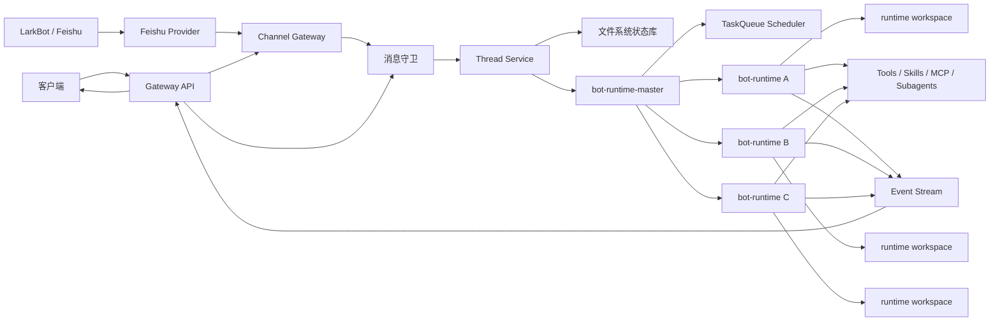
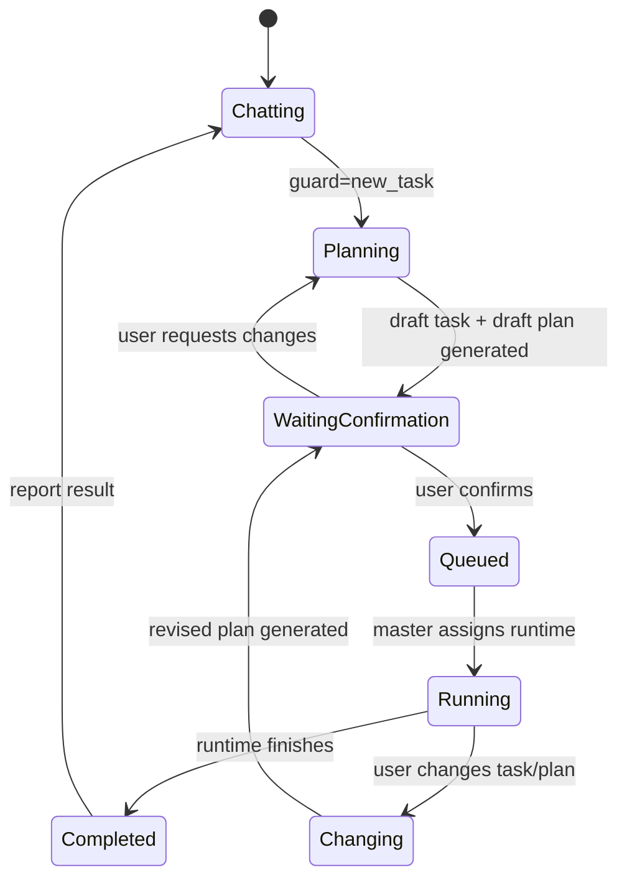
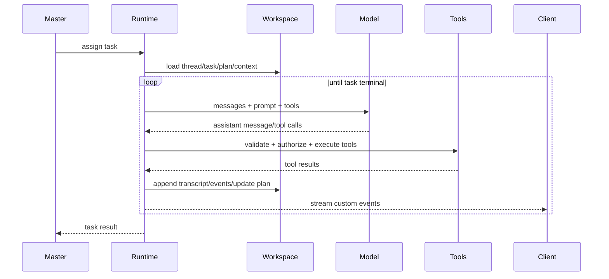
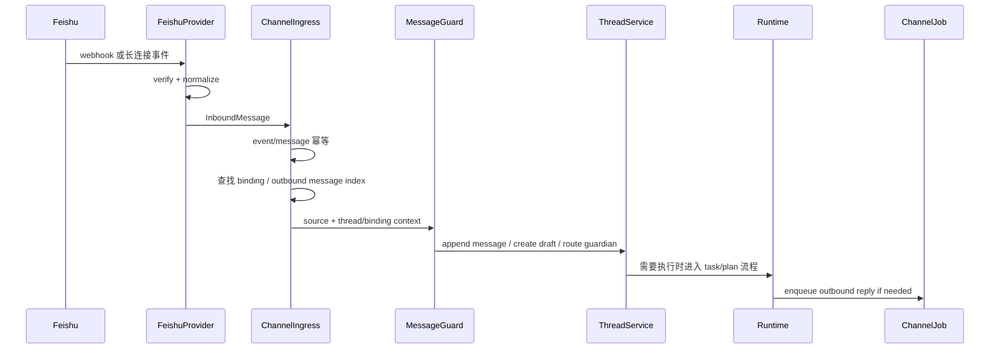
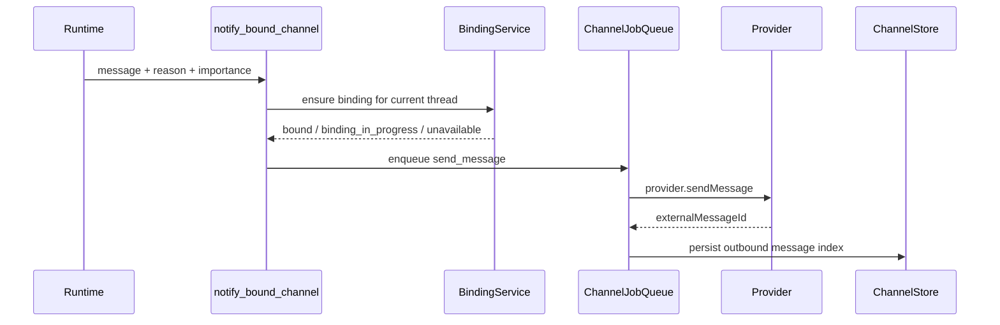

# AI 自动工作流系统架构设计

版本：0.2
日期：2026-04-28
状态：设计草案

## 1. 设计目标

本设计面向一个“AI 员工”式自动工作流系统。用户通过客户端或 LarkBot 与系统持续沟通，系统在 thread 内维护上下文、任务列表、计划、执行状态和产物。`bot-runtime` 负责像员工一样持续工作，`bot-runtime-master` 负责调度和组织多个 runtime。

设计重点不是做一个远程调用 agent 的工具，而是建立一个可持久、可观察、可确认、可变更、可恢复的工作系统。

## 2. 参考项目结论

### 2.1 Claude Code 可复用点

`claude-code-analysis/` 提供的是 agent runtime 内核参考：

- Query / agent loop：模型响应、tool_use、tool_result 回流形成循环。
- Tool 协议：schema、权限、只读/破坏性、并发安全、UI 呈现、结果映射。
- Tool orchestration：按并发安全性分批执行工具，延迟应用上下文修改。
- Subagent / multi-agent：主 agent 派生 worker，worker 独立上下文，结果回流主线程。
- Skills：Markdown + metadata + resources 的渐进加载能力包。
- Transcript：append-only JSONL 的 session 持久化。
- Context compact：长会话压缩、状态补偿、工具/文件/skill 重注入。
- Memory：文件化、多层级、可治理的记忆系统。

### 2.2 DeerFlow 可复用点

`deer-flow/` 提供的是产品化 super agent harness 参考：

- Harness / App 分层：agent 内核与产品入口解耦。
- Gateway + runtime 架构：非 agent API 与 agent 执行分离。
- Per-thread workspace：每个 thread 有独立 workspace/uploads/outputs。
- Middleware pipeline：thread data、uploads、sandbox、summarization、todo、memory、clarification 等横切能力插件化。
- Streaming：`values`、`messages`、`custom` 三类事件并行输出。
- Artifacts：`present_files` 将 outputs 目录产物显式展示给用户。
- IM Channels：Channel、MessageBus、ChannelStore、FeishuChannel 已覆盖远程消息接入基本形态。
- Subagent：`task` tool、后台执行、timeout、custom event 推送进度。

### 2.3 xuedian 可复用点

`/Users/eeo/code/xuedian` 提供的是文件系统化 `bot-runtime` 与飞书通道实现参考：

- 实例级持久化：`DATA_DIR/instances/<runtime-id>/state`，通过稳定 runtime id 和 `.lock` 保证重启恢复与单实例占用。
- Channel 状态库：channel 配置、thread binding、chat claim、webhook event、channel message、job queue 全部落盘。
- 飞书入站：webhook 签名校验、URL verification、长连接接收、消息归一化、event id 幂等。
- 飞书出站：创建群、删除群、发送消息通过 channel job runner 异步执行。
- 绑定保护：`chat-claims/<channel>/<external-chat-id>` 防止一个外部群聊绑定多个 thread。
- Guardian：bot 私聊和未绑定群只作为控制面入口，不直接进入业务 thread。
- 已绑定群路由：只有 `@bot` 或回复 bot 消息才进入业务 thread。
- 客户端配置：`apps/chat` 通过 API 代理读取/保存飞书配置，读取时 Secret 只返回 `hasSecret` 状态。

这些能力不应原样写死为 Feishu 专属核心逻辑，应抽象为通用 Channel 插件系统，Feishu 只是第一种 provider。

## 3. 总体架构



## 4. 分层设计

### 4.1 Client 层

职责：

- 展示 thread 对话。
- 展示 taskList、active task、plan、plan revision。
- 展示 runtime events、tool call、subagent、artifact。
- 提供确认交互：确认 task、确认 plan、确认变更、取消任务。
- 提供 channel 配置和绑定状态查看。
- 读取 channel 配置时只展示脱敏字段，Secret 只展示是否已配置。

可复用 DeerFlow：

- workspace 页面结构。
- MessageList 的消息分组思路。
- TodoList / SubtaskCard 的进度展示方式。
- Artifact panel / artifact preview / download。
- useStream 风格的流式状态消费。

需要新增：

- 正式 taskList 面板。
- task 草稿 / plan 草稿确认 UI。
- plan revision 时间线。
- 消息守卫判定结果展示。
- channel 配置抽屉：启用/禁用、provider 配置、Secret 重新输入保存。
- thread channel 状态：未配置、未绑定、绑定中、已绑定、解绑中、失败。

### 4.2 Gateway API 层

职责：

- 提供客户端 REST / SSE / WebSocket API。
- 接收客户端消息并转交消息守卫。
- 暴露 thread、task、plan、artifact、runtime 状态查询。
- 管理模型、skills、tools、MCP、runtime 注册信息。
- 管理 channel provider 配置、绑定状态和 webhook 入口。
- 对外屏蔽 runtime 运行形态。

可复用 DeerFlow：

- `/api/models`
- `/api/skills`
- `/api/mcp`
- `/api/threads/{id}/uploads`
- `/api/threads/{id}/artifacts`

需要新增：

- `/api/threads/{id}/tasks`
- `/api/threads/{id}/active-task`
- `/api/tasks/{id}/plan`
- `/api/tasks/{id}/confirm`
- `/api/plans/{id}/confirm`
- `/api/plans/{id}/revisions`
- `/api/runtime/register`
- `/api/runtime/heartbeat`
- `/api/channels`
- `/api/channels/{provider}/config`
- `/api/channels/{provider}/webhook`
- `/api/threads/{id}/channel-bindings`

### 4.3 Message Guard 层

消息守卫是本项目相比 DeerFlow 必须新增的关键层。

职责：

- 识别消息来源：客户端、Lark 私聊、Lark 群聊，以及后续其他 channel provider。
- 建立或命中 provider/channel/chat/topic/user 与 thread 的关联。
- 做幂等处理，避免 IM 重试导致重复任务。
- 判断消息意图：
  - 普通沟通。
  - 新任务。
  - 当前任务补充。
  - 当前任务变更。
  - task / plan 确认。
  - 查询进度。
  - 取消 / 暂停。
  - 无关消息。
- 判断消息能否进入正式 task 流程。
- 将 guard decision 写入 transcript，方便审计和回放。

设计原则：

- 来源识别、thread 映射、幂等、确认状态必须由确定性代码处理。
- 语义意图可以使用 LLM 辅助，但必须输出结构化结果。
- 未确认的 task / plan 不能进入正式 taskList。

### 4.4 Thread Service 层

职责：

- 管理 thread 元数据。
- 维护 thread context。
- 维护 taskList。
- 维护 active task。
- 管理草稿 task / plan。
- 写入 transcript。
- 管理 plan revision。
- 为 runtime 提供当前工作上下文。

Thread 是系统的协作容器，不只是聊天会话。

### 4.5 bot-runtime-master 层

职责：

- 管理 runtime 注册和心跳。
- 根据 runtime 能力、负载、workspace、skills 分配任务。
- 维护全局 taskQueue。
- 处理 task 状态转移。
- 收集 runtime events。
- 调度失败重试、暂停、取消。
- 将运行状态同步给 Gateway。

第一版可以先实现单 runtime master，但接口上保留多 runtime 注册能力。

### 4.6 bot-runtime 层

职责：

- 执行 agent loop。
- 加载 thread/task/plan/context。
- 加载 prompt、skills、tools。
- 调用模型。
- 执行 tool call。
- 派生 subagent。
- 写入 workspace。
- 更新 plan 状态。
- 产生 custom events。
- 在需要确认时暂停。

bot-runtime 是执行面，不直接处理 Lark 原始消息，也不负责判断某条 IM 消息属于哪个 thread。runtime 如需对外沟通，只能调用 `notify_bound_channel` 这类通用工具，由 channel 层选择 provider 并异步发送。

## 5. 文件系统设计

参考 DeerFlow 的 per-thread workspace，并结合 Claude Code transcript 机制。

```text
data/
  instances/
    <runtime-id>/
      .lock
      .runtime-info.json
      state/
        threads/
          <thread-id>/
            thread.json
            transcript.jsonl
            guard-decisions.jsonl
            context/
              THREAD.md
              SUMMARY.md
              MEMORY.md
            drafts/
              task-draft.json
              plan-draft.json
            tasks/
              <task-id>/
                task.json
                plan.json
                plan-revisions/
                  <revision-id>.json
                events.jsonl
                logs/
                artifacts/
            user-data/
              workspace/
              uploads/
              outputs/
        bindings/<thread-id>/<channel-type>/
          active.json
          history/
        chat-claims/<channel-type>/<external-chat-id>
        channels/<channel-type>.json
        channel-messages/<channel-type>/
        jobs/{pending,locked,done,failed,dedupe}/
        webhooks/<channel-type>/<event-id>.json
        _index/
      workspace/
  skills/
    public/
    custom/
```

该结构吸收 `xuedian` 的实例隔离和恢复设计。`runtime-id` 是部署级稳定身份；同一 `runtime-id` 同时只能有一个进程持有 `.lock`。channel 配置、绑定、消息和 job 必须与 thread/task/plan 一样持久化。

### 5.1 Transcript

`transcript.jsonl` 使用 append-only 写入，记录：

- user message。
- assistant message。
- tool call。
- tool result。
- task event。
- plan event。
- artifact event。

`guard-decisions.jsonl` 单独记录消息守卫决策，便于调试意图识别和上下文污染问题。

### 5.2 Context 文件

`context/THREAD.md` 记录 thread 级背景。
`context/SUMMARY.md` 记录长对话压缩摘要。
`context/MEMORY.md` 记录稳定事实索引。

原则：

- 不是所有历史都注入 prompt。
- 由索引和摘要控制注入范围。
- task 执行只加载当前 active task 相关上下文。

### 5.3 Artifact

只有 `user-data/outputs` 下的文件可以通过客户端或 LarkBot 展示给用户。workspace 中间文件默认不直接暴露。

这复用 DeerFlow `present_files` 的安全边界。

## 6. 核心数据模型

### 6.1 Thread

```ts
type Thread = {
  id: string
  title: string
  status: "chatting" | "planning" | "waiting_confirmation" | "working" | "blocked" | "idle"
  taskListId: string
  activeTaskId?: string
  draftTaskId?: string
  draftPlanId?: string
  channelRefs: ChannelRef[]
  contextSummary?: string
  createdAt: string
  updatedAt: string
}
```

### 6.2 Task

```ts
type Task = {
  id: string
  threadId: string
  title: string
  description: string
  status: "draft" | "confirmed" | "queued" | "running" | "blocked" | "changing" | "completed" | "failed" | "cancelled"
  sourceMessageIds: string[]
  planId?: string
  activePlanRevisionId?: string
  assignedRuntimeId?: string
  artifactIds: string[]
  changeRecordIds: string[]
  createdAt: string
  updatedAt: string
}
```

### 6.3 Plan

```ts
type Plan = {
  id: string
  taskId: string
  status: "draft" | "pending_confirmation" | "active" | "revising" | "superseded" | "completed"
  objective: string
  steps: PlanStep[]
  expectedArtifacts: string[]
  revisionIds: string[]
  createdAt: string
  updatedAt: string
}
```

### 6.4 PlanStep

```ts
type PlanStep = {
  id: string
  title: string
  description?: string
  status: "pending" | "in_progress" | "completed" | "blocked" | "skipped" | "superseded" | "failed"
  startedAt?: string
  completedAt?: string
  evidence?: string[]
}
```

### 6.5 GuardDecision

```ts
type GuardDecision = {
  id: string
  messageId: string
  threadId: string
  source: "client" | "lark_private" | "lark_group"
  intent:
    | "chat"
    | "new_task"
    | "task_update"
    | "plan_update"
    | "confirm_task"
    | "confirm_plan"
    | "progress_query"
    | "cancel_task"
    | "irrelevant"
  targetTaskId?: string
  targetPlanId?: string
  confidence: number
  requiresUserConfirmation: boolean
  reason: string
  createdAt: string
}
```

### 6.6 ChannelConfig

```ts
type ChannelConfig = {
  provider: "feishu" | "slack" | "wecom" | "email" | "custom"
  enabled: boolean
  ingress: {
    webhookEnabled?: boolean
    longConnectionEnabled?: boolean
  }
  publicFields: Record<string, string | boolean | number>
  secretRefs: Record<string, string>
  createdAt: string
  updatedAt: string
}
```

HTTP 读取配置时返回 `ChannelConfigView`，只能包含 `publicFields` 和 `hasSecret` 布尔值，不能返回 Secret 明文。

### 6.7 ChannelBinding

```ts
type ChannelBinding = {
  id: string
  threadId: string
  provider: string
  externalConversationId?: string
  externalConversationType: "dm" | "group" | "topic"
  status: "binding" | "bound" | "unbinding" | "failed" | "disabled"
  createdBy: "client" | "guardian" | "runtime" | "admin"
  createdAt: string
  updatedAt: string
}
```

同一个 `provider + externalConversationId` 默认只能绑定一个 thread。该约束通过 `chat-claims` 或等价索引保证。

### 6.8 ChannelEvent 和 ChannelJob

```ts
type ChannelInboundEvent = {
  id: string
  provider: string
  externalEventId: string
  externalMessageId?: string
  status: "received" | "processed" | "skipped" | "failed"
  payloadRef: string
  createdAt: string
  processedAt?: string
}

type ChannelJob = {
  id: string
  provider: string
  type: "create_conversation" | "delete_conversation" | "send_message"
  status: "pending" | "running" | "succeeded" | "failed" | "dead"
  dedupeKey?: string
  payload: Record<string, unknown>
  result?: Record<string, unknown>
  attemptCount: number
  lastError?: string
  runAfter: string
  createdAt: string
  updatedAt: string
}
```

## 7. 状态机

### 7.1 从沟通到执行



### 7.2 确认门禁

任何正式执行都必须满足：

- task.status 是 `confirmed` 或 `queued`。
- plan.status 是 `active`。
- task 已进入 thread.taskList。
- guard decision 表示用户确认过 task / plan。

如果不满足，runtime 只能继续澄清或等待确认。

## 8. Runtime Loop 设计



Runtime loop 的核心约束：

- 工具调用必须经过 schema 校验和 guardrail。
- 并发工具必须按安全性分批。
- 所有状态变化写入事件。
- 需要用户输入时中断，不继续猜测。
- subagent 结果回流到主 task 的 plan step。

## 9. Tool 与原子能力设计

### 9.1 Tool 协议

每个工具应声明：

- name。
- description。
- input schema。
- output schema。
- readOnly。
- destructive。
- concurrencySafe。
- requiresApproval。
- permission check。
- call。
- result mapper。

默认策略：

- 默认不可并发。
- 默认非只读。
- 默认需要经过 guardrail。
- 内置工具优先级高于外部 MCP 工具。

### 9.2 第一版内置工具

- `read_file`
- `write_file`
- `list_dir`
- `str_replace`
- `bash`（可配置，默认谨慎启用）
- `present_files`
- `ask_clarification`
- `confirm_task`
- `confirm_plan`
- `update_task`
- `update_plan`
- `task`（subagent）
- `tool_search`（可选）

## 10. Skills 设计

Skill 复用 Claude Code 和 DeerFlow 的思想：它是能力包，不是单个工具。

```text
skills/<category>/<skill-name>/
  SKILL.md
  references/
  scripts/
  assets/
```

Skill metadata 应包含：

- name。
- description。
- when_to_use。
- allowed_tools。
- agent/persona。
- workflow。
- output_contract。

加载策略：

- 默认只注入 skill 列表和描述。
- 命中后再读取 `SKILL.md`。
- `SKILL.md` 引用的资源按需读取。
- subagent 可以有自己的 skill allowlist。

## 11. Message Guard 设计

### 11.1 两阶段判断

第一阶段：确定性判断。

- channel 类型。
- chat_id / topic_id。
- message_id 幂等。
- mention / slash command。
- 当前 thread 状态。
- 是否存在 pending confirmation。

第二阶段：LLM 结构化分类。

- intent。
- target task / plan。
- 是否需要澄清。
- 是否是确认。
- 置信度。
- 理由。

### 11.2 输出

消息守卫必须输出 `GuardDecision`，不能只返回自然语言。

低置信度策略：

- 不创建 task。
- 不修改 active task。
- 进入澄清。

### 11.3 与 Guardrail 的区别

Message Guard 管消息入口和上下文边界。
Guardrail 管工具调用和执行安全。

这两个层都需要，但作用不同。

## 12. 通用 Channel 与 Feishu 插件设计

飞书能力应落在通用 Channel 子系统中。Channel 子系统属于入口和沟通层，不属于 runtime loop 内核。runtime 只能通过通用工具触发通知，不直接依赖 Feishu SDK。

### 12.1 组件边界

```ts
type ChannelProvider = {
  type: string
  normalizeInbound(raw: unknown): InboundMessage | null
  verifyWebhook?(request: WebhookRequest, config: ChannelConfig): boolean
  startLongConnection?(config: ChannelConfig, ingress: ChannelIngress): Promise<void>
  createConversation?(input: CreateConversationInput): Promise<CreateConversationResult>
  deleteConversation?(input: DeleteConversationInput): Promise<void>
  sendMessage(input: SendChannelMessageInput): Promise<SendChannelMessageResult>
}
```

核心组件：

- `ChannelRegistry`：注册 `feishu` 等 provider，按 provider type 路由能力。
- `ChannelConfigStore`：保存配置和 Secret 引用，读取时返回脱敏视图。
- `ChannelBindingRepository`：保存 thread 与外部会话绑定，维护 active/history。
- `ExternalConversationClaim`：保证同一个外部 chat/topic 不被多个 thread 同时绑定。
- `ChannelIngress`：统一处理入站消息的幂等、归一化、绑定查找和守卫转发。
- `ChannelOutboundJobRunner`：异步执行创建会话、删除会话、发送消息。
- `ChannelNotifierTool`：暴露给 runtime 的 `notify_bound_channel`，只允许通知当前 thread 已绑定 channel。
- `Guardian`：处理 bot 私聊、未绑定群、控制命令和 thread 创建入口。

### 12.2 入站流程



已绑定群的额外规则：

- 没有 `@bot` 且不是回复 bot 出站消息时，默认跳过。
- 明确触达 bot 时，把消息追加到绑定 thread，并以 `sourceType=feishu_group` 执行。
- 为避免回复回环，出站消息成功后必须记录 provider message id。

未绑定入口规则：

- bot 私聊进入 Guardian，可创建或查询 thread，但不能绕过 task/plan 确认。
- 未绑定群进入 Guardian，只提示绑定或创建流程，不直接创建业务 thread。

### 12.3 出站流程



`notify_bound_channel` 必须保持通用返回值：

- `binding_unavailable`：provider 未配置或已禁用。
- `binding_in_progress`：正在创建或绑定外部会话。
- `binding_failed`：绑定失败，可重试或人工处理。
- `sent` / `enqueued`：已进入出站队列或发送完成。

### 12.4 Feishu Provider 第一版

Feishu provider 实现：

- 配置字段：`enabled`、`botAppId`、`botAppSecret`、`botSigningSecret`、`botName`、`operatorOpenId`。
- 配置读取：返回 `enabled`、`botAppId`、`botName`、`operatorOpenId`、`hasBotAppSecret`、`hasBotSigningSecret`。
- webhook：校验 `x-lark-request-timestamp`、`x-lark-request-nonce`、`x-lark-signature`，支持 URL verification。
- 长连接：使用飞书 WS client 作为可选 ingress adapter。
- 消息归一化：仅第一版支持 `im.message.receive_v1` 文本消息，提取 `chatId`、`chatType`、`messageId`、`mentionsBot`、`replyToMessageId`、纯文本。
- 出站：支持创建群、删除群、发送文本。
- 绑定状态：`binding`、`bound`、`unbinding`、`failed`。

后续 provider 只需实现同一个接口，不应影响 runtime loop 和 task/plan 模型。

## 13. Master / Runtime 调度设计

### 13.1 Runtime 注册

runtime 启动后向 master 注册：

```ts
type RuntimeRegistration = {
  runtimeId: string
  serverId: string
  workspaceRoot: string
  capabilities: string[]
  enabledSkills: string[]
  maxConcurrentTasks: number
  heartbeatAt: string
}
```

### 13.2 调度策略

第一版：

- 单 runtime。
- 单 active task。
- 保留 master 接口。

第二版：

- 多 runtime 注册。
- taskQueue 分配。
- runtime 负载感知。
- runtime crash 后任务恢复。

### 13.3 任务恢复

恢复依据：

- task.json。
- plan.json。
- transcript.jsonl。
- events.jsonl。
- runtime heartbeat。

如果 runtime 中断：

- task 标记为 `blocked` 或 `queued`。
- master 可重新分配。
- 新 runtime 根据 transcript 和 plan 恢复上下文。

## 14. 与参考项目的复用映射

| 我们的能力 | 可参考来源 | 复用方式 |
|---|---|---|
| agent loop | Claude Code QueryEngine / DeerFlow lead_agent | 复用 loop 思想，结合本项目 task/plan 状态 |
| tool 协议 | Claude Code Tool | 复用 schema、安全、并发标记 |
| tool 调度 | Claude Code toolOrchestration | 复用分批并发策略 |
| thread workspace | DeerFlow Paths / ThreadDataMiddleware | 直接复用目录模型并扩展 task/plan |
| artifact | DeerFlow present_files / artifact API | 直接复用 outputs-only 展示原则 |
| subagent | Claude Code AgentTool / DeerFlow task_tool | 复用隔离上下文、timeout、event |
| skills | Claude Code Skills / DeerFlow skills | 复用渐进加载与文件结构 |
| memory/context | Claude Code memdir / DeerFlow MemoryMiddleware | 复用文件化和摘要注入 |
| transcript | Claude Code sessionStorage | 复用 append-only JSONL |
| 实例级文件系统状态 | xuedian bot-runtime | 复用 `instances/<runtime-id>/state`、锁、恢复扫描思想 |
| 通用 Channel 状态库 | xuedian ChannelRepository | 抽象成 provider 无关的配置、绑定、事件、消息、job 存储 |
| 飞书 provider | xuedian Feishu webhook/long-connection/client | 改造成 ChannelProvider 的一个实现 |
| 绑定和 chat claim | xuedian bindings/chat-claims | 复用一外部会话一 thread 的约束和恢复校验 |
| 出站 job | xuedian ChannelJobRunner | 改造成 provider 无关的 channel job runner |
| notify_bound_channel | xuedian notify_bound_channel | 保留通用工具形态，去除 Feishu 专名 |
| Guardian | xuedian GuardianService | 复用控制面入口思想，扩展为消息守卫前置/协作模块 |
| LarkBot | DeerFlow FeishuChannel / xuedian Feishu provider | 复用 Channel 抽象、Webhook、长连接和群聊路由 |
| 消息守卫 | 本项目新增 | 参考 guardrail/clarification，但需独立设计 |
| taskList/taskQueue | 本项目新增 | 不能直接用 TodoList 替代 |
| plan revision | 本项目新增 | 基于 Todo/Plan 扩展 |

## 15. 第一版落地范围

第一版建议实现：

- 文件系统状态库。
- thread / task / plan 数据模型。
- 单 runtime loop。
- task / plan 草稿与确认门禁。
- 客户端对话 + taskList + active task + plan + artifact 展示。
- append-only transcript。
- basic tool 协议。
- present_files。
- ask_clarification。
- 通用 channel 配置、绑定、入站幂等、出站 job。
- Feishu provider 的 webhook、长连接、文本消息、群聊路由和脱敏配置 API。
- message guard 的确定性入口 + LLM 结构化意图分类。

第一版暂缓：

- 多 runtime 真实调度。
- 完整 MCP 管理。
- 完整 skill 市场。
- 企业级权限。
- Slack、企业微信、邮件等多 provider 全量实现。

## 16. 主要风险

### 16.1 taskList 与 TodoList 混淆

TodoList 是执行步骤可视化；taskList 是用户确认后的正式工作清单。必须独立建模。

### 16.2 消息守卫过度依赖 LLM

LLM 可用于语义分类，但幂等、状态机、确认门禁必须由代码保证。

### 16.3 上下文污染

群聊噪音、多个任务、变更对话容易污染 active task。需要 thread/task/plan 分层上下文和明确 target。

### 16.4 运行时恢复不足

如果只存内存状态，重启后无法继续工作。必须坚持文件系统持久化和 append-only event。

### 16.5 Subagent 失控

需要限制并发数、禁止递归派生、设置 timeout，并把子任务结果纳入主 plan。

### 16.6 Channel 与业务逻辑耦合

如果 Feishu 类型、job 类型、配置字段直接进入核心 task/plan/runtime 模型，后续扩展其他沟通渠道会反复返工。provider 细节必须收敛在 ChannelProvider 内部。

## 17. 下一步

建议下一步先写一份 implementation plan，聚焦第一版：

1. 文件系统状态库和 ID 规范。
2. thread/task/plan schema。
3. channel provider schema 和 Feishu provider 最小实现。
4. message guard schema。
5. runtime loop 最小实现。
6. 客户端最小可视化。
