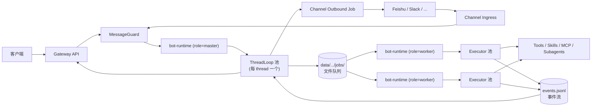
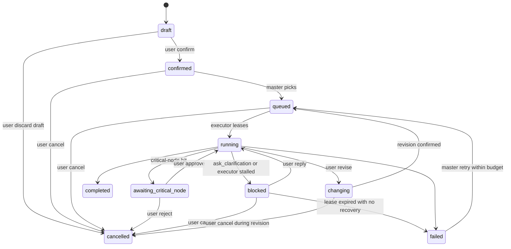
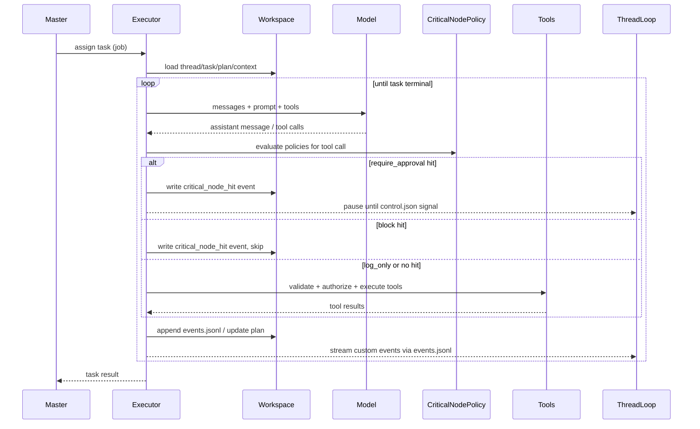
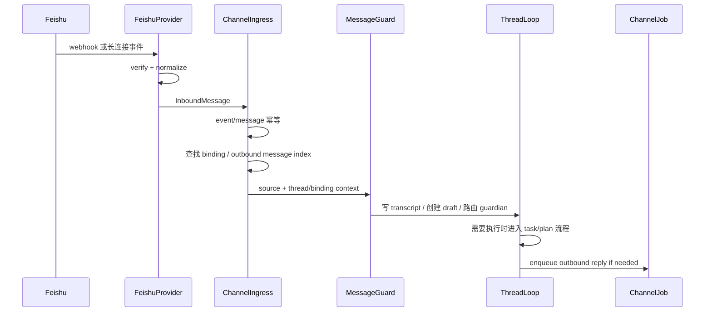
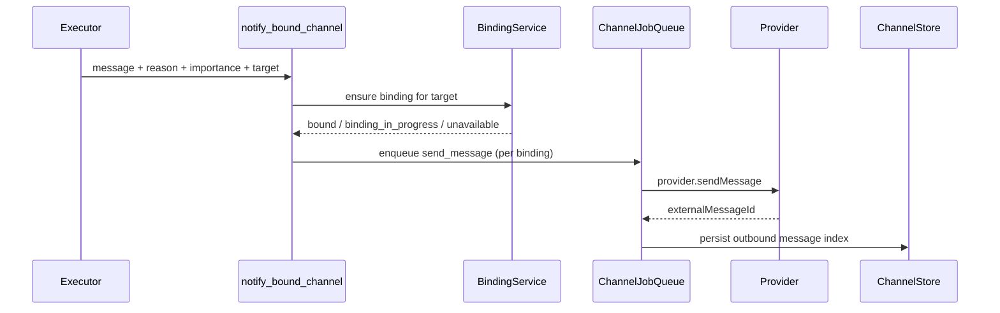

# AI 自动工作流系统架构设计

版本：final-v001 独立整理版
日期：2026-04-30
状态：最终整理

本文档为独立交付版，除配套 `requirement.md` 外不依赖仓库中的其它文件。

---

## 0. 阅读指南

- 第 1–2 章：设计目标、参考项目复用结论。
- 第 3 章：总体架构（角色化 bot-runtime）。
- 第 4 章：分层设计（Client / Gateway / Channel / Guard / ThreadLoop / Executor）。
- 第 5 章：进程内分层（ThreadLoop + Executor）。
- 第 6 章：bot-runtime 角色（master / worker / hybrid）。
- 第 7 章：核心数据模型。
- 第 8 章：文件系统结构。
- 第 9 章：状态机。
- 第 10 章：ThreadLoop ↔ Executor 通信协议。
- 第 11 章：Runtime Loop 与工具协议。
- 第 12 章：Skills 设计。
- 第 13 章：Message Guard 设计。
- 第 14 章：Channel 子系统与飞书 Provider。
- 第 15 章：CriticalNodePolicy 机制。
- 第 16 章：客户端流式协议（SSE）。
- 第 17 章：故障恢复。
- 第 18 章：安全与沙箱。
- 第 19 章：观测与审计。
- 第 20 章：测试与评测策略。
- 第 21 章：工程默认值清单。
- 第 22 章：与参考项目的复用映射。
- 第 23 章：第一版落地范围与风险。
- 附录：命名一致性约定、决策卡片速查。

---

## 1. 设计目标

本设计面向"AI 员工"式自动工作流系统。用户通过客户端或飞书等远程渠道与系统持续沟通，系统在 thread 内维护上下文、任务列表、计划、执行状态与产物。`bot-runtime` 像员工一样持续工作，按角色配置切分调度面（master）与执行面（worker）。

设计重点不是做一个远程调用 agent 的工具，而是建立一个**可持久、可观察、可确认、可变更、可恢复、可拦截的工作系统**。

核心设计原则：

- **AI 员工高自治 + 关键节点拦截**：任务确认后自主推进；只在用户配置的关键节点回到人工。
- **TaskList 唯一权威**：不维护独立 TaskQueue 数据，调度从 List 投影队列视图。
- **进程内分层**：ThreadLoop（thread 主循环，常驻轻量）+ Executor（task 执行循环，短命）；用户可在执行中随时插话。
- **bot-runtime 通用化**：单一二进制 + 配置化角色（master / worker / hybrid），单机 v1 hybrid 一键起，多机 v2 通过共享存储或 RPC 协调。
- **文件系统持久化优先**：所有关键状态（task、plan、绑定、job、policy）都落盘，进程崩溃可恢复。
- **通用 Channel + 可插拔 Provider**：飞书是第一种 provider，runtime 不直接依赖 Feishu SDK。

---

## 2. 参考项目复用结论

### 2.1 Claude Code 可复用点

`claude-code-analysis/` 提供 agent runtime 内核参考：

- Query / agent loop：模型响应、tool_use、tool_result 回流形成循环。
- Tool 协议：schema、权限、只读 / 破坏性、并发安全、UI 呈现、结果映射。
- Tool orchestration：按并发安全性分批执行工具，延迟应用上下文修改。
- Subagent / multi-agent：主 agent 派生 worker，worker 独立上下文，结果回流主线程。
- Skills：Markdown + metadata + resources 的渐进加载能力包。
- Transcript：append-only JSONL 的 session 持久化。
- Context compact：长会话压缩、状态补偿、工具 / 文件 / skill 重注入。
- Memory：文件化、多层级、可治理的记忆系统。

### 2.2 DeerFlow 可复用点

`deer-flow/` 提供产品化 super agent harness 参考：

- Harness / App 分层：agent 内核与产品入口解耦。
- Gateway + runtime 架构：非 agent API 与 agent 执行分离。
- Per-thread workspace：每个 thread 有独立 workspace / uploads / outputs。
- Middleware pipeline：thread data、uploads、sandbox、summarization、todo、memory、clarification 等横切能力插件化。
- Streaming：`values` / `messages` / `custom` 三类事件并行输出。
- Artifacts：`present_files` 将 outputs 目录产物显式展示给用户。
- IM Channels：Channel / MessageBus / ChannelStore / FeishuChannel 已覆盖远程消息接入基本形态。
- Subagent：`task` tool、后台执行、timeout、custom event 推送进度。

### 2.3 xuedian 可复用点

`xuedian/servers/bot-runtime` 提供文件系统化 `bot-runtime` 与飞书通道实现参考：

- 实例级持久化：`DATA_DIR/instances/<runtime-id>/state`，通过稳定 runtime id 与 `.lock` 保证重启恢复与单实例占用。
- Channel 状态库：channel 配置、thread binding、chat claim、webhook event、channel message、job queue 全部落盘。
- 飞书入站：webhook 签名校验、URL verification、长连接接收、消息归一化、event id 幂等。
- 飞书出站：创建群、删除群、发送消息通过 channel job runner 异步执行。
- 绑定保护：`chat-claims/<channel>/<external-chat-id>` 防止一个外部群聊绑定多个 thread。
- Guardian：bot 私聊和未绑定群只作为控制面入口，不直接进入业务 thread。
- 已绑定群路由：只有 `@bot` 或回复 bot 消息才进入业务 thread。
- 客户端配置：`apps/chat` 通过 API 代理读取 / 保存飞书配置，读取时 Secret 只返回 `hasSecret` 状态。

### 2.4 不建议照搬的部分

- 不建议第一版直接照搬完整 LangGraph Server + Gateway + Nginx 多进程部署复杂度。
- 不建议把 `taskList` 简化成 LangChain TodoList。
- 不建议完全依赖 LLM 做消息守卫；消息来源、thread 映射、幂等、权限、已确认状态必须由确定性代码处理。
- 不建议让 LarkBot 消息直接进入 runtime；必须先经过消息守卫和 thread 关联层。
- 不建议把 `xuedian` 的 Feishu 类型、job 类型和 repository 方法原样写死到核心模型中；应抽成 provider 接口。

---

## 3. 总体架构



**单机部署（v1 推荐）**：`role: hybrid`，所有方框落到一个进程内，`jobs/` 退化为同进程文件传递（仍走文件以便恢复）。

**多机部署（v2）**：master 一台、worker N 台，共享 `data/instances/<runtime-id>/state/`（NFS / S3FS / 共享卷），`jobs/` 是真正的跨进程协调点。

---

## 4. 分层设计

### 4.1 Client 层

职责：

- 展示 thread 对话、TaskList、active task、plan、PlanRevision 时间线。
- 展示 runtime events、tool call、subagent、artifact。
- 提供确认交互：确认 task / plan、确认变更、关键节点审批、取消、暂停。
- 提供 channel 配置和绑定状态查看。
- 读取 channel 配置时只展示脱敏字段，Secret 只展示 `hasSecret`。

可复用 DeerFlow：

- workspace 页面结构。
- MessageList 的消息分组思路。
- TodoList / SubtaskCard 的进度展示。
- Artifact panel / artifact preview / download。
- useStream 风格的流式状态消费。

需要新增：

- 正式 TaskList 面板。
- task 草稿 / plan 草稿确认 UI。
- plan revision 时间线 + 变更历史面板。
- 消息守卫判定结果展示（含 `shortCircuited` 标记）。
- channel 配置抽屉：启用 / 禁用、provider 配置、Secret 重新输入保存。
- thread channel 绑定状态展示。
- 关键节点拦截审批 UI。

### 4.2 Gateway API 层

职责：

- 提供客户端 REST / SSE API（v2 再上 WebSocket）。
- 接收客户端消息并转交消息守卫。
- 暴露 thread / task / plan / artifact / runtime 状态查询。
- 管理模型、skills、tools、MCP、runtime 注册信息。
- 管理 channel provider 配置、绑定状态和 webhook 入口。
- 管理 CriticalNodePolicy CRUD。
- 对外屏蔽 runtime 运行形态。

可复用 DeerFlow：`/api/models`、`/api/skills`、`/api/mcp`、`/api/threads/{id}/uploads`、`/api/threads/{id}/artifacts`。

需要新增：

- `/api/users/me`
- `/api/threads/{id}/tasks`
- `/api/threads/{id}/active-task`
- `/api/tasks/{id}/plan`
- `/api/tasks/{id}/confirm`
- `/api/tasks/{id}/critical-node/approve`
- `/api/plans/{id}/confirm`
- `/api/plans/{id}/revisions`
- `/api/threads/{id}/events?cursor=<lastEventId>`（SSE）
- `/api/runtime/register`
- `/api/runtime/heartbeat`
- `/api/channels`
- `/api/channels/{provider}/config`
- `/api/channels/{provider}/webhook`
- `/api/threads/{id}/channel-bindings`
- `/api/critical-node-policies`

### 4.3 Channel Ingress 层

职责：

- 接收外部渠道（飞书、Slack 等）的 webhook / 长连接事件。
- provider 验签与 challenge 处理。
- 消息归一化为统一 `InboundMessage`。
- 按 provider event id 做幂等。
- 查找 binding，识别"是否回复 bot"防回环。
- 把 InboundMessage 与上下文（source / binding / fromUser）转给 MessageGuard。

详见第 14 章。

### 4.4 Message Guard 层

消息守卫是本项目相比 DeerFlow 必须新增的关键层。

职责：

- 来源识别：客户端 / Lark 私聊 / Lark 群聊及其他 channel provider。
- thread 关联或创建。
- 幂等处理。
- 两阶段判断：规则短路（成本控制）→ LLM 结构化分类。
- 输出 `GuardDecision`，含 `shortCircuited` 与 `ruleHits`。
- LLM 不可用时降级为纯规则 + 全部标 `chat`，并广播 `guard_degraded` 事件。

详见第 13 章。

### 4.5 ThreadLoop 层（master 角色驻留）

ThreadLoop 是 thread 维度的 actor，常驻轻量：

- 接收 inbound 事件、客户端事件、Executor 上报事件。
- 维护 thread 状态（chatting / planning / waiting_confirmation / working / blocked / awaiting_critical_node / idle）。
- 对话与澄清。
- 草稿 task / plan 生成与确认门禁。
- 写 `control.json` 控制 Executor。
- 管理 PlanRevision 流转（生成新 revision、归档旧 artifact）。
- 通过 SSE 推送事件给客户端、通过 channel outbound job 推送给绑定渠道。

每个 thread 的 ThreadLoop 是单线程消费它的事件队列（飞书入站、客户端入站、Executor 上报、master 通知都进同一队列），天然串行，不需要锁。

### 4.6 Executor 层（worker 角色驻留）

Executor 是 task 维度的对象（per task），短命：

- 拉取 master 派发的 `execute_task` job，写 `lockHolder` / `leaseExpireAt`。
- 加载 task / plan / context / workspace。
- 执行 agent loop（详见第 11 章）。
- 在每次 tool dispatch 前评估 CriticalNodePolicy。
- 写 events.jsonl，按 graceful 策略响应 control.json 信号。
- task 完成后写 task summary 回 thread。

### 4.7 Master 调度层（master 角色驻留）

职责：

- 管理 runtime 注册和心跳（v1 单机本身就是 runtime）。
- 从 TaskList 投影"可执行队列视图"，按 thread 维度依次取下一个 confirmed/queued task。
- 派发 `execute_task` job 到 `jobs/pending/`。
- 重试调度器：固定周期扫描 `status=failed` 任务，根据 `task.retry.nextRetryAt` 决定 requeue。
- 处理暂停、取消信号。
- 收集 runtime / executor 状态，同步给 Gateway。

第一版单 runtime（hybrid），但接口预留多 worker 注册。

#### 4.7.1 重试调度器伪代码

```text
# master 进程内独立 fiber，每 RUNTIME_RETRY_POLL_MS 毫秒触发一次（默认 5000ms）
loop forever:
 acquire lock state/_locks/retry-scheduler.lock # v1 hybrid 是 flock；v2 多机用共享锁
 candidates = scan tasks where status == "failed"
 candidates = sort_by(task -> task.retry.nextRetryAt asc) # 升序，老任务优先
 for task in candidates:
 if task.retry is null:
 continue # 缺省 retry 视为 attemptCount=0,maxRetries=2,但缺 failureClass 不能重试
 if task.retry.failureClass != "transient_error":
 ensure_event_once(task, "task_retry_exhausted",
 reason="non_transient",
 failureClass=task.retry.failureClass) # 幂等：已写过则跳过
 continue
 if task.retry.attemptCount >= task.retry.maxRetries:
 ensure_event_once(task, "task_retry_exhausted",
 reason="max_retries",
 failureClass="transient_error")
 continue
 if task.retry.nextRetryAt is null or now() < task.retry.nextRetryAt:
 continue # 还没到时间
 # 满足重试条件
 new_attempt = task.retry.attemptCount + 1
 event = append_event(task, "task_retry_scheduled",
 attemptCount=new_attempt,
 maxRetries=task.retry.maxRetries,
 failureClass="transient_error",
 nextRetryAt=task.retry.nextRetryAt)
 if append_event failed:
 log_error; continue # 不静默丢弃
 task.retry.attemptCount = new_attempt
 task.retry.lastEventId = event.id
 task.status = "queued"
 persist(task) # task.json 与事件原子顺序：先事件后 task
 release lock
 sleep RUNTIME_RETRY_POLL_MS
```

要点：

- 事件顺序：先写 `task_retry_scheduled` 事件，再翻 `task.status = queued`；崩溃后下一任 master 用事件流重建状态，且事件已存在的 task 不会被重复重试。
- `ensure_event_once`：以 `(taskId, lastEventId)` 去重，避免在 transient_error 上反复写 `task_retry_exhausted`。
- `nextRetryAt = null` 等同于"未排重试"，需要由 Executor 在写 `executor_finished{outcome=failed}` 时一并填入（见 §10.2 增强）。
- 多 master 共存：`state/_locks/retry-scheduler.lock` 的持有者同时只能有一个；锁失效（lease 60s）由 fencing token 兜底。
- 用户手动重试不走此路径：`/api/tasks/{id}/retry` 直接写 `task_manual_retry_requested` 事件并把 `task.retry.attemptCount = 0` 后翻状态，不与轮询调度共享 attemptCount 配额。

---

## 5. 进程内分层：ThreadLoop + Executor

### 5.1 为什么拆开

| 维度 | 拆（选择） | 不拆 / 单 loop |
|---|---|---|
| 对象划分 | thread loop（per thread）+ Executor（per task） | 单一 loop |
| LLM 上下文窗口 | thread ctx 与 task ctx 各一份 | 全混，长任务会爆 |
| 用户中途发消息 | thread loop 一直在听，立刻处理 | 单 loop 在跑工具，要插"消息处理点" |
| Executor 崩了 | thread loop 还在，task 标记 blocked 重排 | 整 thread 死 |
| 跨进程（master / worker） | 天然支持 | 不好拆 |
| 飞书 + 主子 bot 消息并发 | thread loop 单线程串行 | 抢锁 |
| 上下文压缩负担 | 自然分离 | 主动压缩 |

**选择拆开**的最强理由：用户提的两个并发场景（master 在干活时飞书用户发消息、飞书消息和主子 bot 消息同时到）在拆开模型下天然成立，不需要靠"打断 LLM"或"分布式锁"。

### 5.2 拆开的具体安排

- bot-runtime 进程内引入两类对象：`ThreadLoop`（thread 维度）和 `Executor`（task 维度）。
- task 上下文与 thread 上下文文件分离：`tasks/<task-id>/context/` 单独存。
- task 完成后 Executor 写"task summary"回 thread，长 transcript 不必倒灌。
- thread loop 始终在线接消息，Executor 短命可崩可重启。
- 与角色配置组合：master 角色进程只起 ThreadLoop 池；worker 角色进程只起 Executor 池；hybrid 角色都起。

---

## 6. bot-runtime 角色

### 6.1 角色配置

bot-runtime 是单一二进制 / 单一服务，启动时按配置切角色：

- `role: master` — 进程内只跑 ThreadLoop 池，不跑 Executor。
- `role: worker` — 进程内只跑 Executor 池，不跑 ThreadLoop。
- `role: hybrid` — 同进程内两类都跑，v1 单机部署默认。

配置项：环境变量 `BOT_RUNTIME_ROLE`，取值 `master` / `worker` / `hybrid`。

### 6.2 角色间通信

master 角色与 worker 角色之间通过文件队列 `jobs/` + 事件流 `events.jsonl` 协调，不需要直接 RPC：

- 跨进程通信走持久化层：master 写"分配 task" job，worker 拉去执行；worker 写事件，master 投影到 ThreadLoop。
- v2 多机：可选用 RPC 替换文件队列（接口不变）。

### 6.3 解决两个具体并发场景

1. **master 在干活时飞书用户发消息**：master 角色的 bot-runtime 进程里 ThreadLoop 是常驻的，飞书 inbound 走 channel ingress → guard → 对应 thread 的事件队列；当时 master 即使在派活也不会阻塞此入口。
2. **飞书消息和主子 bot 消息同时到**：每个 thread 的 ThreadLoop 是单线程消费它的事件队列（飞书入站、客户端入站、Executor 上报、master 通知都进同一队列）；天然串行，不需要锁。

---

## 7. 核心数据模型

### 7.1 User（v1）

```ts
type User = {
 id: string
 displayName: string
 channelIdentities: {
 feishu?: { openId: string; tenantKey?: string }
 slack?: { userId: string; teamId: string }
 email?: string
 }
 createdAt: string
 updatedAt: string
}
```

### 7.1.1 TaskList

```ts
type TaskList = {
 id: string
 threadId: string
 orderedTaskIds: string[] // 按用户确认时间线性追加；重启可由 tasks/ 扫描重建
 createdAt: string
 updatedAt: string
}
```

落盘位置：`state/threads/<thread-id>/task-list.json`。重启时由 `tasks/` 子目录按 `task.confirmedAt` 升序重建并和落盘文件做一致性校验，不一致则触发 `task_list_repair` 事件。

> retry 不重排 TaskList：`failed → queued` 自动 retry / `task_manual_retry_requested` 用户重试 / `task_retry_reset_by_plan_update` plan 切换重置 retry，三条路径都不修改 `orderedTaskIds`。调度器仍从队首向后扫描，老任务先于新任务被 retry，避免 retry 风暴让新任务永久饥饿。任何企图通过 retry 路径上调任务优先级的逻辑必须被拒绝并写 `task_state_transition_blocked{reason: "retry_must_not_reorder_tasklist"}`。

### 7.1.2 ChangeRecord

```ts
type ChangeRecord = {
 id: string
 taskId: string
 oldPlanRevisionId: string
 newPlanRevisionId: string
 triggerMessageId: string
 triggerUserId: string
 guardDecisionId: string
 userOriginalText: string
 llmSummary: string
 archivedArtifactPaths: string[] // 仅记录路径，artifact 状态由 ArtifactRecord 维护
 createdAt: string
}
```

落盘位置：`state/threads/<thread-id>/tasks/<task-id>/change-records/<change-id>.json`。append-only，不可重写。

### 7.1.3 ArtifactRecord

```ts
type ArtifactRecord = {
 id: string
 taskId: string
 planRevisionId: string
 relativePath: string // outputs/ 或 _archive/<rev>/ 下相对路径
 sizeBytes: number
 mimeType: string
 sha256: string
 status: "active" | "archived"
 archivedAt?: string
 createdAt: string
 updatedAt: string
}
```

落盘位置：`state/threads/<thread-id>/tasks/<task-id>/artifacts/<artifact-id>.json`。归档时仅更新 `status` 与 `relativePath`，文件实体由 PlanRevision 流程移动到 `_archive/<revisionId>/`。

### 7.1.4 SkillManifest

```ts
type SkillManifest = {
 name: string // kebab-case，全局唯一
 description: string // ≤ 200 字符
 whenToUse: string
 allowedTools: string[] // 可空数组
 agent?: string // agent 与 persona 二选一必填
 persona?: string
 workflow?: string
 outputContract?: string
 version: string // semver
 riskClass: "low" | "medium" | "high"
}
```

校验失败处理：runtime 启动时对每个 `skills/**/SKILL.md` 解析 frontmatter，未通过 schema 校验的 skill 不进入注册表，并写入：

```ts
type SkillsLoadError = {
 kind: "skills_load_error"
 skillPath: string
 reason: string
 field: string | null
 at: string
}
```

到 `state/_diagnostics/skills.jsonl`，客户端可通过 `/api/skills?status=error` 查询失败列表。

### 7.2 Thread

```ts
type Thread = {
 id: string
 ownerUserId: string
 title: string
 status:
 | "chatting"
 | "planning"
 | "waiting_confirmation"
 | "working"
 | "blocked"
 | "awaiting_critical_node"
 | "idle"
 taskListId: string
 activeTaskId?: string // 0..1，严格 1 个 active running
 draftTaskId?: string
 draftPlanId?: string
 channelBindingIds: string[] // 多绑定，跨 provider 也允许
 contextSummary?: string
 createdAt: string
 updatedAt: string
}
```

### 7.3 Task

```ts
type Task = {
 id: string
 threadId: string
 ownerUserId: string // 等于发起者 User
 confirmedByUserId?: string // 必须等于 ownerUserId
 title: string
 description: string
 status:
 | "draft"
 | "confirmed"
 | "queued"
 | "running"
 | "awaiting_critical_node"
 | "blocked"
 | "changing"
 | "completed"
 | "failed"
 | "cancelled"
 sourceMessageIds: string[]
 planId?: string
 activePlanRevisionId?: string
 assignedRuntimeId?: string
 assignedExecutorId?: string // worker 角色进程内的 executor 实例 id
 budget?: TaskBudget
 retry?: TaskRetryState // 缺省视为 attemptCount=0, maxRetries=2
 artifactIds: string[]
 changeRecordIds: string[]
 archivedRevisionIds: string[] // 历史 plan revision
 blockedReason?: BlockedReason // status ∈ {blocked, failed} 时必填
 schemaVersion: 1 | 2 // 2 表示包含 TaskRetryState；缺失或解析失败按 1 处理
 lastUserSignalAt?: string // ISO timestamp，cancel/pause/revise 信号写 control.json 时同步刷新
 lastUserSignalKind?: "cancel" | "pause" | "revise" // 最近一次用户信号的类型
 createdAt: string
 updatedAt: string
}

type BlockedReason =
 | "retry_pending" // failed + retry.failureClass=transient_error + nextRetryAt 未到
 | "retry_exhausted" // failed + retry.attemptCount>=maxRetries 或非 transient
 | "awaiting_user_action" // blocked 由 ask_clarification 或 stalled 触发，等用户回复
 | "non_idempotent_tool_in_flight" // blocked 由 §17.3 in-flight non_idempotent 检测触发

type TaskBudget = {
 maxDurationMs?: number // 默认 4h
 maxTokens?: number // 默认 1M
 maxSubagents?: number // 默认 8
 maxCostUsd?: number
}

type TaskRetryState = {
 attemptCount: number // 当前已用自动重试次数（用户手动重试会重置为 0）
 maxRetries: number // 默认 2；仅对 transient_error 失败有效
 failureClass?:
 | "transient_error"
 | "assertion_error"
 | "permission_error"
 | "user_cancelled"
 lastFailureAt?: string
 lastFailureReason?: string // 短文本，长版进 events.jsonl
 nextRetryAt?: string // 下次允许 master 重新派发的时间；缺失视为不重试
 lastEventId?: string // 关联最近一条 task_retry_scheduled / task_retry_exhausted
}
```

### 7.4 Plan

```ts
type Plan = {
 id: string
 taskId: string
 status:
 | "draft"
 | "pending_confirmation"
 | "active"
 | "revising"
 | "superseded"
 | "completed"
 objective: string
 steps: PlanStep[]
 expectedArtifacts: string[]
 revisionIds: string[]
 createdAt: string
 updatedAt: string
}

type PlanStep = {
 id: string
 title: string
 description?: string
 status:
 | "pending"
 | "in_progress"
 | "completed"
 | "blocked"
 | "skipped"
 | "superseded"
 | "failed"
 startedAt?: string
 completedAt?: string
 evidence?: string[]
}
```

### 7.5 PlanRevision

```ts
type PlanRevision = {
 id: string
 planId: string
 taskId: string
 status: "active" | "superseded"
 fullPlan: Plan // 完整快照（v1 不做 patch）
 reason: string // 为什么变更
 sourceMessageId: string
 archivedArtifactPaths: string[] // _archive/<rev>/ 下文件
 supersededAt?: string
 createdAt: string
}
```

### 7.6 GuardDecision

```ts
type GuardDecision = {
 id: string
 messageId: string
 threadId: string
 fromUserId?: string
 source: "client" | "lark_private" | "lark_group" | "slack" | string
 intent:
 | "chat"
 | "new_task"
 | "task_update"
 | "plan_update"
 | "confirm_task"
 | "confirm_plan"
 | "progress_query"
 | "cancel_task"
 | "irrelevant"
 targetTaskId?: string
 targetPlanId?: string
 shortCircuited: boolean // 是否走规则短路（未过 LLM）
 ruleHits: string[] // 命中的规则 id
 confidence: number
 requiresUserConfirmation: boolean
 reason: string
 createdAt: string
}
```

### 7.7 ChannelConfig

```ts
type ChannelConfig = {
 provider: "feishu" | "slack" | "wecom" | "email" | "custom"
 enabled: boolean
 ingress: {
 webhookEnabled?: boolean
 longConnectionEnabled?: boolean
 }
 publicFields: Record<string, string | boolean | number>
 secretRefs: Record<string, string>
 createdAt: string
 updatedAt: string
}
```

HTTP 读取配置时返回 `ChannelConfigView`，只能包含 `publicFields` 和 `hasSecret` 布尔值，不返回 Secret 明文。

### 7.8 ChannelBinding

```ts
type ChannelBinding = {
 id: string
 threadId: string
 provider: string
 externalConversationId?: string
 externalConversationType: "dm" | "group" | "topic"
 status: "binding" | "bound" | "unbinding" | "failed" | "disabled"
 createdBy: "client" | "guardian" | "runtime" | "admin"
 enabled: boolean
 notifyDefault: boolean // notify target=all 时是否包含
 createdAt: string
 updatedAt: string
}
```

同一个 `provider + externalConversationId` 默认只能绑定一个 thread；该约束通过 `chat-claims/<channel-type>/<external-chat-id>` 索引保证。反向不防（一个 thread 可多个外部 chat）。

### 7.9 ChannelInboundEvent / ChannelJob

```ts
type ChannelInboundEvent = {
 id: string
 provider: string
 externalEventId: string
 externalMessageId?: string
 status: "received" | "processed" | "skipped" | "failed"
 payloadRef: string
 createdAt: string
 processedAt?: string
}

type ChannelJob = {
 id: string
 provider: string
 type: "create_conversation" | "delete_conversation" | "send_message"
 status: "pending" | "running" | "succeeded" | "failed" | "dead"
 dedupeKey?: string
 payload: Record<string, unknown>
 result?: Record<string, unknown>
 attemptCount: number
 lastError?: string
 runAfter: string
 createdAt: string
 updatedAt: string
}
```

### 7.10 CriticalNodePolicy

```ts
type CriticalNodePolicy = {
 id: string
 scope: "global" | "user" | "thread" | "skill"
 matcher: NodeMatcher
 action: "require_approval" | "block" | "log_only"
 ownerUserId: string
 enabled: boolean
 createdAt: string
}

type NodeMatcher =
 | { kind: "tool", toolName: string, argMatch?: Record<string, unknown> }
 | { kind: "external_io", direction: "outbound", provider?: string }
 | { kind: "filesystem", op: "delete" | "overwrite", minCount?: number }
 | { kind: "budget_overflow", dim: "time" | "tokens" | "subagents" | "cost" }
 | { kind: "out_of_scope", planRevisionId: string }
```

加载顺序：global → user → thread → skill，后者覆盖前者。注入点：Executor 在 tool dispatch 之前评估所有 policy。v1 默认值：空数组。

### 7.11 RuntimeRegistration

```ts
type RuntimeRegistration = {
 runtimeId: string
 serverId: string
 role: "master" | "worker" | "hybrid"
 workspaceRoot: string
 capabilities: string[]
 enabledSkills: string[]
 maxConcurrentTasks: number
 heartbeatAt: string
}
```

---

## 8. 文件系统结构

```text
data/
 instances/
 <runtime-id>/
 .lock # 单进程独占（v1 hybrid 模式）
 .runtime-info.json # role, version, startedAt, fencingTokenSeed
 state/
 users/<user-id>.json
 threads/
 <thread-id>/
 thread.json
 transcript.jsonl
 guard-decisions.jsonl
 context/
 THREAD.md
 SUMMARY.md
 MEMORY.md
 drafts/
 task-draft.json
 plan-draft.json
 tasks/
 <task-id>/
 task.json
 plan.json # = activeRevision 的快照
 plan-revisions/
 <revision-id>.json
 events.jsonl # Executor 写、ThreadLoop 读
 control.json # ThreadLoop 写、Executor 读
 logs/
 context/ # task 级上下文，独立于 thread context
 user-data/
 workspace/ # bash 默认工作目录
 uploads/
 outputs/
 _archive/<revision-id>/ # 旧 artifact 归档
 bindings/
 <thread-id>/<channel-type>/<binding-id>/
 active.json
 history/
 chat-claims/<channel-type>/<external-chat-id>
 channels/<channel-type>.json
 channel-messages/<channel-type>/_idx
 critical-node-policies/
 <policy-id>.json
 jobs/
 pending/<job-id>.json
 locked/<job-id>.json # 含 lockHolder, leaseExpireAt
 done/<job-id>.json
 failed/<job-id>.json
 dedupe/<dedupe-key> # idempotency
 webhooks/<channel-type>/<event-id>.json
 _index/ # 重建索引时落盘
 workspace/ # runtime 级公共 workspace（罕用）
 skills/
 public/
 custom/
```

设计要点：

- 实例级隔离：通过 `runtimeId` 与 `.lock` 保证。
- 多绑定结构：`bindings/<thread-id>/<channel-type>/<binding-id>/`（不是单文件）。
- 不维护独立 TaskQueue 目录：`tasks/<task-id>/task.json` 是 single source of truth；调度从扫描派生。
- task 级上下文与 thread 级上下文分目录（`tasks/<task-id>/context/` vs `threads/<thread-id>/context/`）。
- 旧 artifact 归档在 `outputs/_archive/<revision-id>/`。

---

## 9. 状态机

### 9.1 Task 状态



Task 状态机不变量：

- 终止状态 `completed` / `failed` / `cancelled` 是吸收态；任何转移路径不得让任务从这三个状态中走出（除了 `failed → queued` 的有限重试，且重试由 master 而非用户触发）。
- 取消信号可以从任何非终止状态进入 `cancelled`；但已 `completed` 的任务不能"撤销完成"。
- 状态转移日志按 `task_state_transition` 事件写入 events.jsonl，字段 `from / to / reason / actor / at`。

本设计把 `failed → queued` 重试合同从 `TaskBudget` 字段挪到独立的 `TaskRetryState` 中，并在状态机层约束：

- `failed → queued` 仅由 master 调度器触发，前置条件全部满足时才执行：
 - `task.retry.failureClass = "transient_error"`，且
 - `task.retry.attemptCount < task.retry.maxRetries`（默认 maxRetries=2），且
 - `now >= task.retry.nextRetryAt`。
- 触发时 master 在写状态转移之前先写 `task_retry_scheduled` 事件并把 `attemptCount += 1`，再把任务重新放回 TaskList 投影队列。
- 失败属于 `assertion_error / permission_error / user_cancelled` 时不写 `task_retry_scheduled`，状态停留在 `failed`，并写一条 `task_retry_exhausted{reason: "non_transient"}`。
- `attemptCount >= maxRetries` 的 transient 失败也走 `task_retry_exhausted{reason: "max_retries"}`，不再继续 requeue。
- 任何来自 `failed` 但目标不是 `queued` 的转移请求（例如试图直接回到 `running` 或写到 `completed`）必须被拒绝，写 `task_state_transition_blocked{from: "failed", to: <attempted>}`。
- 用户显式重试（客户端 / `/retry` 命令）走单独通道：把 `retry.attemptCount` 重置为 0、清空 `failureClass / nextRetryAt`，写 `task_manual_retry_requested` 事件后再走 `failed → queued`，与自动重试不混用 retry 配额。
- cancel × retry 竞态：master 在 `failed → queued` 转移前必须比较 `task.lastUserSignalAt` 与 `task.retry.lastFailureAt`：
 1. 如果 `lastUserSignalAt > lastFailureAt` 且 `lastUserSignalKind = "cancel"`，cancel 信号已经覆盖 retry：master 不调度，写 `task_retry_skipped{reason: "user_cancel_supersedes"}`，并保持 task 在 `failed`（cancel 路径会另行把状态改为 `cancelled`）。
 2. 如果 `lastUserSignalAt > lastFailureAt` 且 `lastUserSignalKind = "pause"`，pause 信号挂起 retry：master 不调度，写 `task_retry_skipped{reason: "user_pause_active"}`；resume 后下一轮调度可继续。
 3. 否则正常走 retry 调度。
- budget_overflow 与 retry 互斥：`task.budget` 任意一项耗尽时 master 写 `task_retry_exhausted{reason: "non_transient", failureClass: "budget_overflow"}` 直接落 `failed` + `blockedReason="retry_exhausted"`，不进入退避调度、不写 `task_retry_scheduled`、不消耗 retry 配额；客户端面板对 budget_overflow 失败仅启用 `cancel`（与 retry_exhausted 一致）。
- retry × CriticalNodePolicy 重审：retry 派发的新 ExecuteTaskJob 在每次 tool call 之前必须重新走 `Pol.evaluate(toolCall)`，不允许沿用上次失败时的 policy 决策；policy 配置可能已 hot-reload，且 `risk_class=high` 的 skill 在 retry 路径上仍然必须走 `awaiting_critical_node` 拦截（不缓存上次 approve 结果）。
- plan_update × retry 配额重置：当用户在 task 处于 `failed` 时通过 `update_plan` 工具或 `plan_update` 守卫决策提交新计划，master 必须把 `failed → queued` 的转移和 PlanRevision 写入、ChangeRecord 写入、retry 状态重置串成同一原子事务，保证"切了 plan 之后旧的 retry 配额不会跨域生效"：
 1. 事务前置条件：`task.status = failed`、新计划已通过 `confirm_plan` 守卫决策、`task.lastUserSignalKind ≠ "cancel"`（cancel 优先级仍然高于 plan_update）。
 2. 事务步骤（按顺序，任一失败必须回滚）：
 - (a) 写新的 `PlanRevision`（`status=active`），旧 PlanRevision `status=superseded`；
 - (b) 写 `ChangeRecord`，关联旧 / 新 `planRevisionId` 与触发消息 id；
 - (c) 重置 `task.retry`：`attemptCount=0`、`failureClass=null`、`nextRetryAt=null`、`lastFailureAt=null`、`lastFailureReason=null`，并把 `task.retry.lastEventId` 推进到当前事件流末尾；
 - (d) 写 `task_retry_reset_by_plan_update{taskId, oldAttemptCount, oldFailureClass, changeRecordId, planRevisionId, at}`；
 - (e) 写状态转移 `failed → queued`，并派发新的 `ExecuteTaskJob`（`fencingToken` 单调递增、`planRevisionId` 指向新 revision，禁止复用旧 fencingToken）。
 3. 任意步骤失败：master 必须把已写入的 PlanRevision 标 `status=draft` / 删除、ChangeRecord 不写入、保留旧 retry 状态，并写 `task_state_transition_blocked{from: "failed", to: "queued", reason: "plan_update_retry_reset_failed"}`；事务由验收 40 兜底。
 4. 与 cancel/pause 优先级的关系：本规则严格弱于 cancel/pause —— 若事务执行期间用户写入 cancel 信号（`lastUserSignalAt` 推进到事务起始时间之后），master 必须 abort 事务并把 task 留在 `failed`，让 cancel 路径接管（同 cancel 优先级合同）。
 5. 与用户显式重试（`task_manual_retry_requested`）的边界：用户显式重试不改变 plan，仅清零 retry 计数；plan_update 同时改 plan 和清零 retry，两者不复用同一事件 kind，不复用同一 metric。

### 9.2 Thread 状态

`chatting` / `planning` / `waiting_confirmation` / `working` / `blocked` / `awaiting_critical_node` / `idle`

### 9.3 Plan 状态

`draft` / `pending_confirmation` / `active` / `revising` / `superseded` / `completed`。每次变更产生新 `PlanRevision`，旧 revision.status = `superseded`。

### 9.4 确认门禁

任何正式执行都必须满足：

- `task.status` ∈ {`confirmed`, `queued`}。
- `plan.status` = `active`。
- `task.confirmedByUserId` = `task.ownerUserId`（仅发起者本人可确认）。
- task 已进入 thread.taskList。
- 存在对应的 `confirm_task` / `confirm_plan` `GuardDecision`。

不满足时 Executor 不启动，ThreadLoop 继续澄清或等待确认。

---

## 10. ThreadLoop ↔ Executor 通信协议

### 10.1 派活：master → worker

文件位置：`data/instances/<runtime-id>/state/jobs/pending/<job-id>.json`

```ts
type ExecuteTaskJob = {
 id: string
 type: "execute_task"
 taskId: string
 threadId: string
 planRevisionId: string
 assignedAt: string
 fencingToken: number // master 单调递增
 budget?: TaskBudget
}
```

worker 拉取 → 移到 `jobs/locked/<job-id>.json` 并写 `lockHolder`、`lockedAt`、`leaseExpireAt`（默认 lease 60s，每 30s 续约）。

### 10.2 事件回流：worker → master

文件位置：`data/instances/<runtime-id>/state/threads/<thread-id>/tasks/<task-id>/events.jsonl`（append-only）

```ts
type ExecutorEvent =
 | { kind: "executor_started", executorId, fencingToken, at }
 | { kind: "tool_call", toolName, argsRef, at }
 | { kind: "tool_result", toolName, resultRef, at }
 | { kind: "plan_step_updated", stepId, status, at }
 | { kind: "subagent_spawned", subagentId, parentStepId, at }
 | { kind: "subagent_completed", subagentId, summaryRef, at }
 | { kind: "critical_node_hit", policyId, action, at }
 | { kind: "executor_paused", reason, at }
 | { kind: "executor_finished", outcome: "completed" | "failed" | "cancelled", summaryRef, at }
 | { kind: "executor_heartbeat", at }
 | { kind: "task_retry_scheduled", taskId, attemptCount, maxRetries, failureClass, nextRetryAt, at }
 | { kind: "task_retry_exhausted", taskId, attemptCount, maxRetries, failureClass, reason: "max_retries" | "non_transient", at }
 | { kind: "task_manual_retry_requested", taskId, requestedByUserId, at }
 | { kind: "task_state_transition_blocked", taskId, from, to: string, attemptedActor, reason, at }
 | { kind: "retry_scheduler_lock_stolen", previousHolder, currentHolder, fencingToken, at }
 | { kind: "task_retry_classification_warning", taskId, attemptCount, similarity, hint, at }
 | { kind: "runtime_shutdown", role: "master" | "worker" | "hybrid", reason: "signal" | "timeout", at }
 | { kind: "task_blocked", taskId, blockedReason: BlockedReason, suggestedActions: ("retry"|"skip"|"cancel")[], at }
 | { kind: "task_block_resolved", taskId, blockedReason: BlockedReason, action: "retry"|"skip"|"cancel", actorUserId, at }
 | { kind: "task_schema_migrated", taskId, fromVersion: 1, toVersion: 2, migratedFields: string[], at }
 | { kind: "task_schema_migration_failed", taskId, fromVersion: 1, toVersion: 2, errorClass: "io_error"|"schema_invalid"|"concurrent_write", at }
 | { kind: "task_retry_skipped", taskId, reason: "user_cancel_supersedes" | "user_pause_active", lastUserSignalAt, attemptCount, at }
 | { kind: "task_retry_reset_by_plan_update", taskId, oldAttemptCount, oldFailureClass: "transient_error"|"assertion_error"|"permission_error"|"user_cancelled"|null, changeRecordId, planRevisionId, fencingToken, at }
 | { kind: "client_ack", threadId, cursor, ackedAt, at }
 | { kind: "sse_ack_missing", threadId, taskId?: string, lastSentEventId, lastAckedEventId, gapEvents, at }
 | { kind: "sse_replay_emitted", threadId, fromEventId, toEventId, eventCount, reason: "ack_missing"|"reconnect"|"cursor_below_buffer", at }
 | { kind: "sse_replay_truncated", threadId, droppedEventCount, oldestRetainedEventId, reason: "buffer_overflow"|"max_age_reached", at }
 | { kind: "task_action_denied", taskId, requestedAction: "retry"|"skip"|"cancel", reason: "not_owner"|"invalid_state"|"terminal_state", requestedByUserId, at }
 | { kind: "notify_throttled", taskId, providerId, target, reason: "duplicate_retry_window"|"global_rate_limit", suppressedNotificationKind: "task_failed"|"task_retry_started"|"task_retry_exhausted"|"task_blocked", windowStartedAt?: string, at }
 | { kind: "events_jsonl_rotated", taskId, archivedFile, archivedSize, archivedAgeDays, reason: "size_overflow"|"age_overflow", at }
 | { kind: "events_jsonl_rotation_failed", taskId, errorClass: "io_error"|"compress_error"|"rename_error", at }
 | { kind: "lastFailureReason_redacted", taskId, redactedKinds: ("email"|"phone"|"api_key"|"bearer_token"|"credit_card"|"id_number")[], originalLengthBytes, redactedLengthBytes, at }
 | { kind: "lastFailureReason_redaction_failed", taskId, errorClass: "regex_exception"|"length_overflow", at }
 | { kind: "inbound_duplicate", providerId, eventId, originalProcessedAt, at }
 | { kind: "sse_replay_invariant_violated", taskId, expectedAfterEventId, actualEventId, at }
 | { kind: "skills_fallback_to_cache", skillName, cacheTimestamp, at }
```

注：`client_ack / sse_ack_missing / sse_replay_emitted / sse_replay_truncated` 4 个事件由 SSE handler 写入 `runtime.jsonl`（thread/task 维度的运行时观测），不写入 `tasks/<task-id>/events.jsonl`，避免污染 task 级事件流；客户端订阅 SSE 时仍会收到 `sse_replay_emitted` 与 `reload_required` 作为 custom 事件控制 UI 行为。

ThreadLoop 用 inotify / fs polling / lease watcher 监听新事件，更新 thread state、push 给客户端 / channel。

### 10.3 中断信号：master → worker

文件位置：`data/instances/<runtime-id>/state/threads/<thread-id>/tasks/<task-id>/control.json`（mutable）

```ts
type TaskControl = {
 signal?: "pause" | "resume" | "cancel" | "revise"
 revisionId?: string // signal=revise 时
 signalAt: string
 signalFencingToken: number
}
```

Executor 在每次 tool call 前后检查 `control.json`，按 graceful 策略响应：

- `pause`：完成当前 tool call → 写 `executor_paused` 事件 → 释放 lock 但保留 lease。
- `cancel`：完成当前 tool call → 写 `executor_finished{outcome: cancelled}` → 释放 lock。
- `revise`：完成当前 tool call → 加载新 revision → 重新进入 loop。
- 强杀（超时回退）：master 在等待 graceful stop 超过 N 秒（默认 60s）后，把 job 标记 `failed_timeout`、强制释放 lock，等下次重排。

---

## 11. Runtime Loop 与工具协议

### 11.1 Runtime Loop



核心约束：

- 工具调用必须经过 schema 校验 + guardrail + CriticalNodePolicy 评估。
- 并发工具按安全性分批（read-only / concurrencySafe 可并发；写操作、破坏性操作串行）。
- 所有状态变化写入事件。
- 需要用户输入时中断，不继续猜测。
- subagent 结果回流到主 task 的 plan step。

### 11.2 Tool 协议

每个工具应声明：

- `name` / `description` / `inputSchema` / `outputSchema`。
- `readOnly` / `destructive` / `concurrencySafe` / `requiresApproval`。
- `permissionCheck()` / `call()` / `resultMapper()`。

默认策略：

- 默认不可并发。
- 默认非只读。
- 默认需要经过 guardrail。
- 内置工具优先级高于外部 MCP 工具。

### 11.2.1 retry 不级联到 subagent

- subagent（由父 task 调用 `task` 工具派生）拥有独立的执行循环；subagent 内部 transient_error 由 subagent 自己决定是否重试，父 task 的 retry 调度器不介入。
- 父 task 收到 `subagent_completed{summaryRef.outcome: "failed"}` 时按本地分类规则决定：
 - 父任务自身的 retry 配额、failureClass、nextRetryAt 走父 task 的 §9.1 规则；
 - subagent 内部消耗的 retry 配额不计入父 task 配额；
 - 父 task 收到 subagent 失败摘要后可以选择 retry 自己的 step，或直接 fail 自己。
- master 不向 subagent 写 `task_retry_scheduled` 事件；subagent 自身的 events.jsonl 自包含 retry 事件流。
- §23.1 第 (d) 项 v1 不做项 "retry × subagent 深度 ≥ 2 传播" 仍然成立；本节只解释 v1 路径的 subagent 浅层 retry 边界，不放开多层级联。

### 11.3 第一版内置工具

- 文件：`read_file` / `write_file` / `list_dir` / `str_replace`。
- 命令：`bash`（默认启用，工作目录 = `tasks/<task-id>/user-data/workspace/`）。
- 产物：`present_files`（仅 outputs/ 目录可展示）。
- 交互：`ask_clarification`、`confirm_task`、`confirm_plan`、`confirm_critical_node`。
- 任务：`update_task`、`update_plan`。
- subagent：`task`。
- 通知：`notify_bound_channel`（必须传 target）。
- 检索：`tool_search`（可选）。

---

## 12. Skills 设计

Skill 是能力包，不是单个工具。

```text
skills/<category>/<skill-name>/
 SKILL.md
 references/
 scripts/
 assets/
```

Skill metadata 应包含：`name` / `description` / `when_to_use` / `allowed_tools` / `agent` 或 `persona` / `workflow` / `output_contract`。

加载策略：

- v1 默认全量加载 `skills/public/` 与 `skills/custom/`。
- 加载时只过 schema 校验（`SKILL.md` frontmatter）。
- 渐进加载：默认只注入 skill 列表与描述；命中后再读取 `SKILL.md`；`SKILL.md` 引用的资源按需读取。
- subagent 可以有自己的 skill allowlist。
- 不做 trust list / 沙箱执行（v1 选择简单方案，可通过 CriticalNodePolicy `kind: skill` 后续约束）。

---

## 13. Message Guard 设计

### 13.1 两阶段判断

**阶段 1：确定性规则短路**（控成本 + 防群聊噪声）

| 来源 | 规则 |
|---|---|
| 已绑群消息 | 默认 `ignore`（写 transcript，不进上下文）；进入阶段 2 仅当：`@bot`、回复 bot 出站消息、slash 命令、当前 thread `waiting_confirmation` 且发送者为 task ownerUser |
| 未绑群消息 | 完全 `ignore`（除非来自 Guardian 的"创建/绑定"流程命令） |
| 飞书私聊 | 默认进入阶段 2 |
| 客户端 | 默认进入阶段 2 |

**阶段 2：LLM 结构化分类**

输出（结构化 JSON，温度 0）：

- `intent` ∈ {`chat`, `new_task`, `task_update`, `plan_update`, `confirm_task`, `confirm_plan`, `progress_query`, `cancel_task`, `irrelevant`}。
- `targetTaskId` / `targetPlanId`（可选）。
- `requiresUserConfirmation` / `confidence` / `reason`。

### 13.2 输出 GuardDecision

每条进入系统的消息都产生一条 `GuardDecision`，含 `shortCircuited` 与 `ruleHits`，写入 `guard-decisions.jsonl`。

### 13.3 LLM 不可用 Fallback

- 退化为只走规则；能识别为 `confirm_task` / `confirm_plan` / `cancel_task` 这类显式信号的就走，否则全部标 `chat` 入 transcript。
- 系统状态广播 `guard_degraded` 事件，客户端提示用户改用显式 `/confirm` `/cancel` 命令。

### 13.4 与 Guardrail 的区别

- Message Guard 管消息入口与上下文边界。
- Guardrail（Tool Authorization）管工具调用与执行安全。
- CriticalNodePolicy 管业务级关键节点拦截。

三层不能合并。

### 13.5 群聊确认权

- `Task.confirmedByUserId` 必须等于 `Task.ownerUserId`。
- 群里其他人的"确认"信号被守卫识别为 `chat` / `irrelevant`，不进入确认门禁。

---

## 14. Channel 子系统与飞书 Provider

飞书能力落在通用 Channel 子系统中。runtime 只能通过通用工具触发通知，不直接依赖 Feishu SDK。

### 14.1 组件边界

```ts
type ChannelProvider = {
 type: string
 normalizeInbound(raw: unknown): InboundMessage | null
 verifyWebhook?(request: WebhookRequest, config: ChannelConfig): boolean
 startLongConnection?(config: ChannelConfig, ingress: ChannelIngress): Promise<void>
 createConversation?(input: CreateConversationInput): Promise<CreateConversationResult>
 deleteConversation?(input: DeleteConversationInput): Promise<void>
 sendMessage(input: SendChannelMessageInput): Promise<SendChannelMessageResult>
}
```

核心组件：

- `ChannelRegistry`：注册 `feishu` 等 provider，按 type 路由能力。
- `ChannelConfigStore`：保存配置和 Secret 引用，读取时返回脱敏视图。
- `ChannelBindingRepository`：保存 thread 与外部会话绑定，维护 active / history。
- `ExternalConversationClaim`：保证同一外部 chat / topic 不被多个 thread 同时绑定。
- `ChannelIngress`：统一处理入站消息的幂等、归一化、绑定查找和守卫转发。
- `ChannelOutboundJobRunner`：异步执行创建会话、删除会话、发送消息。
- `ChannelNotifierTool`：暴露给 runtime 的 `notify_bound_channel`，必须传 `target`。
- `Guardian`：处理 bot 私聊、未绑定群、控制命令和 thread 创建入口。

### 14.2 入站流程



已绑定群额外规则：

- 没有 `@bot` 且不是回复 bot 出站消息时，默认跳过。
- 明确触达 bot 时把消息追加到绑定 thread，并以 `sourceType=feishu_group` 执行。
- 出站消息成功后必须记录 provider message id，避免回复回环。

未绑定入口规则：

- bot 私聊进入 Guardian，可创建或查询 thread，但不能绕过 task/plan 确认。
- 未绑定群进入 Guardian，只提示绑定或创建流程，不直接创建业务 thread。

### 14.3 出站流程



`notify_bound_channel` 返回值（保持通用）：

- `binding_unavailable`：provider 未配置或已禁用。
- `binding_in_progress`：正在创建或绑定外部会话。
- `binding_failed`：绑定失败，可重试或人工处理。
- `sent` / `enqueued`：已进入出站队列或发送完成。

`target` 取值：

- `target: 'all'`（默认）— 通知所有 active binding。
- `target: { provider: 'feishu' }` — 仅通知该 provider 的所有 binding。
- `target: { bindingId: '...' }` — 精确指定。

### 14.4 飞书 Provider 第一版

- 配置字段：`enabled`、`botAppId`、`botAppSecret`、`botSigningSecret`、`botName`、`operatorOpenId`。
- 配置读取：返回 `enabled`、`botAppId`、`botName`、`operatorOpenId`、`hasBotAppSecret`、`hasBotSigningSecret`（不回显 Secret 明文）。
- webhook：校验 `x-lark-request-timestamp` / `x-lark-request-nonce` / `x-lark-signature`，支持 URL verification。
- 长连接：使用飞书 WS client 作为可选 ingress adapter；与 webhook 同 provider 不同 ingress。
- 消息归一化：第一版仅支持 `im.message.receive_v1` 文本消息，提取 `chatId` / `chatType` / `messageId` / `mentionsBot` / `replyToMessageId` / 纯文本。
- 出站：创建群、删除群、发送文本。
- 绑定状态：`binding` / `bound` / `unbinding` / `failed` / `disabled`。
- `operatorOpenId` 映射到 `User.id`（通过 `User.channelIdentities.feishu.openId`）。

### 14.5 飞书产品要求

- 客户端可开启 / 关闭飞书能力，关闭后 webhook 与长连接不应继续处理业务消息。
- 可从 thread 创建或绑定远程群聊。
- 可在执行重要阶段主动同步到绑定群，但不刷 token / 日志。
- 群聊中的自然讨论默认不进入任务上下文。
- 群聊新需求仍走 task/plan 草稿与用户确认。
- runtime 通知外部渠道只能通过 `notify_bound_channel`。
- 客户端应能看到 thread 的 channel 绑定状态。

---

## 15. CriticalNodePolicy 机制

### 15.1 评估时机

Executor 在每次 tool dispatch 前调用 `evaluatePolicies(toolCall, context)`：

1. 加载 policies 按优先级合并（global → user → thread → skill，后者覆盖前者）。
2. 命中条件：matcher 匹配本次 tool call 的属性。
3. 命中后按 action 执行：
 - `require_approval` → 写 `critical_node_hit` 事件 → `task.status = awaiting_critical_node` → 中止本次 tool call → 等 `control.json signal=resume / cancel`。
 - `block` → 写事件、跳过本次 tool call、继续 loop。
 - `log_only` → 写事件、继续 tool call。

### 15.2 配置生效

- `data/instances/<runtime-id>/state/critical-node-policies/<policy-id>.json` 是单文件配置。
- 客户端通过 `/api/critical-node-policies` 增删改。
- Executor 在每次评估前重读（或文件 mtime 缓存），无需重启服务。

### 15.3 v1 默认值

- 空数组：v1 不强制任何关键节点拦截。
- 用户跑起来后按需新增。

> retry 路径上的 policy 必须重审：retry 触发 `failed → queued` 派发新 ExecuteTaskJob 后，新 executor 在每次 tool call 前必须重新走 `Pol.evaluate(toolCall)`，不允许沿用上次失败前的 policy 决策（policy 配置可能在两次执行之间 hot-reload）。`risk_class=high` 的 skill 在 retry 路径上仍必须走 `awaiting_critical_node` 拦截，不缓存上次 approve 结果；这是 v1 retry 安全的最后一道闸。

---

## 16. 客户端流式协议

- **主通道**：SSE，路径 `/api/threads/{id}/events?cursor=<lastEventId>`。
- **备用通道**：WebSocket（v2 再上）。
- **事件源**：直接读 `tasks/<task-id>/events.jsonl` + thread 级广播事件，按时间戳合并。
- **断线续传**：客户端发起请求时带 `cursor=<lastEventId>`；服务端从该 id 之后的事件回放（events.jsonl 提供 fileOffset 索引）。
- **事件分类**：
 - `messages`：对话 token 流。
 - `values`：thread / task / plan 状态快照。
 - `custom`：业务事件（task_started / plan_revised / guard_decision / critical_node_hit / guard_degraded / task_blocked / task_block_resolved ...）。
- **`task_blocked` payload 客户端契约**：客户端收到 SSE `custom: task_blocked{taskId, blockedReason, suggestedActions}` 后必须按 `suggestedActions` 渲染按钮：`retry_exhausted` 仅启用 `cancel`；`retry_pending` 启用 `cancel` 并在 `nextRetryAt` 倒计时显示；`awaiting_user_action` 与 `non_idempotent_tool_in_flight` 启用三动作。用户点击后 client 走 `POST /api/tasks/{id}/retry`、`POST /api/tasks/{id}/skip`、`POST /api/tasks/{id}/cancel`；server 在写状态翻转前先 append `task_block_resolved` 事件。

### 16.1 客户端 ack 协议

SSE 链路从单向 push 升级为 ack + replay 双向合同，使客户端在网络抖动 / 浏览器后台 / WebSocket 兜底未上线时仍能恢复正确的事件序列。

- **客户端 ack 心跳**：客户端每 `RUNTIME_SSE_ACK_INTERVAL_MS`（默认 10000ms）通过 `POST /api/threads/{id}/ack` 回写一次 `{cursor: <lastEventId>, ackedAt}`，或在 SSE 长连接上以 `event: client_ack` 行内回写（实现层 v1 选 POST 路径，避免 SSE 单向语义被破坏）。
- **server 跟踪**：server 端为每个活跃 SSE 连接维护 `lastSentEventId` 与 `lastAckedEventId`；当 `now - lastAckedAt > RUNTIME_SSE_ACK_TIMEOUT_MS`（默认 30000ms）时把连接标记为 `degraded`，写一条 `sse_ack_missing{threadId, taskId?, lastSentEventId, lastAckedEventId, gapEvents, at}` 事件到 `runtime.jsonl`。
- **degraded 后的策略**：server 不立即关闭连接（避免反复重连风暴），而是在下一次有事件 push 前先回放窗口内的事件，并发 `sse_replay_emitted{fromEventId, toEventId, eventCount, reason: "ack_missing"}` 通知客户端进入 catch-up 模式；客户端收到后必须把 `lastEventId` 校准到 `toEventId`、停止当前 UI 增量更新、走"补齐结束再恢复"流程。
- **正常重连**：客户端断线重连仍走原有 `cursor=<lastEventId>` 路径；server 优先在 §16.2 replay buffer 找到游标对应位置，找不到时退回到 events.jsonl 全量扫描（仅当 `lastEventId` 早于 buffer 边界）。

### 16.2 server replay 窗口

- **结构**：server 进程在内存中维护按 `threadId` 分片的 ring buffer，每条记录 `{eventId, taskId, kind, payloadRef, persistedAt, fileOffset}`；payload 不放入内存（用 `payloadRef` 指向 events.jsonl 文件偏移）。
- **容量**：单 thread buffer 容量上限 `RUNTIME_SSE_REPLAY_BUFFER_EVENTS`（默认 1000）条事件 OR `RUNTIME_SSE_REPLAY_MAX_AGE_S`（默认 600）秒，先到先生效。
- **淘汰**：超出容量时 server 写 `sse_replay_truncated{threadId, droppedEventCount, oldestRetainedEventId, reason: "buffer_overflow"|"max_age_reached"}` 一次（每 60s 至多 1 次，避免事件流自身污染），并把游标早于 `oldestRetainedEventId` 的客户端通过 `event: reload_required{cursor: oldestRetainedEventId, at}` 通知"必须重新加载 thread events.jsonl"。
- **崩溃恢复**：server 重启后 buffer 为空；首次有客户端连接时从 events.jsonl 末尾 `RUNTIME_SSE_REPLAY_BUFFER_EVENTS` 条记录回填 buffer，使 ack 路径不需要等到下一次新事件才生效。
- **buffer 与 events.jsonl 关系**：buffer 是热缓存，events.jsonl 是权威源；客户端 cursor 早于 buffer 边界时必须走 events.jsonl 流式回放，server 写 `sse_replay_emitted{reason: "cursor_below_buffer"}` 一次（用作可观测信号，不影响行为）。

### 16.3 客户端断线 → 重连 → 补齐流程

```
client 断网
 ↓（持续 < ack_timeout）
server 观察到无 ack（写 sse_ack_missing）
 ↓
client 恢复连接 GET /api/threads/{id}/events?cursor=<lastEventId>
 ↓
server 在 ring buffer 中找到 cursor 后位置
 ├── 命中：server 发 sse_replay_emitted{reason: "ack_missing"|"reconnect"} 后逐条 push 至 lastSentEventId，再恢复正常 push
 └── 未命中（cursor 太老）：server 发 reload_required，client 全量 GET /api/threads/{id}/events.jsonl 重新初始化
```

客户端 UI 合同：
- catch-up 模式下不渲染增量动画；进度条 / spinner 只显示"补齐 N 条事件"。
- task_blocked + suggestedActions 状态在断线期间必须从本地缓存读取，重连补齐后再以 server payload 覆盖（避免按钮闪烁）。
- `reload_required` 事件触发时 client 清空内存 thread state、重新拉 events.jsonl 后才允许用户操作。

### 16.4 retry-history view API

```
GET /api/tasks/{id}/retry-history?cursor=<eventId>&limit=100

Response 200:
{
 "taskId": "<id>",
 "items": [
 {
 "eventKind": "task_retry_scheduled" | "task_retry_exhausted" | "task_manual_retry_requested" | "task_retry_skipped" | "task_retry_classification_warning" | "task_retry_reset_by_plan_update" | "events_jsonl_rotated",
 "attemptCount": <number | null>,
 "failureClass": "transient_error"|"assertion_error"|"permission_error"|"user_cancelled"|"budget_overflow"|null,
 "failureReason": <string redacted>,
 "nextRetryAt": <ISO timestamp | null>,
 "triggeredBy": "master"|"user"|"plan_update"|"system",
 "at": <ISO timestamp>,
 "extra": { ... event-kind specific fields ... }
 }
 ],
 "nextCursor": <eventId | null>
}
```

合同：
- 必须返回 7 类 retry 相关事件的并集（包含 `events_jsonl_rotated`，因为它会影响事件流连续性）。
- `failureReason` 字段是 §18.4 脱敏后版本（与磁盘 task.json 一致）。
- owner 校验复用 §10.2 / 验收 42 路径：非 owner 返回 HTTP 403 + `task_action_denied{requestedAction: "retry-history-view", reason: "not_owner"}`。
- 分页：默认 limit=100；响应 > 1MB 时强制分页；cursor = 上一页最后一条事件的 eventId。
- 包含归档：当事件分布跨 active events.jsonl 与 `events-archive/<task-id>/*.jsonl.gz` 时，server 透明合并；客户端不感知归档。
- 本 API 不暴露原始 LLM prompt / context（隐私保护，与 §18.4 LLM 不脱敏内存上下文不冲突）。

---

## 17. 故障恢复

### 17.1 .lock 与 fencing token

- v1 hybrid 模式：进程启动时获取 `.lock`（`flock` 或类似机制），读取或写入 `.runtime-info.json` 中的 `fencingTokenSeed`，每次派 job 时 `++fencingToken`。
- 进程崩溃后：`.lock` 自然释放；下一个进程启动检测 `.runtime-info.json` 的 `lastSeenAt`，超过 lease（默认 30s）则视为前任已死，递增 `fencingTokenSeed` 起新一轮。
- 多机模式：`.lock` 由共享存储（NFS lock / Redis lock / etcd lease）实现；fencing token 防止 stale worker 写入。

### 17.2 重启扫描

```
on bot-runtime startup:
 1. 锁定 .lock，加载 .runtime-info.json
 2. 扫 jobs/locked/，对每个 job：
 - 若 leaseExpireAt 已过 → 标 failed_timeout 移到 failed/，task.status 回 confirmed
 - 否则保留（worker 还在跑）
 3. 扫 webhooks/<channel-type>/，超过 N 天的 dedupe 记录清理
 4. 扫 chat-claims/，对每条对应的 binding 校验 thread/task 是否存在；不存在 → 标 orphan
 5. 扫 tasks/，对 status=running 但无活跃 lease 的 task → 标 blocked
 6. 扫 tasks/，对 status=failed 的 task：保持 failed，不预先 requeue；retry.nextRetryAt 缺失时也不补，等 §4.7.1 调度器在下一周期处理
 7. 扫 state/_locks/retry-scheduler.lock：若文件存在但 `lockHolderRuntimeId` 与当前 runtimeId 不同 且 `now > leaseExpireAt`：
 - 把原文件 rename 为 `retry-scheduler.lock.stale.<oldFencingToken>`（保留至少 7 天供审计）
 - 写一条 `runtime.jsonl` 事件 `retry_scheduler_lock_reclaimed{previousHolder, previousFencingToken, leaseExpireAt, currentRuntimeId, at}`
 - 写一条 `retry_scheduler_lock_stolen{previousHolder, currentHolder=currentRuntimeId, fencingToken=newFencingToken}` 事件（与 §4.7.1 保持一致）
 - 不删除 stale 文件；运维通过 `cleanup_stale_locks` 周期任务清理过期 stale 文件（默认 30 天）
 8. 启动 ThreadLoop / Executor 池（按 role）+ 重试调度器 fiber（master 角色）
```

### 17.3 in-flight tool call

- Executor 在每次 tool call 前后写 events.jsonl（call、result）。`tool_call` 事件必须携带：
 - `toolName`、`callId`、`argsRef`、`preStateHashes: { [path: string]: string }` —— 写工具调用前对每个目标路径计算 sha256；只读工具该字段为空对象。
 - `idempotencyClass`：`read_only` / `idempotent_write` / `non_idempotent`（如 `notify_bound_channel`、`bash` 默认归 `non_idempotent`，可在 tool descriptor 中提升为 `idempotent_write`）。
- 崩溃后下一任 Executor 加载 events.jsonl 重建：
 1. 找最后一条 `tool_call`，若已有同 `callId` 的 `tool_result` → 跳过，进入下一步推理。
 2. 否则视为 in-flight，按 `idempotencyClass` 处理：
 - `read_only`：直接重做，无需校验。
 - `idempotent_write`：对每个 `preStateHashes[path]` 重新计算当前 sha256；若全部一致则重做（写入未发生），任何一个不一致则跳过该 tool call 并写 `tool_call_skipped{reason: "preStateHashMismatch"}` 事件。
 - `non_idempotent`：直接 `task.status = blocked`，写 `executor_blocked{reason: "non_idempotent_tool_in_flight", callId}`，等用户在客户端选择"重试 / 跳过 / 取消"。
- in-flight 检测必须在 Executor 进入新 loop 之前完成；不允许跳过。该流程构成验收标准 11 的实现基础。

### 17.5 TaskRetryState schema 迁移

```
fn migrate_task_retry_state() -> MigrationReport:
 on bot-runtime startup, after step 7 stale lock handling, before step 8 fiber start:
 let migrated = 0
 let failed = 0
 for each task_dir in tasks/<task-id>/:
 let task = read_json(task_dir + "task.json")
 if task.schemaVersion >= 2 and task.retry is present:
 continue # already migrated
 try:
 # 字段映射：旧 budget 字段被允许保留以避免对其它代码路径的破坏，retry 是新一等记录
 new_retry = {
 attemptCount: task.budget?.attemptCount ?? 0,
 maxRetries: task.budget?.maxRetries ?? 2,
 failureClass: null,
 lastFailureAt: null,
 lastFailureReason: null,
 nextRetryAt: null,
 lastEventId: null,
 }
 # 单 task 写入是文件级原子（write to .tmp + rename），不需要分布式锁
 atomic_write(task_dir + "task.json", task with {
 retry: new_retry,
 schemaVersion: 2,
 updatedAt: now()
 })
 append_event(task_dir + "events.jsonl", {
 kind: "task_schema_migrated",
 taskId: task.id,
 fromVersion: 1, toVersion: 2,
 migratedFields: ["retry", "schemaVersion"],
 at: now(),
 })
 metric_inc("task_schema_migration_total", { fromVersion: 1, toVersion: 2 })
 migrated += 1
 catch err:
 # 不阻塞启动；保留原 task.json，等下一轮迁移
 append_event(task_dir + "events.jsonl", {
 kind: "task_schema_migration_failed",
 taskId: task.id,
 fromVersion: 1, toVersion: 2,
 errorClass: classify(err),
 at: now(),
 })
 metric_inc("task_schema_migration_failed_total", { errorClass: classify(err) })
 failed += 1
 return MigrationReport { migrated, failed }
```

合同：

- 迁移脚本是幂等的：第二次启动时所有 schemaVersion=2 task 直接跳过；只对仍是 schemaVersion=1 的 task 重做。
- master §4.7.1 重试调度器在每轮扫描前检查 `task.schemaVersion`：< 2 时跳过该 task（不写 retry 事件、不变更状态），由迁移脚本下一轮处理。这避免在迁移未完成时把未带 retry 的 task 误重试。
- failed 迁移不阻塞 runtime 启动：runtime 仍正常服务，failed task 在下一轮迁移再尝试，运维通过 `task_schema_migration_failed_total` 监控。

### 17.6 events.jsonl 归档算法

```
on_append_event(taskId, event):
 active_path = "tasks/<taskId>/events.jsonl"
 size = stat(active_path).size
 age_days = (now - first_event_timestamp(active_path)) / 86400
 if size + len(event_json) > RUNTIME_EVENTS_JSONL_MAX_BYTES OR age_days > RUNTIME_EVENTS_JSONL_MAX_AGE_DAYS:
 rotate(taskId, active_path, reason)
 append(active_path, event_json)
 fsync(active_path)
 update_gauge events_jsonl_active_size_bytes{taskId} = size + len(event_json)

rotate(taskId, active_path, reason):
 # Step 1: 关闭当前 fd，fsync
 fsync(active_path); close(active_path)
 # Step 2: 计算 archive-id 与目标
 startTs = first_event_timestamp(active_path)
 endTs = last_event_timestamp(active_path)
 fileHash = sha256(active_path)[0:8]
 archive_id = f"{startTs}-{endTs}-{fileHash}"
 archive_dir = f"events-archive/{taskId}"
 mkdir_p(archive_dir)
 archive_path = f"{archive_dir}/{archive_id}.jsonl.gz"
 # Step 3: gzip + atomic rename
 try:
 gzip_compress(active_path, archive_path + ".tmp")
 fsync(archive_path + ".tmp")
 rename(archive_path + ".tmp", archive_path)
 unlink(active_path)
 except Exception as e:
 # 失败：保留原 active_path 继续 append；写 rotation_failed 事件
 write_event(taskId, {kind: "events_jsonl_rotation_failed", errorClass: classify(e)})
 metrics.inc("events_jsonl_rotation_failed_total", labels={errorClass: classify(e)})
 return
 # Step 4: 创建新 empty active_path
 touch(active_path)
 # Step 5: 立即 append rotated 事件作为新文件第一条
 write_event(taskId, {kind: "events_jsonl_rotated", archivedFile: archive_path, archivedSize: size, archivedAgeDays: age_days, reason: reason})
 metrics.inc("events_jsonl_rotated_total", labels={taskId, reason})
```

重启扫描（§17.2 step）必须包含 `events-archive/<task-id>/*.jsonl.gz` 在内做 task 历史回放：按 archive-id 时间范围倒序扫描，但 SSE replay buffer（§16.2）只回放 active events.jsonl，不读 archive（buffer 是热缓存，archive 走 cold path / `GET /api/tasks/{id}/events?from=<archive-id>` 单独走流式 gunzip）。

### 17.4 双重确认幂等

- confirmation 携带 nonce + 状态机检查；已 confirmed 状态忽略二次 confirm。
- 同一 webhook event id 重复投递时，inbound 幂等保证只产生一次 `GuardDecision`。

---

## 18. 安全与沙箱

### 18.1 bash 工具

- 默认启用，工作目录 = `tasks/<task-id>/user-data/workspace/`。
- 不限命令白名单（用户授权高自治）。
- 通过环境变量 + `chdir` 限制；不上 docker / firejail（v1 选择简单方案）。
- 写入限制：默认只能写 `tasks/<task-id>/user-data/workspace/` 与 `outputs/`；试图写 `tasks/` 之外的路径时由文件系统包装层拒绝（不靠 OS 权限）。
- 后续要做沙箱：增加 CriticalNodePolicy `kind: tool, toolName: bash, action: require_approval` 即可。

### 18.2 Skill 加载

- 默认全量加载 `skills/public/` 与 `skills/custom/`。
- 加载时只过 schema 校验。
- 不做 trust list / 沙箱执行；Skill 可读取 `references/` 下任意文件。
- 后续要做 trust：增加 CriticalNodePolicy `kind: skill, action: require_approval` 即可。

### 18.3 MCP

- 默认可启用，配置写在 `instances/<runtime-id>/state/mcp/<mcp-id>.json`。
- 启动时按配置 spawn / connect。
- 权限继承本地进程，不做 sandbox。

### 18.4 Secret 与 PII 脱敏

- transcript / events.jsonl 写入前过 `sanitize()` 函数：
 - 检测 Lark token / Slack token / API key / email / phone 模式 → 替换为 `<redacted:secret>` / `<redacted:pii>`。
 - 不影响内存中的 LLM 上下文（LLM 需要原文工作）。
- HTTP 日志 / 控制台日志默认脱敏。
- 正则定义集中到 `lib/sanitize/patterns.ts`，覆盖 6 类：
 - `email`: `[\w._%+-]+@[\w.-]+\.[A-Za-z]{2,}`
 - `phone`: 大陆手机号 `1[3-9]\d{9}` + E.164 国际号 `\+\d{6,15}`
 - `api_key`: `(?:api[-_]?key|x-api-key|sk-[A-Za-z0-9]{20,})`（前缀 + 长度组合，避免误伤）
 - `bearer_token`: `Bearer\s+[A-Za-z0-9\-_]+\.[A-Za-z0-9\-_]+\.[A-Za-z0-9\-_]+`（JWT 三段）+ 通用 `Bearer\s+[A-Za-z0-9\-_]{20,}`
 - `credit_card`: 13-19 位数字 + Luhn 校验通过
 - `id_number`: 中国 18 位身份证 + 国际 SSN-like 模式
- `task.retry.lastFailureReason` 字段写盘前必须经过同一份 `sanitize()`：
 - 命中任意模式 → 替换为 `<redacted:<kind>>`，写 `lastFailureReason_redacted{redactedKinds, originalLengthBytes, redactedLengthBytes}` 事件。
 - LLM 用于 retry 决策的内存上下文保留原文，避免分类质量下降。
 - regex 异常或字段长度 > 16KB 时截断到 16KB 并写 `lastFailureReason_redaction_failed`。
- 与 `task_retry_classification_warning`的关系：classification 比较的是脱敏前的 `lastFailureReason`（在内存上下文里），不影响相似度判断。

### 18.5 外发回环防护

- 出站消息成功后必须记录 provider `message id`。
- inbound 时若 `replyToMessageId` 命中本系统出站记录，标记为 `replyToBot`，配合规则短路避免回环。

---

## 19. 观测与审计

- **日志**：结构化 JSON 日志，字段 `runtimeId / role / threadId / taskId / executorId / fencingToken / eventKind / durationMs / ...`。
- **Trace**：OpenTelemetry，跨 master / worker 的 trace 通过 `traceparent` 透传到 `jobs/<job-id>.json`。
- **指标**：
 - `task_created_total` / `task_confirmed_total` / `task_completed_total` / `task_failed_total` / `task_cancelled_total`。
 - `task_retry_scheduled_total`（labeled by `failureClass`）。 取代合并版 `task_retry_total`，准确区分调度发生与未发生。
 - `task_retry_exhausted_total`（labeled by `failureClass`、`reason=max_retries|non_transient`）。
 - `task_manual_retry_total`（labeled by `requestedByUserId`）。与自动重试分开统计。
 - `task_state_transition_blocked_total`（labeled by `from`、`to`、`attemptedActor`）。
 - `retry_scheduler_lock_stolen_total`（labeled by `previousHolder`）。监控双 master 切换。
 - `retry_scheduler_lock_reclaimed_total`（labeled by `cause=stale_lease|orphan_holder`）。区分启动期回收路径与运行期 lease 抢占。
 - `retry_scheduler_lock_stale_files`（gauge）。监控 `state/_locks/retry-scheduler.lock.stale.*` 数量，> 5 时触发清理告警。
 - `task_schema_migration_total`（labeled by `fromVersion`、`toVersion`）。统计每次启动迁移的 task 数量，可在版本升级窗口内观察迁移波。
 - `task_schema_migration_failed_total`（labeled by `errorClass=io_error|schema_invalid|concurrent_write`）。监控迁移失败的 task 数与原因，> 0 时阻塞下一次部署。
 - `retry_scheduler_lag_ms`（gauge）。fiber heartbeat 与当前时间差。
 - `retry_scheduler_replay_corrected_total`。重启回放修复 task_retry_scheduled-but-not-persisted 的次数。
 - `task_retry_classification_warning_total`（labeled by `taskId`）。误标 failureClass 风暴诊断。
 - `runtime_shutdown_total`（labeled by `role=master|worker|hybrid`、`reason=signal|timeout`）。graceful 退出可观测。
 - `task_blocked_total`（labeled by `blockedReason`）。按四枚举聚合阻塞分布。
 - `task_block_resolution_total`（labeled by `blockedReason`、`action=retry|skip|cancel`）。验证三动作面板用户决策路径是否被使用。
 - `task_retry_reset_by_plan_update_total`（labeled by `oldFailureClass=transient_error|assertion_error|permission_error|user_cancelled|none`）。统计 plan_update 触发的 retry 配额重置次数，按旧 failureClass 区分；与 `task_manual_retry_total` 区分（后者仅清零 retry 但不改 plan）。配套 alert：单 thread 30 分钟内 `> 5` 次 reset 表明 plan 在重复抖动，需要回归 MessageGuard / PlanRevision eval。
 - `sse_ack_missing_total`（labeled by `threadId`）。客户端 ack 心跳超时计数，> 5/min 提示客户端版本 / 浏览器后台异常或 server overload。
 - `sse_replay_emitted_total`（labeled by `reason=ack_missing|reconnect|cursor_below_buffer`）。监控客户端补齐路径分布；`cursor_below_buffer` 占比高表明 buffer 容量需要上调或客户端断线时间过长。
 - `sse_replay_truncated_total`（labeled by `reason=buffer_overflow|max_age_reached`）。> 0 即触发告警，因为客户端必须走 `reload_required` 全量重载，UX 体验下降。`sse_replay_buffer_active_size`（gauge, labeled by `threadId`）作为运维侧的容量参考。
 - `task_action_denied_total`（labeled by `action=retry|skip|cancel`、`reason=not_owner|invalid_state|terminal_state`）。监控客户端三动作越权 / 终态触发分布；`reason=not_owner` 占比 > 5% 表明客户端 SSE 推送跨 thread / 跨 owner，`terminal_state` 占比高表明客户端 UI 在 task 完成 / 取消后未及时移除按钮。
 - `notify_throttled_total`（labeled by `provider`、`reason=duplicate_retry_window|global_rate_limit`）。监控 retry × notify 节流命中分布；`duplicate_retry_window` 占比高说明同一 task 重试事件密集（可能 retry 风暴），`global_rate_limit` 命中提示 IM 渠道整体限频被打满，可能需要扩 ChannelProvider 出站并发或调高 `RUNTIME_NOTIFY_GLOBAL_RPM`。
 - `events_jsonl_rotated_total`（labeled by `taskId`、`reason=size_overflow|age_overflow`）。归档触发计数；`size_overflow` 占比高说明事件密度高（高频 tool_call 或 retry 风暴），`age_overflow` 占比高说明 task 跨度长。
 - `events_jsonl_active_size_bytes`（gauge, labeled by `taskId`）。当前活跃 events.jsonl 文件字节数；超过 `RUNTIME_EVENTS_JSONL_MAX_BYTES * 0.5` 时升预警。
 - `events_jsonl_rotation_failed_total`（labeled by `errorClass`）。归档失败次数；> 0 即告警，task 历史可能被覆盖。
 - `task_failure_reason_redacted_total`（labeled by `redactedKind=email|phone|api_key|bearer_token|credit_card|id_number`）。按脱敏类型统计；某 kind 占比突增提示用户输入或外部错误信息含敏感字段。
 - `task_failure_reason_redaction_failed_total`（labeled by `errorClass=regex_exception|length_overflow`）。脱敏失败次数；> 0 必须人工介入查 regex 配置或输入长度异常源。
 - `inbound_duplicate_total`（labeled by `providerId`）。重复 webhook 命中数；高并发下持续 > 0 表明 ChannelProvider 端有重试或 webhook 配置重复。
 - `sse_replay_invariant_violated_total`（labeled by `taskId`）。P0 级别违规；> 0 即 page。
 - `skills_fallback_to_cache_total`（labeled by `skillName`）。skill 启动 fallback 次数；持续 > 0 表明该 skill schema 长期不通过，需要人工修。
 - `executor_active_count`（gauge）。
 - `guard_short_circuit_ratio`（counter / counter）。
 - `critical_node_hit_total`（labeled by policy）。
 - `tool_call_duration_ms`（histogram, labeled by tool）。
 - `tool_call_skipped_total`（labeled by `reason=preStateHashMismatch|non_idempotent|...`）。
 - `task_list_repair_total`（重启扫描修复 TaskList 与磁盘不一致的次数）。
 - `artifact_consistency_warning_total`（ArtifactRecord 与磁盘文件实体不一致计数，labeled by `kind=missing|extra|sha256_mismatch`）。
 - `skills_load_error_total`（按 `field` 维度标注失败原因）。
- **审计文件**：`guard-decisions.jsonl` + `events.jsonl` + `task.json` 的版本历史 + `state/_diagnostics/skills.jsonl` + `change-records/<id>.json` 共同构成审计依据。

### 19.1 Grafana retry 仪表盘

v1 部署必须随包发布 `ops/grafana/retry-dashboard.json`，覆盖 retry 体系全链路 5 行核心面板：

| 行 | 标题 | metric 表达式 | 时间窗口 |
|---|---|---|---|
| 1 | retry 调度密度 | `sum by (failureClass) (rate(task_retry_scheduled_total[5m]))` | 5min, stack |
| 2 | retry 异常分类 | `sum by (failureClass, reason) (rate(task_retry_exhausted_total[5m]))` + `sum (rate(task_retry_classification_warning_total[5m]))` | 5min |
| 3 | scheduler 锁健康 | `sum by (cause) (rate(retry_scheduler_lock_reclaimed_total[1m]))` + `sum(retry_scheduler_lock_stale_files)` + `sum(rate(retry_scheduler_lock_stolen_total[1m]))` | 1min |
| 4 | schema 迁移 | `sum by (fromVersion, toVersion) (rate(task_schema_migration_total[5m]))` + `sum by (errorClass) (rate(task_schema_migration_failed_total[5m]))` | 5min |
| 5 | 阻塞分布与决策 | `sum by (blockedReason) (task_blocked_total)` + `sum by (action) (rate(task_block_resolution_total[5m]))` | 1min snapshot + 5min rate |

3 条告警（PagerDuty / 飞书机器人 webhook 二选一）：

- **retry 风暴**：`avg_over_time(sum(rate(task_retry_scheduled_total{failureClass="transient_error"}[5m]))[10m:]) > 10/min` 持续 10 分钟。响应：检查外部依赖 / 限流，若 retry classification warning 同期上升则降级。
- **lock stale 累积**：`retry_scheduler_lock_stale_files > 5`。响应：跑 §17.2 step 7 stale lock 清理脚本，确认无 fencing token 漂移。
- **schema 迁移失败**：`task_schema_migration_failed_total > 0` 即 page。响应：阻塞下一次部署，回滚版本，按 §17.5 流程重做迁移。

仪表盘 JSON 版本化在 `ops/grafana/retry-dashboard.json`，每次新增 metric 必须在同 PR 中更新该 JSON 与 §19 metric 列表保持一致。

### 19.2 retry 故障排查 runbook

`docs/runbooks/retry-troubleshooting.md` 必须包含 5 个独立 SOP，结构统一如下：

```
## SOP-N: <场景名>

**Signal**: <告警 / metric 阈值>
**Hypothesis**: <最可能的根因 1-3 条>
**Diagnose**:
 - 命令 1: <bash / sql / metric 查询>
 - 命令 2: ...
**Mitigate**:
 - Step 1: <可执行修复>
 - Step 2: ...
**Escalation**: <联系人 / Slack 频道 / oncall 升级条件>
```

5 个必备 SOP：

1. **retry 风暴**：信号 = `task_retry_scheduled_total{failureClass="transient_error"} > 10/min`；诊断 = 检查外部依赖延迟 / 限流；缓解 = 临时调高 transient 退避或人工把 failureClass 升级为 assertion_error。
2. **lock stale 累积**：信号 = `retry_scheduler_lock_stale_files > 5`；诊断 = 列 `state/_locks/*.stale.*` 文件 + last fencingToken；缓解 = 跑 §17.2 step 7 cleanup 并验证新 fencingToken 严格大于。
3. **schema migration 失败**：信号 = `task_schema_migration_failed_total > 0`；诊断 = 看 `events.jsonl` 中 `task_schema_migration_failed{errorClass}`；缓解 = 修复 IO / schema / 并发原因后让 task 重新进入 v1 → v2 迁移；阻塞下一次部署。
4. **classification 误判风暴**：信号 = `task_retry_classification_warning_total` 短时上升；诊断 = 取若干 task 的 lastFailureReason 对比；缓解 = 把样本回归到 FailureClassClassification eval 数据集 + retrain prompt。
5. **kill-9 retry recovery 阻塞**：信号 = `retry_scheduler_replay_corrected_total` 异常 + `retry_scheduler_lag_ms > 30000`；诊断 = 检查 §20.2 e2e 剧本；缓解 = 重启 master / 查 SIGKILL 来源（OOM 还是容器 evict）。

CI 阶段加入"runbook 可执行性测试"：每条 SOP 注入对应 metric 异常 → 自动跑 mitigate 步骤 → 断言 metric 回归正常；缺一条即阻塞发布。

---

## 20. 测试与评测策略

### 20.1 单元 / 集成

- 数据模型 schema validation：100% 覆盖；针对 TaskList / ChangeRecord / ArtifactRecord / SkillManifest，每个 schema 至少 1 条正样本通过、每个必填字段至少 1 条缺失负样本被拒绝、每个枚举字段（如 `ArtifactRecord.status`、`SkillManifest.riskClass`）覆盖越界负样本。
- 文件系统状态库 read / write / index：覆盖正常 + 并发 + 部分写入；新增"TaskList 与 `tasks/` 子目录一致性"用例（缺 task / 多 task / 顺序错乱）必须触发 `task_list_repair`。
- ArtifactRecord 一致性扫描：构造 `missing` / `extra` / `sha256_mismatch` 三类故障，断言 `artifact_consistency_warning` 事件按 `kind` 区分写出。
- ChannelProvider 接口：每个 provider 必须有正常 + 错误 + 幂等 + 限流测试。
- 状态机： §9.1 中每条边都必须有测试；额外覆盖：
 - `failed → queued` 自动路径仅在 `failureClass="transient_error"` 且 `attemptCount < maxRetries` 且 `now >= nextRetryAt` 同时成立时触发；否则吸收并写 `task_retry_exhausted` 或 `task_state_transition_blocked`。
 - 给定 `failureClass="assertion_error" / "permission_error" / "user_cancelled"` 的失败任务，断言 master 不调用 requeue、`attemptCount` 不增长、不写 `task_retry_scheduled`。
 - `attemptCount = maxRetries` 边界：第 maxRetries 次失败必须写 `task_retry_exhausted{reason: "max_retries"}` 并保持 `failed`。
 - 用户显式重试：`task_manual_retry_requested` 必须把 `attemptCount` 重置为 0、清空 `failureClass / nextRetryAt`，与自动重试不复用 retry 配额。
 - `completed` / `cancelled` 接收任意转移请求时必须写 `task_state_transition_blocked` 并保持原状态。
 - `non_idempotent` 工具崩溃恢复时必须从 `running` 转入 `blocked` 并暴露给客户端。
- TaskRetryState schema：每个字段必须有正样本与缺失负样本；`failureClass` 越界、`maxRetries < 0`、`attemptCount > maxRetries` 必须被 schema validator 拒绝。
- 退避调度：构造一个 transient_error 任务连续失败 3 次，断言 `nextRetryAt` 退避序列等于 30s / 120s / 300s（容差 ±2s）；第 3 次失败必须写 `task_retry_exhausted`。
- 重试调度器：fake clock 触发轮询周期，断言：
 1. 单 task 在 `now < nextRetryAt` 时不被 requeue；越过 `nextRetryAt` 的下一轮被 requeue 且事件先于状态翻转。
 2. 多 task 候选按 `nextRetryAt` 升序处理；同一时间窗口内老任务优先 requeue。
 3. 事件 append 失败时 task.status 不能翻；事件成功且 task.status 翻转失败时下次轮询能恢复（用 `lastEventId` 幂等去重）。
 4. 多 master 模拟：两个 fiber 抢 `state/_locks/retry-scheduler.lock`，断言只有一个 fiber 写 `task_retry_scheduled`，另一个空跑。
- 用户手动重试 API：`POST /api/tasks/{id}/retry` 在 `failureClass=assertion_error` 时仍可成功；断言 `attemptCount` 重置为 0、新事件 `task_manual_retry_requested` 写入。
- 锁租约抢占：mock 两个 master fencing token A=1 / B=2，A 持锁但卡在 fiber，到期后 B 抢锁；断言 `retry_scheduler_lock_stolen` 事件写入、A 检测到 fencing token 落后后立即停止写 `task_retry_scheduled`。
- graceful shutdown：master 收到 SIGTERM 时正在写第 3 个 `task_retry_scheduled`；断言所有 3 个任务都 persist 到 queued、`runtime_shutdown{reason: "signal"}` 写入、lock 释放，整体耗时 < `RUNTIME_RETRY_SHUTDOWN_TIMEOUT_MS`。
- 误标 failureClass 诊断：构造一个任务两次 transient_error 重试，第一次 reason 是 "lease expired"，第二次是 "schema validation failed"；断言 Jaccard similarity < 0.5、`task_retry_classification_warning` 事件写入、metric 加一。
- replay 修复：模拟"已写 task_retry_scheduled 但 task.json 未翻 queued"的崩溃，新 master 启动后断言能从事件流回放修复，并写 `retry_scheduler_replay_corrected_total += 1`。
- blockedReason 一致性：构造每条 `failed/blocked` 转移路径，断言 `task.blockedReason` 与触发原因匹配（transient_error + retry 未到 → `retry_pending`；max_retries / 非 transient → `retry_exhausted`；ask_clarification → `awaiting_user_action`；§17.3 `non_idempotent` → `non_idempotent_tool_in_flight`）；缺失时必须写 `task_state_transition_blocked{reason: "missing_blocked_reason"}`。
- task_blocked 事件 payload：每个 blockedReason 必须给出对应的 `suggestedActions`（`retry_exhausted` → `["cancel"]`；`retry_pending` → `["cancel"]`；`awaiting_user_action` / `non_idempotent_tool_in_flight` → `["retry","skip","cancel"]`）；客户端断言 SSE custom 事件按上述映射启用按钮。
- 三动作 API：`POST /api/tasks/{id}/skip`、`POST /api/tasks/{id}/cancel` 与现有 `POST /api/tasks/{id}/retry` 在 server 端必须先写 `task_block_resolved` 再翻状态；断言 `task_block_resolution_total` 三 label 各自有非零计数。
- stale 锁清理：fake clock 推进让 `state/_locks/retry-scheduler.lock.leaseExpireAt < now`，启动新 runtime；断言：
 1. 原 lock 文件被 rename 为 `retry-scheduler.lock.stale.<oldFencingToken>`，文件实体保留可读。
 2. `runtime.jsonl` 写 `retry_scheduler_lock_reclaimed{cause: "stale_lease"}` 一条。
 3. `events.jsonl` 写 `retry_scheduler_lock_stolen` 一条（cause 字段不重复）。
 4. `retry_scheduler_lock_reclaimed_total{cause="stale_lease"} += 1`，`retry_scheduler_lock_stale_files` gauge += 1。
 5. 新 runtime 持有新 lock 文件 `state/_locks/retry-scheduler.lock`，fencingToken 严格大于 stale 文件中的旧 token。
- cancel × retry race：mock 一个 transient_error 失败 task（lastFailureAt=t1），写 cancel 信号到 control.json（lastUserSignalAt=t2 > t1）；fake clock 推进过 nextRetryAt；断言 master 不调度、`task_retry_skipped{reason: user_cancel_supersedes}` 一条、task.status 仍 failed（直到 cancel 路径异步翻 cancelled）；对照组：lastUserSignalAt=t0 < t1 时 master 正常 requeue。
- pause × retry race：同上，lastUserSignalKind=pause；断言 `task_retry_skipped{reason: user_pause_active}`；resume 后下一轮调度恢复。
- retry × 既有合同联合测试：构造一个 task，组合验证 4 条注脚：
 1. subagent retry 不级联：父 task 调用 `task` 派生 subagent；subagent 内部 transient_error 重试 2 次后失败上报；断言父 task 的 `attemptCount` 不增长，`task_retry_scheduled` 不被父 task 写入；父 task 收到 `subagent_completed{outcome: failed}` 后按自身策略决定。
 2. budget × retry 互斥：构造 task `budget.maxDurationMs=60000`，注入持续 70s 的 tool call 让 budget 耗尽；断言写 `task_retry_exhausted{failureClass: "budget_overflow", reason: "non_transient"}`、不写 `task_retry_scheduled`、`blockedReason="retry_exhausted"`、客户端面板仅启用 cancel。
 3. TaskList ordering 不重排：构造 5 个 task（按 confirmedAt 顺序 T1-T5），让 T2 transient_error 失败 + 自动 retry；断言 `taskList.orderedTaskIds` 不变、调度器仍从队首扫描、T1 完成后才 retry T2。
 4. CriticalNodePolicy retry 重审：构造一个 `risk_class=high` skill，第一次 tool call 命中 policy → `awaiting_critical_node` → user approve → fails；retry 派发新 job 后第二次 tool call 必须再次命中 `awaiting_critical_node`（不沿用上次 approve）；断言写两条 `critical_node_hit` 事件。
- lastFailureReason PII 脱敏：
 1. 6 类正则覆盖：分别注入含 email / phone / api_key / bearer_token / credit_card / id_number 的失败原因；断言每条触发对应 `redactedKinds`、写 `lastFailureReason_redacted` 事件、metric `task_failure_reason_redacted_total{redactedKind} += 1`、磁盘上的 task.json `retry.lastFailureReason` 字段含 `<redacted:*>` 占位符。
 2. 多类型混合：单条 reason 同时含 email + bearer_token；断言 `redactedKinds=["email","bearer_token"]`、两条 metric 各 +1。
 3. LLM 内存路径不脱敏：构造一条带 email 的失败 reason，断言下一轮 retry classification 输入仍是原文（mock 模型调用截获 prompt 字符串）。
 4. 脱敏失败：mock regex 抛异常（注入恶意 lookbehind）；断言 `lastFailureReason_redaction_failed{errorClass: "regex_exception"}` 事件、metric +1、字段被截断为空字符串而非原文。
 5. 长度溢出：注入 32KB 失败 reason；断言截断到 16KB 并写 `lastFailureReason_redaction_failed{errorClass: "length_overflow"}`。
- events.jsonl 归档：mock 一个 task：
 1. size_overflow：写入 events 直至累积 > 64MB；断言归档触发，archive 文件存在 + gzip 可解压、新 active 文件第一条是 `events_jsonl_rotated{reason: "size_overflow", archivedSize ≈ 64MB}`、`events_jsonl_rotated_total{reason="size_overflow"} += 1`、`events_jsonl_active_size_bytes` 重置为接近 0。
 2. age_overflow：注入老 events（first timestamp = now - 31d）；下次 append 时断言 `events_jsonl_rotated{reason: "age_overflow", archivedAgeDays ≈ 31}`。
 3. 归档失败：mock gzip 抛异常；断言 `events_jsonl_rotation_failed{errorClass: "compress_error"}` 写入、`events_jsonl_rotation_failed_total{errorClass="compress_error"} += 1`、原 active 文件保留可继续 append、不创建新空文件。
 4. 重启回放包含归档：构造 active + 1 个 archive 文件，重启扫描断言两文件按 archive-id 时间范围倒序合并；task 历史完整。
 5. SSE buffer 不读 archive：发起 SSE 连接，cursor 早于 archive 边界时 server 走 `reload_required`（与 §16.2 协议一致），不直接 stream archive。
 6. 归档原子性：注入 rename 前进程被 kill；重启后断言 `<archive-id>.jsonl.gz.tmp` 被清理或被识别为 incomplete，原 active 文件保留，不丢事件。
- retry × notify_bound_channel 节流：mock 一个 task 在 5 分钟内连续触发 3 次 retry，每次都让 master 调用 `notify_bound_channel{kind: task_retry_started}`：
 1. 第 1 次：ChannelProvider 实际发送，无 `notify_throttled` 事件，metric 无增。
 2. 第 2 次：(taskId, providerId, target, kind) 命中 15min 窗口 → 不调用 ChannelProvider；写 `notify_throttled{reason: "duplicate_retry_window", suppressedNotificationKind: "task_retry_started", windowStartedAt}` 事件；`notify_throttled_total{provider, reason="duplicate_retry_window"} += 1`。
 3. 第 3 次：同上，metric 累加。
 4. 不同 kind：同 task / 同 target 切到 `kind: task_blocked`，断言不命中窗口（kind 不同），ChannelProvider 实际发送。
 5. 全局限频：构造同 instance / 同 provider / 同 target 在 1 分钟内触发 35 次（不同 task），第 31 次开始命中 `RUNTIME_NOTIFY_GLOBAL_RPM=30`，断言后续写 `notify_throttled{reason: "global_rate_limit"}`。
 6. 用户手动重试重置：在窗口期内写 `task_manual_retry_requested`，断言 (taskId, providerId, target) 窗口被清；下一次 notify 实际发送。
- POST 三动作 owner 校验：mock 一个 task（ownerUserId=U1, status=failed, blockedReason=retry_pending）：
 1. owner 路径：U1 POST /api/tasks/{id}/retry，断言 200 + `task_block_resolved` 事件 + 状态翻转，无 `task_action_denied`。
 2. 越权路径：U2 POST /api/tasks/{id}/retry，断言 HTTP 403 + `task_action_denied{reason: "not_owner", requestedByUserId=U2}` 事件先于任何状态翻转写入；状态保持 failed；`task_action_denied_total{action="retry", reason="not_owner"} += 1`。
 3. 终态路径：把 task.status=completed，U1 POST /api/tasks/{id}/retry，断言 HTTP 409 + `task_action_denied{reason: "terminal_state"}`、`task_action_denied_total{action="retry", reason="terminal_state"} += 1`；status 保持 completed。
 4. 状态不允许：task.status=running, U1 POST /api/tasks/{id}/skip（skip 仅允许 blocked / failed），断言 HTTP 409 + `task_action_denied{reason: "invalid_state"}`。
 5. 校验顺序：U2 + status=completed 同时违反，必须先写 `task_action_denied{reason: "not_owner"}`（owner 校验先于 status 校验），不暴露状态信息。
 6. cancel 终态：task.status=cancelled, U1 POST /api/tasks/{id}/cancel，断言 HTTP 409 + `task_action_denied{reason: "terminal_state"}`，与 retry/skip 终态拒绝路径一致。
- SSE ack + replay 协议：用 mock SSE 客户端 + fake clock 验证：
 1. 正常路径：客户端每 10s POST `client_ack{cursor=Ek}`，server 推进 `lastAckedEventId=Ek`，无 `sse_ack_missing`；断言 `sse_replay_emitted_total{reason="ack_missing"}` 不增长。
 2. ack 超时：客户端停止 ack 30s 后，server 写一条 `sse_ack_missing{lastSentEventId=Em, lastAckedEventId=Ek, gapEvents=m-k}`；下一条事件 push 前 server 先发 `sse_replay_emitted{fromEventId=Ek+1, toEventId=Em, reason="ack_missing"}`；客户端补齐后再恢复正常增量；`sse_ack_missing_total{threadId} += 1`。
 3. 客户端正常重连（cursor 命中 buffer）：断言 server 发 `sse_replay_emitted{reason="reconnect"}`，事件计数等于 `lastSentEventId - cursor`，UI 不闪烁。
 4. 客户端断线超过 buffer 窗口（cursor 早于 `oldestRetainedEventId`）：server 发 `reload_required{cursor=oldestRetainedEventId}`，客户端走全量 events.jsonl 重载；`sse_replay_emitted_total{reason="cursor_below_buffer"} += 1`；UI 清空内存 thread state。
 5. buffer 溢出：注入 1500 条事件超过 1000 上限；断言 `sse_replay_truncated{droppedEventCount=500, reason="buffer_overflow"}` 写一次（60s 内），`sse_replay_truncated_total{reason="buffer_overflow"} += 1`，`sse_replay_buffer_active_size{threadId}` gauge ≤ 1000。
 6. buffer 老化：注入 100 条事件后 fake clock 推进 700s（> 600s max age）；断言旧事件淘汰、写 `sse_replay_truncated{reason="max_age_reached"}`。
 7. server 重启冷启 buffer 回填：重启 server 后 buffer 为空，下一个客户端连接时 server 从 events.jsonl 末尾 1000 条回填，断言客户端重连时游标在 buffer 内不会触发 reload_required。
 8. ack 与 task_blocked 协同：注入 task_blocked 事件后客户端断网 25s（< timeout），重连后断言 task_blocked + suggestedActions 状态从本地缓存恢复，server payload 覆盖后 UI 不闪烁；`sse_ack_missing_total` 不增长。
- plan_update × retry 配额重置：构造一个 `failed` 任务（`retry.attemptCount=2, failureClass="transient_error", nextRetryAt=now+300s`），mock 用户提交新 plan 并通过 confirm_plan；fake clock 不前进。断言：
 1. 同一事务内 PlanRevision 新写入（旧 `status=superseded`）、ChangeRecord 写入、`task.retry.attemptCount=0` / `failureClass=null` / `nextRetryAt=null` 同时成立；
 2. `task_retry_reset_by_plan_update{oldAttemptCount=2, oldFailureClass="transient_error"}` 一条；该事件在 ChangeRecord 之后、`task_state_transition{from: failed, to: queued}` 之前；
 3. 派发的新 `ExecuteTaskJob.planRevisionId` 指向新 revision；新 `fencingToken` > 旧；
 4. metric `task_retry_reset_by_plan_update_total{oldFailureClass="transient_error"} += 1`；
 5. 故障注入：让步骤 (b) ChangeRecord 写入抛 IO；断言新 PlanRevision 不持久化（status=draft 或文件不存在）、retry 状态保留旧值、写一条 `task_state_transition_blocked{reason: "plan_update_retry_reset_failed"}`、metric `task_retry_reset_by_plan_update_total` 不增长；
 6. cancel 抢占：在事务起始 t0 之后立即写 `lastUserSignalKind=cancel, lastUserSignalAt=t0+1ms`；断言事务 abort、task 留在 `failed`、不写 `task_retry_reset_by_plan_update`、`task_retry_skipped{reason: user_cancel_supersedes}` 在下一轮调度时写入；
 7. 与 `task_manual_retry_requested` 不混用：本路径不写 `task_manual_retry_requested`、`task_manual_retry_total` 不增长。
- TaskRetryState schema 迁移：构造一个 历史版本 风格的 `task.json`（无 retry 字段、无 schemaVersion，`budget.maxRetries=3`、`budget.attemptCount=1`）。启动新 runtime，断言：
 1. `task.json` 现在包含 `retry: { attemptCount: 1, maxRetries: 3, ...其它 null }` 与 `schemaVersion: 2`；
 2. 该 task `events.jsonl` 写一条 `task_schema_migrated{fromVersion: 1, toVersion: 2, migratedFields: ["retry", "schemaVersion"]}`；
 3. `task_schema_migration_total{fromVersion: 1, toVersion: 2} += 1`；
 4. 第二次启动同一 runtime 时该 task 不再被迁移（脚本幂等），`task_schema_migration_total` 不增长；
 5. 注入 IO 失败：mock `atomic_write` 抛 `EACCES`，断言 `task_schema_migration_failed{errorClass: "io_error"}` 写入、metric `task_schema_migration_failed_total += 1`，runtime 启动不阻塞，task 仍是 schemaVersion=1；
 6. master 调度器在 schemaVersion=1 task 上的扫描必须跳过（不写 retry 事件、不变更状态）。

### 20.2 端到端（E2E）

- 用 mock 飞书 webhook 触发完整 inbound → guard → confirm → execute → outbound 流。
- runtime 重启恢复测试：注入"杀进程"后启动新进程，断言 task 继续。
- **kill-9 retry recovery 剧本**（共 6 步），覆盖 master 在写完 `task_retry_scheduled` 但未翻 task.status 时被 kill -9 的崩溃窗口：

 | 步 | 动作 | 断言 |
 |---|---|---|
 | 1 | 启动 master，注入一个 transient_error 失败任务，让 fiber 写 `task_retry_scheduled{attemptCount=1, nextRetryAt=now+30s}` 但中断 task.json 写入；fake clock 推进过 nextRetryAt | events.jsonl 含 `task_retry_scheduled`；task.status 仍 `failed` |
 | 2 | 对 master 进程发 `kill -9`（不走 SIGTERM 路径） | master 退出；不写 `runtime_shutdown` |
 | 3 | 启动新 master（使用相同 runtimeId 工作区） | §17.2 step 7 处理 stale lock：rename `.stale.<token>`、写 `retry_scheduler_lock_reclaimed{cause: stale_lease}` 与 `retry_scheduler_lock_stolen` |
 | 4 | 新 master fiber 启动后回放最近 `task_retry_scheduled`，发现 task.status 仍 `failed` | replay 路径执行 `persist(task.status=queued)`；写 `retry_scheduler_replay_corrected_total += 1`；不写第二条 `task_retry_scheduled`（lastEventId 幂等去重） |
 | 5 | worker 接管 task，重做 in-flight 工具，task.status 翻 `running → completed` | 验收 11 in-flight 流程；events.jsonl 含 `executor_finished{outcome: completed}` |
 | 6 | 全程 wall-clock 计时：从 step 2 kill -9 到 step 5 completed | < 90000 ms（90s）；超时 fail，CI 阻塞发布 |

 剧本在 CI 中作为 `e2e/retry_kill9_recovery.spec.ts`（或等价框架）实现，独立于 §20.2.1 单元矩阵；运行时 mock fake clock 与 SIGKILL 注入器。

### 20.3 Agent eval（必须）

三条关键路径强制覆盖：

1. **MessageGuard eval**：固定 200 条消息样本（含模糊确认、无关闲聊、变更请求、查询进度等），LLM 输出与人工标注的 intent 一致率 ≥ 90%；intent 维度 micro-F1 ≥ 0.85；低于阈值时阻塞发布并回归 prompt / few-shot。
2. **TaskConfirmation eval**：模拟 50 条候选 task draft，验证 owner 用户的"确认 / 拒绝 / 修改"信号驱动状态机；owner 与非 owner 的"确认信号"分别 ≥ 95% 与 0% 进入正式确认门禁。
3. **PlanRevision eval**：模拟 30 个变更场景（小修、大改、推倒重来），断言每条变更产生 `ChangeRecord`、新 `PlanRevision`，且旧 ArtifactRecord 的 `status` 全部转 `archived`、对应 `archivedArtifactPaths` 与磁盘 `_archive/<rev>/` 一一对齐。
4. **FailureClassClassification eval**：固定 200 条 retry 失败样本（4 类 × 50：transient_error 50 / assertion_error 50 / permission_error 50 / user_cancelled 50），样本字段为 `{lastFailureReason: string, expectedFailureClass: 4 选 1}`；运行 LLM 自动分类，断言 (a) overall 准确率 ≥ 90%；(b) per-class precision / recall ≥ 0.85；(c) micro-F1 ≥ 0.85；低于阈值阻塞发布、把误分类样本追加到 prompt few-shot 后重跑；结果落 `tests/evals/results/<date>/failure-class.json`。每月轮换 50 条样本（保留 75% 旧 + 25% 生产新增样本），保证测试集不被 prompt 过拟合。

eval 用 deer-flow 的 evals 模式参考；结果落 `tests/evals/results/<date>/`，每次运行写入 `summary.json`（pass / fail / metrics），失败时上抛 CI。

---

## 21. 工程默认值清单

| 项 | 默认值 |
|---|---|
| Executor 中断方式 | graceful（等当前工具完成）+ 60s 超时强杀 |
| ThreadLoop ↔ Executor 通信 | 文件队列 `jobs/` + `events.jsonl` 流 + per-thread 内存事件总线 |
| 客户端流式 | SSE，cursor 续传 |
| Lock | flock（v1 hybrid）/ NFS lock 或 Redis lease（v2 多机） |
| Lease 时长 | Executor 30s 心跳，60s 失效 |
| Fencing token | 单调递增整数，源于 `.runtime-info.json` |
| 模型预算 task 默认 | maxDurationMs=4h, maxTokens=1M, maxSubagents=8 |
| 双重确认幂等 | confirmation 携带 nonce + 状态机检查（已 confirmed 状态忽略二次 confirm） |
| 确认超时 | v1 不超时，由用户主动取消 |
| Plan revision 形态 | full rewrite |
| Plan revision 链 | 线性，按时间编号 |
| Notify target 默认 | `target: 'all'`，但 LLM prompt 鼓励显式选 |
| MessageGuard LLM | 结构化 JSON 输出，温度 0；fallback 为纯规则 + 全部标 `chat` |
| transcript 脱敏 | 写入前 regex sanitize（Lark / Slack token、API key、email、phone） |
| 日志格式 | JSON，带 runtimeId / role / threadId / taskId / fencingToken |
| Trace 透传 | OTel traceparent 写进 `jobs/<job-id>.json` |
| 测试覆盖 | 数据模型 schema 100%；状态机每条转移；三条关键路径强制 agent eval |
| 重试调度器轮询 | `RUNTIME_RETRY_POLL_MS` 默认 5000；锁路径 `state/_locks/retry-scheduler.lock`，lease 60s；候选按 `nextRetryAt` 升序处理 |
| 用户手动重试 API | `POST /api/tasks/{id}/retry`，写 `task_manual_retry_requested` 后重置 `task.retry.attemptCount=0`、`failureClass=null`、`nextRetryAt=null`，再翻 `failed → queued` |
| 重试调度器锁字段 | `state/_locks/retry-scheduler.lock` 文件 JSON：`{lockHolderRuntimeId, acquiredAt, leaseExpireAt, fencingToken}`，lease 默认 60s |
| 重试调度器 graceful shutdown | `RUNTIME_RETRY_SHUTDOWN_TIMEOUT_MS=30000`；超时强制退出并把 lock 文件标记 stale |
| failureClass 误标诊断 | 连续 2 次 transient_error 重试且 `lastFailureReason` Jaccard token similarity < 0.5 时写 `task_retry_classification_warning` |
| retry replay 深度 | `RUNTIME_RETRY_REPLAY_DEPTH=100`：fiber 启动时回放最近 100 条 `task_retry_scheduled`，对 task.retry.lastEventId 不匹配的执行 persist(queued) |
| kill-9 retry e2e SLA | 端到端 90s（90000 ms）：从 SIGKILL 到 task=completed 的 wall-clock 上限，由 §20.2 剧本断言 |
| SSE 客户端 ack 间隔 | `RUNTIME_SSE_ACK_INTERVAL_MS=10000`：客户端心跳，POST /api/threads/{id}/ack |
| SSE ack 超时 | `RUNTIME_SSE_ACK_TIMEOUT_MS=30000`：server 等待 ack 超时即写 `sse_ack_missing` 并把连接标记 degraded |
| SSE replay 缓冲容量 | `RUNTIME_SSE_REPLAY_BUFFER_EVENTS=1000` / `RUNTIME_SSE_REPLAY_MAX_AGE_S=600`：单 thread ring buffer 上限；先到先生效，溢出写 `sse_replay_truncated` |
| notify 节流窗口 | `RUNTIME_NOTIFY_DUPLICATE_WINDOW_MS=900000`（15 min）：(taskId, providerId, target, notificationKind) 三元组 + kind 维度去重窗口 |
| notify 全局限频 | `RUNTIME_NOTIFY_GLOBAL_RPM=30`：(instance, provider, target) 维度的全局 requests-per-minute 上限；超过即写 `notify_throttled{reason: "global_rate_limit"}` |
| events.jsonl 容量 | `RUNTIME_EVENTS_JSONL_MAX_BYTES=67108864`（64MB）：单 task active events.jsonl 字节上限；触发后归档到 `events-archive/<task-id>/<archive-id>.jsonl.gz` |
| events.jsonl 老化 | `RUNTIME_EVENTS_JSONL_MAX_AGE_DAYS=30`：单 task active 文件 startTimestamp 距 now > 30 天即归档；与容量阈值任一满足 |

---

## 22. 与参考项目的复用映射

| 我们的能力 | 可参考来源 | 复用方式 |
|---|---|---|
| agent loop | Claude Code QueryEngine / DeerFlow lead_agent | 复用 loop 思想，结合本项目 task / plan 状态 |
| tool 协议 | Claude Code Tool | 复用 schema、安全、并发标记 |
| tool 调度 | Claude Code toolOrchestration | 复用分批并发策略 |
| thread workspace | DeerFlow Paths / ThreadDataMiddleware | 直接复用目录模型并扩展 task / plan |
| artifact | DeerFlow present_files / artifact API | 直接复用 outputs-only 展示原则 |
| subagent | Claude Code AgentTool / DeerFlow task_tool | 复用隔离上下文、timeout、event |
| skills | Claude Code Skills / DeerFlow skills | 复用渐进加载与文件结构 |
| memory / context | Claude Code memdir / DeerFlow MemoryMiddleware | 复用文件化和摘要注入 |
| transcript | Claude Code sessionStorage | 复用 append-only JSONL |
| 实例级文件系统状态 | xuedian bot-runtime | 复用 `instances/<runtime-id>/state`、锁、恢复扫描思想 |
| 通用 Channel 状态库 | xuedian ChannelRepository | 抽象成 provider 无关的配置、绑定、事件、消息、job 存储 |
| 飞书 provider | xuedian Feishu webhook / 长连接 / client | 改造成 ChannelProvider 的一个实现 |
| 绑定和 chat claim | xuedian bindings / chat-claims | 复用一外部会话一 thread 的约束和恢复校验 |
| 出站 job | xuedian ChannelJobRunner | 改造成 provider 无关的 channel job runner |
| notify_bound_channel | xuedian notify_bound_channel | 保留通用工具形态，去除 Feishu 专名，必须传 target |
| Guardian | xuedian GuardianService | 复用控制面入口思想 |
| Middleware Pipeline | DeerFlow | 引入 MessageGuardMiddleware / TaskConfirmationMiddleware / PlanRevisionMiddleware / CriticalNodePolicyMiddleware |
| 消息守卫 | 本项目新增 | 规则短路 + LLM 结构化 |
| TaskList / PlanRevision / CriticalNodePolicy | 本项目新增 | 不能用 TodoList 替代 |

---

## 23. 第一版落地范围与风险

### 23.1 落地范围

第一版必做：

- 文件系统状态库与 ID 规范（含 `.lock`、`.runtime-info.json`、fencing token）。
- User / Thread / TaskList / Task / Plan / PlanRevision / ChangeRecord / ArtifactRecord / SkillManifest / GuardDecision / ChannelConfig / ChannelBinding / CriticalNodePolicy 数据模型。
- bot-runtime 单机 hybrid 角色。
- 进程内分层：ThreadLoop（per thread）+ Executor（per task）。
- task / plan 草稿与确认门禁（仅 owner user）。
- TaskList 唯一权威，调度从 List 投影队列视图。
- append-only transcript / events.jsonl / guard-decisions.jsonl。
- 基础工具协议（read_file / write_file / list_dir / str_replace / bash / present_files / ask_clarification / confirm_task / confirm_plan / confirm_critical_node / update_task / update_plan / task / notify_bound_channel）。
- 客户端对话 + TaskList + active task + plan + 变更历史 + artifact + Channel 配置。
- 通用 channel 配置、多绑定、入站幂等、出站 job、脱敏配置 API。
- 飞书 provider 的 webhook、长连接、文本消息、群聊路由、Guardian、Operator OpenId 映射。
- 消息守卫两阶段判断 + LLM fallback。
- CriticalNodePolicy 加载、评估与 `awaiting_critical_node` 状态机。
- SSE 流式协议 + cursor 续传。
- 故障恢复：lock + fencing token + 重启扫描 jobs/locked。
- Secret / PII 脱敏。
- 三条关键路径 agent eval。

第一版暂缓：

- 多机部署（master / worker 物理分离 + 共享存储 / RPC）。
- 完整 MCP 管理 / Skill 市场 / Skill trust list。
- Plan revision 支持 patch（小变更不全量重写）。
- 关键节点策略图形化配置面板。
- 多 active task。
- 数据保留与清理策略（GDPR / 磁盘满）。
- prompt 版本化、模型路由 / fallback / 速率限制。
- 国际化（zh / en）。
- Slack、企业微信、邮件等多 provider。
- 企业级权限。
- retry 机制扩展项 — 任何一项都需开新 RFC，不在 v1：
 - 多机 standby master + fencingToken HA 部署。
 - 独立 RetryPolicy（per-skill / per-task override）。
 - SLA budget split（把 retry 时间从 task budget 拆出来计算）。
 - retry 跨 subagent 深度 ≥ 2 传播。
 - retry storm 自动节流 / circuit breaker（后续假设，不在 v1 引入）。
 - per-tenant retry 配额、retry 任务数据库审计、retry 跨 thread 共享 quota。

v1 的 retry 约束清单（白名单视图）— 仅以下行为允许出现在 v1：

1. 单机 hybrid master + 单写者锁（`state/_locks/retry-scheduler.lock`）。
2. transient_error 自动重试，attemptCount ≤ 2，退避 30s/120s/300s。
3. 用户显式重试（API / 客户端按钮）重置 attemptCount。
4. cancel / pause 信号优先于 retry。
5. blockedReason 四枚举展示给客户端。
6. stale lock 启动期清理。
7. schemaVersion 守门 + 一次性迁移脚本。
8. kill-9 e2e 90s SLA。
9. 与之相关的 §19 metric 与 §10.1 验收。

任何超出该清单的 retry 行为都属于 v2 / 后续 RFC。

### 23.2 主要风险

#### 23.2.1 TaskList 与 TodoList 混淆

TodoList 是执行步骤可视化；TaskList 是用户确认后的正式工作清单。必须独立建模，不能用 TodoList 替代。

#### 23.2.2 消息守卫过度依赖 LLM

LLM 可用于语义分类，但幂等、状态机、确认门禁必须由代码保证；LLM 不可用时必须有 fallback 路径。

#### 23.2.3 上下文污染

群聊噪音、多个任务、变更对话容易污染 active task。需要 thread / task / plan 分层上下文 + 规则短路 + 仅 owner user 确认门禁。

#### 23.2.4 运行时恢复不足

只存内存状态会导致重启后无法继续工作。必须坚持文件系统持久化、append-only event、lease + fencing token。

#### 23.2.5 Subagent 失控

需要限制并发数、禁止递归派生、设置 timeout，并把子任务结果纳入主 plan。可通过 CriticalNodePolicy `kind: budget_overflow` 兜底。

#### 23.2.6 Channel 与业务逻辑耦合

如果 Feishu 类型 / job 类型 / 配置字段直接进入核心 task / plan / runtime 模型，后续扩展其他沟通渠道会反复返工。provider 细节必须收敛在 ChannelProvider 内部。

#### 23.2.7 数据完整性失败模式

引入 TaskList / ChangeRecord / ArtifactRecord / SkillManifest 后，新增 4 类失败模式必须被监控与回归：

- TaskList 与 `tasks/` 子目录漂移：进程崩溃在写 `task-list.json` 与建 task 子目录之间会出现"目录有 task / list 没记录"或反之。重启扫描必须触发 `task_list_repair`，并通过验收 18 兜底。
- ChangeRecord append-only 写失败：磁盘满或权限异常导致 ChangeRecord 写不进去时，必须把 task 置 `blocked` 并阻断 PlanRevision 生效，避免出现"变更已应用但无审计"。
- ArtifactRecord 与文件实体不一致：归档过程中文件移动失败、外部修改 outputs 目录、sha256 漂移；用 `artifact_consistency_warning` 暴露给运维与客户端。
- SkillManifest 校验风暴：单个 skill 元数据写错可能误报多类失败；frontmatter 校验必须按 skill 文件粒度独立失败，不影响其它 skill 加载。

#### 23.2.8a 重试调度器引入的新失败模式

本设计把 `failed → queued` 的失败重试合同从注释升格为带状态、退避、单写者锁的服务后，新增了五类与 retry 调度器相关的失败模式，必须显式监控并具备恢复路径：

- **scheduler 锁租约过期但 fiber 仍存活**： §4.7.1 中 `state/_locks/retry-scheduler.lock` 的 lease 默认 60s。GC 暂停、磁盘抖动、长 syscall 都可能让旧 master 持锁但 fiber 卡住；新 master 启动时按 `now > leaseExpireAt` 抢锁后写 `retry_scheduler_lock_stolen{previousHolder, currentHolder, fencingToken}` 事件，原 fiber 检测到自己 fencing token 落后必须立即停止写 `task_retry_scheduled` 事件并退出，避免双 master 同时 requeue。
- **调度器 fiber stall**：fiber 卡在某次 `persist(task)` 上时整个 retry 路径会停摆。增加 `retry_scheduler_heartbeat_at` 字段（每轮扫描结束写时间戳）；监控指标 `retry_scheduler_lag_ms`（now - heartbeat）>= 30s 时升级告警。
- **append `task_retry_scheduled` 成功但 task.json 翻状态失败**： §4.7.1 用 `lastEventId` 幂等去重，但需要在每次 fiber 启动时回放最近一条 `task_retry_scheduled`，确认对应任务已经处于 `queued`，否则重新执行 persist。指标 `retry_scheduler_replay_corrected_total` 暴露此恢复次数。
- **误标 failureClass**：assertion_error 被 Executor 误标为 transient_error 会持续重试直到 maxRetries 用完，浪费预算。诊断路径：连续两次 transient_error 重试且 `lastFailureReason` 文本相似度 < 0.5（用 simple Jaccard token similarity）时写 `task_retry_classification_warning` 事件，运营从 `task_retry_classification_warning_total` 看到风暴；不自动改判，由人工把 failureClass 升级为 assertion_error。
- **graceful shutdown 中途异常**：master 进程收到 SIGTERM 时如果尚有未完成的 `task_retry_scheduled` 写入，必须先完成那一轮事件 + 状态翻转才释放锁，超过 `RUNTIME_RETRY_SHUTDOWN_TIMEOUT_MS`（默认 30000）后强制退出，并把 lock 文件标记 stale 让下一任 master 清理。

每条失败模式必须在 §19 指标列表中各自暴露至少一个 counter / gauge：`retry_scheduler_lock_stolen_total / retry_scheduler_lag_ms / retry_scheduler_replay_corrected_total / task_retry_classification_warning_total / runtime_shutdown_total{role}`，作为下一阶段评测的可观测锚点。

#### 23.2.8b 客户端阻塞可视化失败模式

`Task.blockedReason` 引入后，客户端动作面板成为新的运行时合同。新增 2 类失败模式：

- **blockedReason 缺失**：开发者把 `task.status` 翻成 `blocked / failed` 时忘了同步设 `blockedReason`，客户端面板会显示"未知阻塞原因"，导致用户既不能 retry 也不能 cancel。schema validator 在写 task.json 时必须强制 `(status ∈ {blocked, failed}) ⇒ blockedReason != null`，违反时拒绝写入并写 `task_state_transition_blocked{reason: "missing_blocked_reason"}`，由验收 31 兜底。
- **suggestedActions 与 blockedReason 不一致**：服务端写 `task_blocked` 事件时 `suggestedActions` 与 §16 客户端契约的映射表必须严格对齐，否则客户端按钮会出现"用户能点 retry 但 server 拒绝"的错觉。建议把映射表抽成共享常量并在 server 与 client 两端用同一份 schema 校验。
- 指标兜底：`task_blocked_total{blockedReason}` 与 `task_block_resolution_total{blockedReason, action}` 暴露在 §19；运营若发现 `awaiting_user_action / non_idempotent_tool_in_flight` 长时间无 resolution，说明客户端三动作面板未生效，需要回归。

#### 23.2.8c 运行时崩溃中途 retry 状态丢失

master 在写完 `task_retry_scheduled` 事件但未完成 task.json 状态翻转时被 SIGKILL（OOM、容器终止、`kill -9`）会出现"事件流领先状态"的窗口。如果新 master 启动后不回放这条事件就直接调度，下列三种事故会发生：

- **重试丢失**：task 永远停留在 `failed`，用户看不到 retry 进度，且 metric `task_retry_scheduled_total` 已经 +1，监控误认为 retry 成功。
- **重复 requeue**：新 master 误以为没有 retry 事件，再写一条 `task_retry_scheduled`；attemptCount 会被算两次，maxRetries 提前用尽。
- **lock 漂移**：如果 stale lock 处理（§17.2 step 7）没在 fiber 启动前完成，新 master 会和 stale lock 持有者并存。

恢复路径（由 e2e 剧本与 §20.1 replay 测试合并验证）：

1. §17.2 step 7 在 fiber 启动前 reclaim stale lock，新 master 持锁。
2. fiber 启动时回放最近 N 条 `task_retry_scheduled`（N 默认 100，由 `RUNTIME_RETRY_REPLAY_DEPTH` 配置）；对每条事件查 `task.json.retry.lastEventId`，若不匹配则执行 persist(task.status=queued)。
3. 写 `retry_scheduler_replay_corrected_total += 1`；不写第二条 `task_retry_scheduled`（lastEventId 幂等去重）。
4. 90s 内必须走完整路径，由 e2e 剧本（§20.2 kill-9 retry recovery）兜底。

新风险条目对应的指标已经在 §19 引入（`retry_scheduler_replay_corrected_total`），不新增 metric；本风险条目把"§19 指标 + 端到端剧本 + §17.5 迁移脚本"三处证据串成 retry 故障链路风险图。

#### 23.2.8d plan_update 与 retry 状态错位

`plan_update` 在 `failed` task 上把"换 plan"与"重置 retry 配额"两件事合到同一个事务里，新增 3 类需要监控并具备恢复路径的失败模式：

- **plan 切换但 retry 未重置**：步骤 (a)-(b) 成功而 (c)-(d) 失败的极端情况下，task 的 PlanRevision 已切换、ChangeRecord 已记录，但 `task.retry.attemptCount` 仍指向旧 plan 的失败累积。下一轮 retry scheduler 会按"旧的 attemptCount + 旧 failureClass"决定是否再调度，导致用户感觉"换了 plan，retry 仍在按旧节奏跑"。事务必须把 (a)-(e) 串成 all-or-nothing；任何一步失败必须回滚已写入的 PlanRevision（由 §17 文件级原子性保证）并写 `task_state_transition_blocked{reason: "plan_update_retry_reset_failed"}`。
- **retry 重置但 plan 未切换**：步骤 (c) 成功而 (a)-(b) 失败的极端情况，task 的 retry 配额已清零但 plan 仍是旧的。下一次自动 retry 会用旧 plan 重新派发 job，预算清零反而让任务"白白多重试 N 次"。事务顺序固定为 (a)→(b)→(c)→(d)→(e)，前三步任一失败必须回滚已落盘的部分。
- **cancel 抢占事务窗口**：用户在事务开始与结束之间写入 cancel 信号时，如果没有显式抢占检查，事务可能把 task 推回 `queued`，与 cancel 优先级合同冲突。事务必须在写入 (e) 之前重新读取 `task.lastUserSignalAt / lastUserSignalKind`，发现 `cancel` 立即 abort、保留 task 在 `failed` 让 cancel 路径接管。

每条失败模式必须由 §19 指标暴露：`task_retry_reset_by_plan_update_total{oldFailureClass}` 监控成功路径，`task_state_transition_blocked_total{reason="plan_update_retry_reset_failed"}` 监控事务失败路径，`task_retry_skipped_total{reason="user_cancel_supersedes"}` 监控 cancel 抢占；任意指标短期内异常飙升时升级告警。

#### 23.2.8e SSE 流可靠性失败模式

把 SSE 从单向 push 升到 ack + replay 双向后，新增 4 类需要监控并具备恢复路径的失败模式：

- **ack 心跳完全消失（客户端永离）**：浏览器 tab 关闭 / 客户端版本错误 / SSE handler 反向代理超时；server 必须在 `RUNTIME_SSE_ACK_TIMEOUT_MS` 后写 `sse_ack_missing` 并把连接标记 degraded，避免 buffer 持续累积。`sse_ack_missing_total{threadId}` 短时飙升（> 5/min）通常意味着客户端版本异常或 SSE handler 失活，需要回归。
- **replay buffer 容量打爆（事件风暴）**：单 thread 短时间产生 > 1000 条事件（密集 tool_call / 大批 critical_node_hit）会让 buffer 溢出；server 写 `sse_replay_truncated` 一次/60s，并通知客户端 reload。`sse_replay_truncated_total{reason="buffer_overflow"}` > 0 即触发告警，运维侧可通过临时调高 `RUNTIME_SSE_REPLAY_BUFFER_EVENTS` 缓解，长期方案是降低事件粒度（合并 tool_call payload 引用）。
- **buffer 老化丢事件（客户端长时间离线）**：客户端断网 > 600s 后游标早于 `oldestRetainedEventId`；server 走 `reload_required` 路径，客户端走全量 events.jsonl 重载。`sse_replay_emitted_total{reason="cursor_below_buffer"}` 占比 > 20% 表明客户端断网时间分布偏长，可调高 `RUNTIME_SSE_REPLAY_MAX_AGE_S` 或在客户端加重连退避策略。
- **server 重启 buffer 冷启动空窗**：server 重启后内存 buffer 为空，正在重连的客户端如果 ack 超时立即触发 `sse_replay_emitted{reason="ack_missing"}`，但 buffer 没数据；必须在首次客户端连接时从 events.jsonl 末尾 1000 条回填 buffer 才允许 ack 超时检测启动。这是一个一次性窗口风险，由 §20.1 测试 7 兜底。

每条失败模式必须由 §19 指标暴露：`sse_ack_missing_total{threadId}` / `sse_replay_emitted_total{reason}` / `sse_replay_truncated_total{reason}` / `sse_replay_buffer_active_size{threadId}`；运维 dashboard 应在同一面板呈现，便于交叉分析（ack 短缺 + buffer 溢出常常同时出现）。

#### 23.2.8f 客户端三动作越权与终态拒绝失败模式

`POST /api/tasks/{id}/{retry|skip|cancel}` 三动作端点引入 server 端两阶段校验后，新增 3 类失败模式：

- **跨 owner 越权请求**：客户端 SSE 推送跨 thread / 跨 owner（例如 U2 浏览器看到 U1 的 task），UI 显示按钮、用户点击导致 server 端 owner 校验拒绝。`task_action_denied_total{reason="not_owner"}` 短时飙升表明前端 SSE 路由 / thread 隔离逻辑有 bug。修复路径：检查 `/api/threads/{id}/events` 的鉴权与 thread.ownerUserId 过滤。
- **终态按钮残留**：task 完成 / 取消后客户端 UI 未及时移除三动作按钮，用户点击 → server 拒绝 → UI 提示"无效状态"。`task_action_denied_total{reason="terminal_state"}` > 0 即提示 UI 在终态事件（`executor_finished` / `task_state_transition`）后没有及时刷新。
- **校验顺序泄漏状态**：先校验 status 再校验 owner 时，越权用户能通过 4xx 区分"task 存在但状态错"与"task 不存在 / 不属于自己"，泄漏 task 元数据。本路径校验顺序固定为 owner → status：越权用户对任何 status 都得到 403 not_owner，避免状态信息泄漏。

每条失败模式的兜底 metric：`task_action_denied_total{action, reason}`；运维 dashboard 分按 action 与 reason 双维度展示，便于交叉分析（`retry × not_owner` 与 `cancel × terminal_state` 通常源自不同的 UI bug）。

#### 23.2.8g 通知风暴 / 限频不一致失败模式

retry 自动调度 + master 默认调用 `notify_bound_channel` 报告进度后，新增 3 类必须监控的失败模式：

- **retry 风暴轰炸 IM 渠道**：连续 transient_error 退避 30s/120s/300s 后 `task_retry_started` × 3 + `task_retry_exhausted` × 1 共 4 条通知 1 小时内连发到同一群聊；如果不节流，单 task 就会让群聊出现"这条任务又失败 / 又重试"的反复噪音。15min 窗口去重把 4 条收敛到 1 条，必要细节由用户主动查 task 详情获取。
- **全局限频不一致**：单实例下多个 task 同时失败时（例如外部 API 429），所有 task 都尝试通知同一 group，逼近 IM 渠道整体限频；如果只做 (taskId, target) 窗口而不做 (instance, provider, target) 全局限频，仍会发送上百条；全局 RPM 兜底确保 ChannelProvider 不被自家 retry 风暴打死。
- **手动重试与窗口冲突**：用户显式 `/retry` 重置 retry 配额后期望立即收到通知确认；如果 (taskId, providerId, target) 窗口未被同时清空，下一次 task_retry_started 会继续被节流，用户无法收到反馈。窗口实现必须在 `task_manual_retry_requested` 事件触发时清掉对应键。

每条失败模式由 §19 `notify_throttled_total{provider, reason}` 暴露；运维 dashboard 按 reason 区分查看，结合 `task_retry_scheduled_total{failureClass="transient_error"}` 交叉判断是 retry 风暴还是 IM 渠道整体限频。

#### 23.2.8h events.jsonl 归档失败模式

引入 events.jsonl 归档后新增 4 类需要监控的失败模式：

- **gzip 压缩失败**：disk full 或权限问题导致 `archive_path.tmp` 写入失败；归档放弃，原 active 文件继续累积，事件不丢。`events_jsonl_rotation_failed_total{errorClass="compress_error"}` 触发后必须人工介入清磁盘。
- **rename 失败**：tmp 文件存在但 rename 到目标 archive 失败（跨设备 / 权限 / 文件已存在）；同上保留 active 文件，写 `events_jsonl_rotation_failed{errorClass: "rename_error"}`，下一次 append 再次尝试。
- **kill 在 rename 中途**：归档过程 kill -9 时可能留下 `archive_path.tmp` 或半压缩文件；§17.2 重启扫描必须能识别这些 incomplete 临时文件并清理，不能误读为完整 archive。
- **archive 历史读取失败**：归档已完成但旧 gzip 文件因外部原因损坏；客户端 `GET /api/tasks/{id}/events?from=<archive-id>` 必须返回 4xx 而不是静默 0 events，避免用户误以为"task 没有历史"。

每条失败模式由 §19 `events_jsonl_rotation_failed_total{errorClass}` 暴露；运维 dashboard 与 `events_jsonl_active_size_bytes{taskId}` 交叉，能识别"归档持续失败 → active 文件长期超阈值 → 启动 replay 时长退化"风暴。

#### 23.2.8i lastFailureReason PII 脱敏失败模式

引入字段级脱敏后新增 3 类必须监控的失败模式：

- **正则误伤**：6 类正则可能误伤合法字段（例如把 task ID 当成 credit_card），导致后续运营人员看 task 详情时无法定位故障原因。建议每次新增正则前在 200 条历史失败样本上跑 false-positive rate < 5%；运行期通过 `task_failure_reason_redacted_total{redactedKind}` 异常分布发现误伤。
- **regex 性能 / catastrophic backtracking**：恶意失败 reason（含特殊字符）触发正则 catastrophic backtracking 时整个 master fiber 卡住；强制每条正则单调用 < 1ms（用 `RE2` 引擎或长度截断）；超过即写 `lastFailureReason_redaction_failed{errorClass: "regex_exception"}`。
- **脱敏与 classification 解耦失败**：开发者误把脱敏后的字段塞回 classification 输入会让 Jaccard 相似度永远 < 0.5（占位符不变），引发误标 warning 风暴。`sanitize()` 必须有显式 `inputForLLM=true` flag 控制是否脱敏；§20.1 测试 3 兜底验证。

每条失败模式由 §19 `task_failure_reason_redacted_total{redactedKind}` 与 `task_failure_reason_redaction_failed_total{errorClass}` 暴露；运维 dashboard 关注：(a) `redactedKind` 分布；(b) `redaction_failed` 计数 > 0 的实例。

#### 23.2.8j retry × 既有合同的边界蔓延

retry 调度器是 v1 的核心能力。如果不显式约束它与 subagent / budget / TaskList ordering / CriticalNodePolicy 的边界，会从单一合同蔓延为破坏既有不变量。新增 4 类需要监控的边界蔓延风险：

- **subagent 失败被父 task retry 链放大**：subagent 内部 retry 配额耗尽后，如果父 task 把 subagent 失败也按 transient_error 处理，就会走父 task retry 路径再分配 retry 配额，整体放大到 subagent×depth × parent retry 次数；§11.2.1 + 验收 46 强制断开级联。
- **budget overflow 被错误归类为 transient_error**：开发者把 timeout 误标为 `transient_error` 时 master 会反复 retry 已经超预算的 task，浪费配额并堆积 task 在 `failed`；§9.1 注脚把 budget_overflow 显式落终态、不消耗 retry 配额。
- **retry 路径偷偷上调任务优先级**：性能优化时容易"加 retry 队列优先级提升"导致用户排队顺序错乱；§7.1.1 注脚 + 验收 48 + `task_state_transition_blocked{reason: "retry_must_not_reorder_tasklist"}` 兜底。
- **retry 跳过 CriticalNodePolicy 重审**：缓存优化时容易"上次已 approve 就不再走 policy"导致 risk_class=high skill 在 retry 路径上绕过审批；§15 注脚 + 验收 49 强制每次 tool call 重读 policy。

每条边界蔓延由现有 `task_state_transition_blocked_total{reason}` / `task_retry_exhausted_total{failureClass}` / `critical_node_hit_total` 三 metric 交叉监控；运维 dashboard 关注：retry 路径上的 critical_node_hit 计数与无 retry 的基线比，差值反映 policy 是否被绕过。

#### 23.2.8k 运维盲区

部署 retry 体系不带监控就发布会出现 3 类典型运维盲区：

- **retry 风暴静默**：transient_error 重试轮次密集（每分钟数十次）但用户没有立即感知；如果不部署 `task_retry_scheduled_total{failureClass}` 5min 阈值告警，运维只能在 budget overflow 后才发现外部依赖故障。§19.1 行 1 + 告警 1 兜底。
- **lock stale 累积**：master crash 后留下 stale lock，下一任 master 抢锁清理失败时 `retry_scheduler_lock_stale_files` gauge 累积，外部观察者完全看不到（无显式告警）。§19.1 行 3 + 告警 2 兜底。
- **schema migration 失败默认沉默**：升级窗口内 `task_schema_migration_failed_total > 0` 时如果不立即 page，next deploy 会再次跑迁移并叠加错误；§19.1 行 4 + 告警 3 兜底。

每条盲区都对应 §19.1 仪表盘 + 告警；缺仪表盘 / 缺告警等同于"在生产部署一个 retry 体系但没有可监控锚点"。

FailureClassClassification eval（§20.3 第 4 条）填补了 retry 体系的另一个盲区：retry × LLM 分类质量。如果 prompt 把 assertion_error 误分为 transient_error，retry 会持续到 budget 耗尽；eval 一致率 ≥ 90% 是 retry 体系发布的硬门槛。

#### 23.2.8l 运维知识断层

retry 体系横跨 12 个事件、16 条 metric、5 类失败模式、3 条告警，oncall / 二线运维若没有结构化的 SOP 与历史回查 API，会出现 3 类知识断层：

- **告警触发但不知如何排查**：metric 阈值打到 PagerDuty / 飞书机器人，oncall 看到一条 `retry_scheduler_lock_stale_files > 5` 不知道下一步动作；§19.2 5 SOP 强制每条告警都有可执行 mitigate 步骤。
- **task 历史不可回查**：用户问"我的 task 为什么连续重试 3 次还失败"，不查历史无法回答；`GET /api/tasks/{id}/retry-history` 把全 7 类事件聚合成一个有序列表，省得运维去 grep events.jsonl。
- **runbook 不可执行 / 过时**：随手写的 markdown 文档很快和实际行为脱节；CI runbook 可执行性测试（§19.2 末段）每次发布都注入故障复现 + 跑 mitigate 步骤断言 metric 回归，让 runbook 成为活文档。

每条断层由 §19.2 SOP + §16.4 API 兜底；运维 dashboard 入口必须直接链接到 SOP 与 API（reduce mean-time-to-mitigate）。

#### 23.2.8m channel inbound 重投递

webhook 重投递常见来源：(a) provider 自身 retry（飞书 webhook 4xx 默认重投 3 次）；(b) 网关 / load balancer 在 upstream 超时后重发；(c) 配置错误把同一 webhook URL 注册多次。如果不去重，每条用户消息可能产生多个 GuardDecision、多个 task draft，给用户带来"我只发了一条但出现了三个待确认 task"的体验。

去重必须按 (providerId, eventId) 持久化键 + 24h TTL；命中即写 `inbound_duplicate{providerId, eventId, originalProcessedAt}` 事件 + counter +1，HTTP 200 直返；不进入 Guard。providerId 维度避免飞书 / Slack 混淆。`inbound_duplicate_total{providerId}` 阈值 > 100/h 触发告警，提示 webhook 配置或 provider retry 策略异常。

#### 23.2.8n SSE replay 因果序违规

§16.2 ring buffer + §16.4 retry-history API 都依赖 events.jsonl 的 eventId 单调 + 因果顺序。如果 events.jsonl 因为外部修改 / 并发写错乱出现 (a) eventId 倒序、(b) `task_block_resolved` 早于 `task_blocked` 出现、(c) `subagent_completed` 早于 `subagent_spawned` — 三类违规会让客户端看到错误的状态翻转顺序。

server replay 在合并事件流时必须做单调 + 因果检查：违规即写 `sse_replay_invariant_violated` 事件、不返回 replay 数据、强制客户端走 `reload_required`。`sse_replay_invariant_violated_total > 0` 即视为 P0 故障。CI chaos test 注入 events.jsonl 乱序后断言 server 拒绝 replay 并写违规事件。

#### 23.2.8o artifact 一致性漂移

artifact 文件可能因为：(a) 外部进程修改 outputs/ 目录、(b) 归档跨 revision 中途崩溃留下 sha256 漂移、(c) 文件系统 corruption — 三类原因导致 ArtifactRecord 与磁盘实体不一致。如果客户端默认渲染漂移 artifact，用户会基于过时 / 损坏的产物做决策。

恢复路径：runtime 启动扫描 sha256 mismatch → 写 `artifact_consistency_warning{kind: "missing"|"extra"|"sha256_mismatch"}` 事件 → 客户端 artifact panel 红框标记 → owner 可选 `POST /api/artifacts/{id}/reseal` 重算 sha256 接受新版本。`artifact_consistency_warning_total{kind}` 暴露 in §19。

#### 23.2.8p skill load 风暴隔离

starter / 用户提交的 skill 配置 yaml 容易出错；如果加载阶段一遇到 schema 失败就停止整批加载，会让一颗坏苹果挡住全部 skills。隔离原则：

- 单个 skill 失败写 `skills_load_error{skillName, errorClass}` + counter +1，但其它 skill 正常加载。
- 同一 skill 连续 N（默认 5）次失败 → fallback 到 `state/_diagnostics/skills-cache.json` 中的上次有效缓存，写 `skills_fallback_to_cache{skillName, cacheTimestamp}` 事件 + counter +1。
- fallback 仅作为启动 fallback；正常路径仍优先读 disk skill。
- 管理面 `GET /api/skills/load-status` 显示每个 skill 当前来源（disk / cache / failed），便于运维定位长期失败 skill。

`skills_fallback_to_cache_total{skillName}` 持续 > 0 表明 skill schema 长期不通过，需要修；`skills_load_error_total{errorClass}` 异常分布反映哪类错误最常见（schema_invalid / yaml_parse / name_conflict）。

#### 23.2.8 高自治默认下的安全边界

bash / skill / MCP 默认全开 + 关键节点空清单意味着 v1 高度信任用户。生产部署前应至少配置：

- 写操作走文件系统包装层限制目录。
- 关键 production 数据库 / API 通过 CriticalNodePolicy `kind: external_io` 拦截。
- 模型 token 与执行时长走 `budget_overflow` 兜底。

---

## 附录 A — 命名一致性约定

| 旧术语 | 本文档新术语 | 说明 |
|---|---|---|
| LarkBot（产品概念） | LarkBot | 仅作产品概念词，不出现在工程代码 |
| LarkBot（工程术语） | Feishu Provider | 工程层面统一叫 provider |
| bot-runtime-master（独立组件） | bot-runtime (role=master) | 不再是独立组件，是角色 |
| bot-runtime（执行面） | bot-runtime (role=worker) 或 hybrid | 角色化 |
| Channel Gateway | Channel Ingress | 与 Outbound 对偶 |
| Control Plane | master role 的 ThreadLoop 池 | 同义合并 |
| TaskQueue（数据） | （删除） | 改为 master 投影视图，不写盘 |
| TaskQueue（口语） | "调度视角的任务队列" | 仍可用作口语 |
| ThreadAgent（早期讨论用语） | ThreadLoop | 实现层正式命名 |

---

## 附录 B — 决策卡片速查

> 用于快速回看每个决策的关键论据。

- **身份**：v1 用 User 单层即可；Org / Tenant 是非目标。
- **群聊确认**：仅发起者；其他人发"确认"按 chat 处理；防上下文污染。
- **active 并发**：严格 1；其余 confirmed 任务 queued；AI 员工语义最自然。
- **List / Queue**：只 List，Queue 是投影；防双写陷阱。
- **bot-runtime 形态**：通用服务 + role 配置；master / worker 通过文件队列 + 事件流协调；解决"用户随时插话"和"多路并发"。
- **thread loop ↔ executor**：拆开；thread loop 常驻轻量、executor 短命；用户两个具体场景在拆开模型下天然成立。
- **变更 archive**：归档可查；主视图清爽；变更历史面板可恢复；AI 员工不偷偷丢东西。
- **多 channel 绑定**：允许多绑定；notify 必须传 target。
- **守卫降级**：规则短路 + 重点过 LLM；防群聊噪声 + 控成本；LLM 挂走纯规则。
- **自治原则**：高自治 + 关键节点；bash / skill / MCP 全开。
- **关键节点 v1**：空清单 + 扩展点（CriticalNodePolicy）；用户跑起来再加。

---
