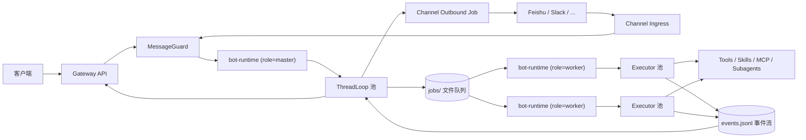
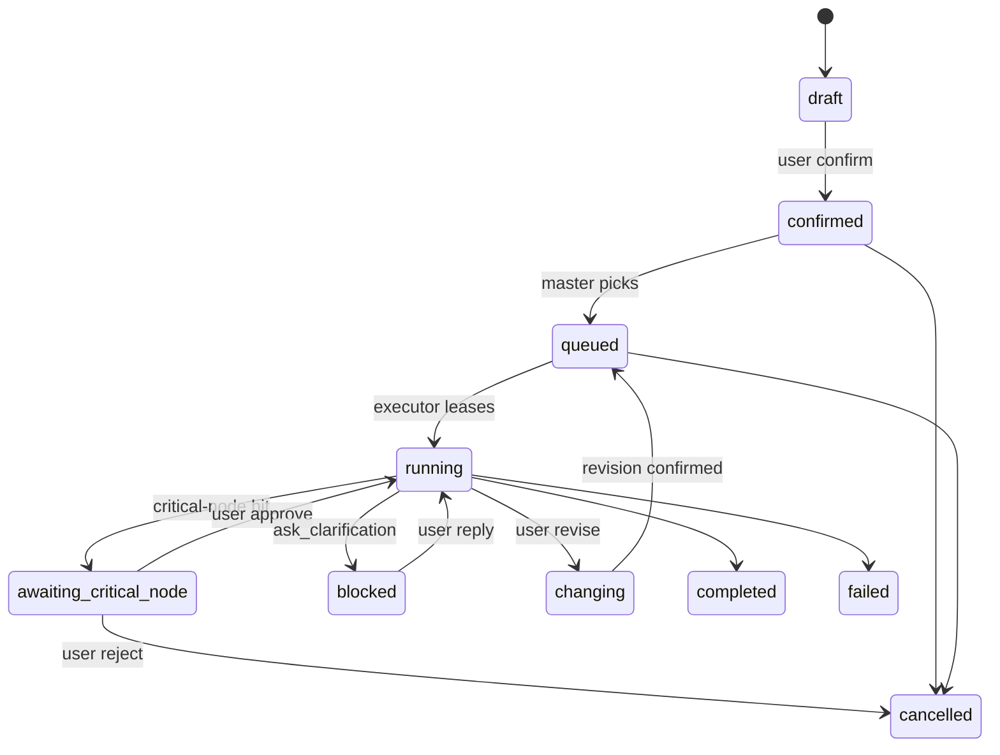

# AI 员工自动工作流系统 — 精进设计 spec

日期：2026-04-28
状态：设计已批准，待生成实现计划
来源文档：
- `requirement.md` v0.3（产品需求与边界）
- `design.md` v0.2（原架构设计）
- `design-v0.3.md`（本次 brainstorming 沉淀，含方案对比与决策依据）

> 本 spec 作为后续 implementation plan 的输入。决策依据与方案对比详见 `design-v0.3.md` 第 4 章；本文档只列**结论**与**实体**。

---

## 1. 范围与目标

### 1.1 v1 目标

构建一个具备"AI 员工"体验的自动工作流系统：

- 用户在客户端或飞书中持续沟通，系统识别意图、生成草稿任务/计划。
- 用户确认后，系统自主执行直至产出结果，仅在关键节点请示。
- 任务、计划、执行过程、产物全部持久化，进程崩溃后可恢复。
- 远程沟通渠道（飞书）作为可插拔 Provider 存在。

### 1.2 v1 非目标

- 完整企业权限 / 多租户
- DAG 工作流编排器
- 完整 Skill 市场 / 计费 / 多模型路由
- 多机部署（保留接口，v1 单机 hybrid）

### 1.3 与原文档的关系

- 原 `design.md` v0.2 的总体架构、middleware pipeline、参考项目复用结论仍然适用。
- 本 spec 在原文档基础上补齐 12 类漏洞，做差量精进，并以本 spec 内容为冲突时的最终依据。

---

## 2. 11 项核心决策

| # | 决策点 | 收敛结果 |
|---|---|---|
| 1 | 身份模型 | User 单层（不引入 Org / Tenant / Workspace） |
| 2 | 群聊确认权 | 仅发起者本人 |
| 3 | active running 并发 | 严格 1 个，其余 confirmed 任务排队 |
| 4 | TaskList vs TaskQueue | 只维护 TaskList，Queue 是 master 投影视图 |
| 5 | bot-runtime 形态 | 通用服务 + 配置化角色（master / worker / hybrid） |
| 6 | 进程内分层 | thread loop 常驻轻量 + per-task Executor 短命 |
| 7 | 变更后旧 plan/artifact | 归档可查，主视图不展示 |
| 8 | 多 channel 绑定 | 允许多绑定，`notify_bound_channel` 必须传 target |
| 9 | 消息守卫 | 规则短路 + 重点过 LLM |
| 10 | 自治原则 | 任务确认 → 自主 → 关键节点 → 结果确认；bash / skill / MCP 默认全开 |
| 11 | v1 关键节点默认清单 | 空清单 + 扩展点（CriticalNodePolicy） |

---

## 3. 架构

### 3.1 角色与进程

`bot-runtime` 是单一二进制，启动时按 `BOT_RUNTIME_ROLE` 配置切角色：

| 角色 | 进程内运行 | 用途 |
|---|---|---|
| `master` | ThreadLoop 池（per-thread actor） | 控制面 / 对话面 |
| `worker` | Executor 池（per-task actor） | 执行面 |
| `hybrid` | 上述两者 | v1 单机部署默认 |

### 3.2 进程内分层

- **ThreadLoop**：每 thread 一个常驻 actor，单线程消费该 thread 的事件队列（飞书入站、客户端入站、Executor 上报、master 通知）。负责对话、澄清、确认门禁、状态管理、向 Executor 派活、向客户端 / Channel 推流。
- **Executor**：每 running task 一个短命 actor。从 jobs 文件队列拉 task，跑 agent loop 与工具调用，写 events.jsonl，可崩可重启。

### 3.3 跨进程协调

master 与 worker 通过共享 `data/instances/<runtime-id>/state/` 协作：

- master 写 `jobs/pending/<job-id>.json` 派活
- worker lease 后移到 `jobs/locked/`，写 `lockHolder, leaseExpireAt, fencingToken`
- worker 写 `tasks/<task-id>/events.jsonl`（append-only），ThreadLoop 监听
- master 写 `tasks/<task-id>/control.json` 发中断 / 变更信号

v1 hybrid 模式：同进程内仍走文件队列以便恢复。
v2 多机：共享 NFS / S3FS / 网络盘 / RPC 替换文件队列（接口不变）。

### 3.4 系统拓扑



---

## 4. 数据模型

### 4.1 User（新增）

```ts
type User = {
  id: string
  displayName: string
  channelIdentities: {
    feishu?: { openId: string; tenantKey?: string }
    slack?: { userId: string; teamId: string }
    email?: string
  }
  createdAt: string
  updatedAt: string
}
```

### 4.2 Thread

```ts
type Thread = {
  id: string
  ownerUserId: string                 // 新增
  title: string
  status: "chatting" | "planning" | "waiting_confirmation" | "working" | "blocked" | "idle"
  taskListId: string
  activeTaskId?: string
  draftTaskId?: string
  draftPlanId?: string
  channelBindingIds: string[]         // 新增；多绑定数组
  contextSummary?: string
  createdAt: string
  updatedAt: string
}
```

### 4.3 Task

```ts
type Task = {
  id: string
  threadId: string
  ownerUserId: string                 // 新增；= 发起者
  confirmedByUserId?: string          // 新增；必须 = ownerUserId
  title: string
  description: string
  status: "draft" | "confirmed" | "queued" | "running" | "awaiting_critical_node"
        | "blocked" | "changing" | "completed" | "failed" | "cancelled"
  sourceMessageIds: string[]
  planId?: string
  activePlanRevisionId?: string
  assignedRuntimeId?: string
  assignedExecutorId?: string         // 新增
  budget?: TaskBudget                 // 新增
  artifactIds: string[]
  changeRecordIds: string[]
  archivedRevisionIds: string[]       // 新增
  createdAt: string
  updatedAt: string
}

type TaskBudget = {
  maxDurationMs?: number
  maxTokens?: number
  maxSubagents?: number
  maxCostUsd?: number
}
```

默认预算：`maxDurationMs=4h, maxTokens=1M, maxSubagents=8`。

### 4.4 Plan

```ts
type Plan = {
  id: string
  taskId: string
  status: "draft" | "pending_confirmation" | "active" | "revising" | "superseded" | "completed"
  objective: string
  steps: PlanStep[]
  expectedArtifacts: string[]
  revisionIds: string[]
  createdAt: string
  updatedAt: string
}

type PlanStep = {
  id: string
  title: string
  description?: string
  status: "pending" | "in_progress" | "completed" | "blocked" | "skipped" | "superseded" | "failed"
  startedAt?: string
  completedAt?: string
  evidence?: string[]
}
```

### 4.5 PlanRevision（新增）

```ts
type PlanRevision = {
  id: string
  planId: string
  taskId: string
  status: "active" | "superseded"
  fullPlan: Plan                       // v1 全量快照，不做 patch
  reason: string
  sourceMessageId: string
  archivedArtifactPaths: string[]      // outputs/_archive/<rev>/ 下文件
  supersededAt?: string
  createdAt: string
}
```

变更链：线性，按时间编号；不允许从历史 revision 分支。

### 4.6 GuardDecision

```ts
type GuardDecision = {
  id: string
  messageId: string
  threadId: string
  fromUserId?: string                  // 新增
  source: "client" | "lark_private" | "lark_group" | "slack" | "..."
  intent:
    | "chat" | "new_task" | "task_update" | "plan_update"
    | "confirm_task" | "confirm_plan" | "progress_query"
    | "cancel_task" | "irrelevant"
  targetTaskId?: string
  targetPlanId?: string
  shortCircuited: boolean              // 新增；是否走规则短路
  ruleHits: string[]                   // 新增；命中规则 id
  confidence: number
  requiresUserConfirmation: boolean
  reason: string
  createdAt: string
}
```

### 4.7 ChannelConfig 与 ChannelBinding

```ts
type ChannelConfig = {
  provider: "feishu" | "slack" | "wecom" | "email" | "custom"
  enabled: boolean
  ingress: {
    webhookEnabled?: boolean
    longConnectionEnabled?: boolean
  }
  publicFields: Record<string, string | boolean | number>
  secretRefs: Record<string, string>
  createdAt: string
  updatedAt: string
}

type ChannelBinding = {
  id: string
  threadId: string
  provider: string
  externalConversationId?: string
  externalConversationType: "dm" | "group" | "topic"
  status: "binding" | "bound" | "unbinding" | "failed" | "disabled"
  createdBy: "client" | "guardian" | "runtime" | "admin"
  enabled: boolean                     // 新增
  notifyDefault: boolean               // 新增；notify target=all 时是否包含
  createdAt: string
  updatedAt: string
}
```

约束：同一 `(provider, externalConversationId)` 默认只能绑一个 thread；反向不防（一个 thread 可有多个外部 chat）。

### 4.8 ChannelInboundEvent / ChannelJob

```ts
type ChannelInboundEvent = {
  id: string
  provider: string
  externalEventId: string
  externalMessageId?: string
  status: "received" | "processed" | "skipped" | "failed"
  payloadRef: string
  createdAt: string
  processedAt?: string
}

type ChannelJob = {
  id: string
  provider: string
  type: "create_conversation" | "delete_conversation" | "send_message"
  status: "pending" | "running" | "succeeded" | "failed" | "dead"
  dedupeKey?: string
  payload: Record<string, unknown>
  result?: Record<string, unknown>
  attemptCount: number
  lastError?: string
  runAfter: string
  createdAt: string
  updatedAt: string
}
```

### 4.9 CriticalNodePolicy（新增）

```ts
type CriticalNodePolicy = {
  id: string
  scope: "global" | "user" | "thread" | "skill"
  matcher: NodeMatcher
  action: "require_approval" | "block" | "log_only"
  ownerUserId: string
  enabled: boolean
  createdAt: string
}

type NodeMatcher =
  | { kind: "tool"; toolName: string; argMatch?: Record<string, unknown> }
  | { kind: "external_io"; direction: "outbound"; provider?: string }
  | { kind: "filesystem"; op: "delete" | "overwrite"; minCount?: number }
  | { kind: "budget_overflow"; dim: "time" | "tokens" | "subagents" | "cost" }
  | { kind: "out_of_scope"; planRevisionId: string }
```

加载顺序：global → user → thread → skill，后者覆盖前者。
v1 默认值：空数组。

### 4.10 ExecuteTaskJob 与 TaskControl（新增）

```ts
type ExecuteTaskJob = {
  id: string
  type: "execute_task"
  taskId: string
  threadId: string
  planRevisionId: string
  assignedAt: string
  fencingToken: number
  budget?: TaskBudget
}

type TaskControl = {
  signal?: "pause" | "resume" | "cancel" | "revise"
  revisionId?: string
  signalAt: string
  signalFencingToken: number
}
```

---

## 5. 文件系统结构

```text
data/
  instances/
    <runtime-id>/
      .lock                              # 单进程独占（v1 hybrid）
      .runtime-info.json                 # role, version, startedAt, fencingTokenSeed
      state/
        users/<user-id>.json
        threads/
          <thread-id>/
            thread.json
            transcript.jsonl
            guard-decisions.jsonl
            context/
              THREAD.md
              SUMMARY.md
              MEMORY.md
            drafts/
              task-draft.json
              plan-draft.json
            tasks/
              <task-id>/
                task.json
                plan.json                # 当前 active revision 的快照
                plan-revisions/<revision-id>.json
                events.jsonl             # Executor 写、ThreadLoop 读
                control.json             # ThreadLoop 写、Executor 读
                logs/
                context/                 # task 级上下文
                user-data/
                  workspace/             # bash 默认工作目录
                  uploads/
                  outputs/
                    _archive/<revision-id>/  # 旧 artifact 归档
        bindings/
          <thread-id>/<channel-type>/<binding-id>/
            active.json
            history/
        chat-claims/<channel-type>/<external-chat-id>
        channels/<channel-type>.json
        channel-messages/<channel-type>/_idx
        critical-node-policies/<policy-id>.json
        jobs/
          pending/<job-id>.json
          locked/<job-id>.json
          done/<job-id>.json
          failed/<job-id>.json
          dedupe/<dedupe-key>
        webhooks/<channel-type>/<event-id>.json
        _index/
      workspace/                         # runtime 级公共 workspace（罕用）
  skills/
    public/
    custom/
```

---

## 6. 状态机

### 6.1 Task



### 6.2 Plan / Thread

- Plan 状态保持原 design.md v0.2 第 7.2 节定义；新增 PlanRevision 概念。
- Thread 状态保持原 v0.3 第 7.3 节定义。

### 6.3 确认门禁不变量

任何正式执行必须满足：

- `task.confirmedByUserId === task.ownerUserId`
- `task.status ∈ {confirmed, queued}`
- `plan.status === active`
- 存在对应的 `GuardDecision { intent: confirm_task, fromUserId: ownerUserId }`

---

## 7. 工作流

### 7.1 新消息进入（含规则短路）

```
inbound → channel ingress (verify, idempotency, normalize)
       → MessageGuard
            ├─ 阶段 1: 确定性规则
            │    - 已绑群: 仅 @bot / 回复 bot / slash 命令 / pending confirmation 时进阶段 2
            │    - 未绑群: 完全 ignore，写 transcript（除 Guardian 创建/绑定流程命令）
            │    - 飞书私聊 / 客户端: 直接进阶段 2
            ├─ 阶段 2: LLM 结构化分类（intent, target, confidence, reason）
            └─ 输出 GuardDecision (含 shortCircuited 与 ruleHits)
       → ThreadLoop 事件队列（per-thread 单线程消费）
```

### 7.2 从对话生成任务

1. ThreadLoop 收到 `intent=new_task`，进入沟通澄清。
2. 生成 draft task + draft plan。
3. 写 `drafts/task-draft.json`、`drafts/plan-draft.json`。
4. 推送给客户端 / 已绑 channel。
5. 等待 owner user 的 `confirm_task` GuardDecision。
6. 确认后 task.status → `confirmed`，写入 TaskList。
7. master ThreadLoop 投影队列视图，写 `jobs/pending/<job-id>.json`。
8. worker Executor lease，task.status → `running`。

### 7.3 执行任务

Executor loop：

```
load thread/task/plan/context
loop:
  read events.jsonl tail + control.json
  if control.signal == cancel: write executor_finished{cancelled}; exit
  if control.signal == pause: write executor_paused; release lock; wait
  if control.signal == revise: load new revision; reset task ctx; continue
  call LLM (messages + prompt + tools)
  for each tool_call:
    evaluate CriticalNodePolicy
      if hit & action=require_approval:
        write critical_node_hit; task.status=awaiting_critical_node; pause
      if hit & action=block: write event; skip tool_call
    schema validate; guardrail check
    execute tool (按并发安全性分批)
    write tool_call + tool_result events
  update plan steps; write events
  if terminal: break
write executor_finished{outcome, summaryRef}
```

### 7.4 执行中变更

```
guard intent=task_update / plan_update
  → ThreadLoop 写 control.json signal=pause
  → Executor 完成当前工具调用 → 写 executor_paused
  → ThreadLoop 生成新 PlanRevision (full rewrite)
  → 旧 active artifact 移到 outputs/_archive/<oldRevisionId>/
  → 走 task confirmation 门禁（owner user 确认）
  → 用户确认后 ThreadLoop 写 control.json signal=revise + new revisionId
  → Executor 加载新 revision、重置 task ctx → 继续 loop
```

### 7.5 任务完成

1. Executor 写 `executor_finished{outcome: completed, summaryRef}`。
2. ThreadLoop 把摘要回写 thread context（`SUMMARY.md` 增量）。
3. task.status → `completed`，thread.status → `chatting`。
4. 推送结果给客户端 / 已绑 channel。
5. 等待 owner user 确认结果或开新任务。

---

## 8. 流式协议

- **主通道**：SSE，路径 `/api/threads/{id}/events?cursor=<lastEventId>`
- **备用通道**：WebSocket（v2）
- **事件源**：`tasks/<task-id>/events.jsonl` + thread 级广播；按时间戳合并
- **续传**：客户端带 `cursor=<lastEventId>`，服务端从该 id 之后的事件回放（events.jsonl 提供 fileOffset 索引）
- **事件分类**（沿用 deer-flow 三分类）：
  - `messages`：对话 token 流
  - `values`：thread/task/plan 状态快照
  - `custom`：业务事件（task_started / plan_revised / guard_decision / critical_node_hit / ...）

---

## 9. 故障恢复

### 9.1 Lock 与 fencing token

- v1 hybrid：进程启动获取 `.lock`（flock），读 `.runtime-info.json` 中 `fencingTokenSeed`，每次派 job `++fencingToken`。
- 进程崩溃：`.lock` 自然释放；新进程检测 `.runtime-info.json.lastSeenAt`，超过 lease（默认 30s）视为前任已死，递增 `fencingTokenSeed`。
- 多机：`.lock` 由共享存储锁实现；fencing token 防 stale worker 写入。

### 9.2 重启扫描流程

```
on bot-runtime startup:
  1. 锁 .lock，加载 .runtime-info.json
  2. 扫 jobs/locked/，对每个 job:
       - leaseExpireAt 已过 → 移到 failed/，task.status 回 confirmed
       - 否则保留
  3. 扫 webhooks/，清理 N 天前的 dedupe
  4. 扫 chat-claims/，对应 binding/thread/task 不存在 → 标 orphan
  5. 扫 tasks/，status=running 但无活跃 lease → 标 blocked
  6. 启动 ThreadLoop / Executor 池（按 role）
```

### 9.3 in-flight tool call 处理

Executor 加载 events.jsonl，最后一条是 `tool_call` 但无匹配 `tool_result`：

- 只读工具：直接重做。
- 写工具：哈希对比目标文件，有变化跳过、无变化重做。
- 不可幂等（如对外发消息）：标 task.status=blocked，等用户介入。

---

## 10. 安全与沙箱

### 10.1 自治原则

```
[task 草稿] → user 确认 → [自主执行] → 命中关键节点 → user 审批 → 继续 → [结果] → user 确认 → done
```

v1 不强制任何关键节点拦截；保留 CriticalNodePolicy 扩展点。

### 10.2 工具权限

- `bash`：默认启用，工作目录 = `tasks/<task-id>/user-data/workspace/`，不限命令白名单；写入限制由包装的 fs API 拒绝（不靠 OS 权限）。
- `read_file / write_file / list_dir / str_replace`：默认启用。
- `present_files / ask_clarification / confirm_task / confirm_plan / update_task / update_plan / task (subagent) / tool_search`：默认启用。
- 新增 `confirm_critical_node`：命中策略时调用，挂起 task 等待审批。
- 新增 `notify_bound_channel(target, message, importance)`：target 必须显式（`'all'` / `{provider}` / `{bindingId}`）。

### 10.3 Skill 与 MCP

- Skill：默认全量加载 `skills/public/` 与 `skills/custom/`，仅过 schema 校验；不做 trust list（v1）。
- MCP：默认可启用，按 `instances/<runtime-id>/state/mcp/<mcp-id>.json` 配置加载，权限继承本地进程。

### 10.4 Secret / PII 脱敏

- transcript / events.jsonl / 日志写入前过 `sanitize()`：检测 Lark token / Slack token / API key / email / phone → 替换为 `<redacted:secret>` / `<redacted:pii>`。
- 不影响内存中 LLM 上下文。

---

## 11. 观测与审计

- **结构化日志**：JSON，字段 `runtimeId, role, threadId, taskId, executorId, fencingToken, eventKind, durationMs`。
- **Trace**：OpenTelemetry，`traceparent` 写入 `jobs/<job-id>.json`，跨 master/worker 透传。
- **指标**：
  - `task_{created,confirmed,completed,failed}_total`
  - `executor_active_count` (gauge)
  - `guard_short_circuit_ratio` (counter / counter)
  - `critical_node_hit_total` (labeled by policy)
  - `tool_call_duration_ms` (histogram, labeled by tool)
- **审计依据**：`guard-decisions.jsonl` + `events.jsonl` + `task.json` 历史。

---

## 12. 测试与评测

### 12.1 单元 / 集成

- 数据模型 schema validation：100%
- 文件系统状态库 read/write/index：覆盖正常 + 并发 + 部分写入
- ChannelProvider 接口：每 provider 必有正常 + 错误 + 幂等 + 限流
- 状态机：每条转移路径必有测试

### 12.2 端到端

- Mock 飞书 webhook 触发完整 inbound → guard → confirm → execute → outbound
- runtime 重启恢复测试：注入 kill 后启动新进程，断言 task 继续

### 12.3 Agent eval（强制）

三条关键路径：

1. **MessageGuard eval**：200 条样本，intent 一致率 ≥ 90%
2. **TaskConfirmation eval**：50 条草稿样本，确认/拒绝/修改信号正确驱动状态机
3. **PlanRevision eval**：30 个变更场景，revision 生成合理、旧 artifact 正确归档

eval 结果落 `tests/evals/results/<date>/`。

---

## 13. v1 验收标准

在 `requirement.md` v0.3 第 16 章 9 条基础上新增 3 条：

1. 用户在一个 thread 中连续对话。
2. 系统识别用户提出的是新任务还是普通沟通。
3. 系统生成草稿 task 和草稿 plan。
4. 用户确认后，task 进入 TaskList。
5. runtime 开始执行 active task。
6. 客户端能看到任务状态、计划步骤、执行日志和产物。
7. 用户在执行中提出变更，系统能记录变更并重新规划。
8. task 完成后，系统回到沟通状态并等待下一个任务。
9. runtime 重启后，thread、task、plan、transcript 和 artifact 不丢失。
10. **同一 webhook event id 重复投递时，inbound 幂等只产生一次 GuardDecision。**
11. **bot-runtime 进程被强杀（kill -9）后重启，已确认任务在不超过 60 秒内自动恢复执行；in-flight tool call 按幂等策略处理。**
12. **CriticalNodePolicy 配置生效不需要重启服务；新增一条 `kind: external_io, action: require_approval` 后，下次外发动作自动走审批。**

---

## 14. 工程默认值

| 项 | 默认值 |
|---|---|
| Executor 中断方式 | graceful（等当前工具完成）+ 60s 超时强杀 |
| ThreadLoop ↔ Executor 通信 | 文件队列 `jobs/` + `events.jsonl` 流 + per-thread 内存事件总线 |
| 客户端流式 | SSE，cursor 续传 |
| Lock | flock（v1 hybrid）/ NFS lock 或 Redis lease（v2 多机） |
| Lease 时长 | Executor 30s 心跳，60s 失效 |
| Fencing token | 单调递增整数，源于 `.runtime-info.json` |
| Task 默认预算 | maxDurationMs=4h, maxTokens=1M, maxSubagents=8 |
| 双重确认幂等 | confirmation 携带 nonce + 状态机检查（已 confirmed 状态忽略二次 confirm） |
| 确认超时 | v1 不超时，由用户主动取消 |
| Plan revision 形态 | full rewrite |
| Plan revision 链 | 线性，按时间编号 |
| Notify target 默认 | `'all'`，但 LLM prompt 鼓励显式选 |
| MessageGuard LLM | 结构化 JSON 输出，温度 0；fallback 退化为纯规则 |
| transcript 脱敏 | 写入前 regex sanitize |
| 日志格式 | JSON，带 runtimeId / role / threadId / taskId / fencingToken |
| Trace 透传 | OTel traceparent 写进 `jobs/<job-id>.json` |
| 测试覆盖 | 数据模型 schema 100%；状态机每条转移；三条关键路径强制 agent eval |

---

## 15. 命名一致性

| 旧术语 | 新术语 | 说明 |
|---|---|---|
| LarkBot（产品概念） | LarkBot（保留） | 仅作产品概念词，不出现在工程代码 |
| LarkBot（工程术语） | Feishu Provider | 工程层面统一叫 provider |
| bot-runtime-master | bot-runtime (role=master) | 不再独立组件，是角色 |
| bot-runtime（执行面） | bot-runtime (role=worker / hybrid) | 角色化 |
| Channel Gateway | Channel Ingress | 与 Outbound 对偶 |
| Control Plane | master role 的 ThreadLoop 池 | 同义合并 |
| TaskQueue（数据） | （删除） | 改为 master 投影视图，不写盘 |
| TaskQueue（口语） | "调度视角的任务队列" | 仍可口语用 |
| ThreadAgent | ThreadLoop | 实现层正式命名 |

---

## 16. 待确认与后续

### 16.1 v0.3 第 15 章原 10 条问题处置

| 原问题 | 处置 |
|---|---|
| #1 第一版是否多 runtime | 单 runtime（hybrid），接口预留多 worker 注册 |
| #2 taskList vs taskQueue 拆不拆 | 不拆，只 TaskList |
| #3 用户确认形式 | 文本 + 按钮都支持，按 channel 适配 |
| #4 LarkBot v1 是否必须接入 | 必须 |
| #5 workspace 是否暴露 | 客户端只展示 outputs/ 与摘要 |
| #6 skill 第一版加载 | 本地文件夹 |
| #7 消息守卫规则 + LLM | 规则短路 + 重点过 LLM |
| #8 旧 artifact 是否标废 | 归档可查 |
| #9 多 active task | 严格 1 |
| #10 task 完成自动下一个 | 否，需要用户确认 |

### 16.2 v0.4 候选

- 多机部署（master / worker 物理分离 + 共享存储 / RPC）
- Plan revision 支持 patch
- 关键节点策略图形化配置
- Skill trust list / 签名 / 沙箱
- Agent eval CI 自动化
- 数据保留与清理（GDPR / 磁盘满）
- prompt 版本化
- 模型路由 / fallback / 速率限制
- 国际化

---

## 17. 实施起点

后续 implementation plan 应按以下顺序展开第一阶段：

1. 文件系统状态库：runtime workspace、`.lock`、fencing token、jobs/、events.jsonl 基础设施
2. 数据模型 schema：User / Thread / Task / Plan / PlanRevision / GuardDecision / ChannelBinding / CriticalNodePolicy
3. ThreadLoop 单进程实现（hybrid role）
4. Executor 单进程实现 + 文件队列协议
5. MessageGuard：规则短路 + LLM 结构化分类
6. 通用 Channel 子系统：ChannelProvider 接口、ChannelIngress、ChannelOutboundJobRunner
7. Feishu Provider 第一版：webhook + 长连接、文本消息、群聊路由、脱敏配置 API
8. 客户端最小可视化：thread 对话、TaskList、active task、plan、artifact、SSE event 流
9. 三条关键路径 agent eval
10. v1 验收 12 条端到端测试

---

## 附录 — 决策依据

详见 `design-v0.3.md` 第 4 章（11 项决策的方案对比与推荐理由），以及该文档第 9 章的命名一致性约定与附录 A 决策卡片速查。
