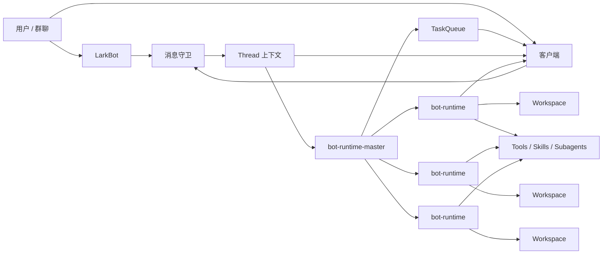

# AI 自动工作流系统需求文档

版本：0.3
日期：2026-04-28
状态：参考项目分析后更新稿，补充 `xuedian` 飞书通道能力

## 1. 背景与目标

本系统目标是创建一个具备“AI 员工 / AI 同事”体验的自动工作流系统，而不是远程使用一个一次性的 vibe coding 工具。

系统由客户端和服务器端组成：

- 客户端负责对话展示、任务查看、过程可视化和人工确认。
- 服务器端核心为 `bot-runtime`，其中 `bot-runtime-master` 是调度与协调核心。
- `bot-runtime` 不是单纯的 worker 进程，而是带有工作区、上下文、任务、计划、技能和沟通能力的智能化机器人。

用户可以通过连续对话提出需求，系统通过消息守卫识别意图，形成待确认的任务和计划。只有用户确认后，任务才会进入正式任务列表并由 `bot-runtime` 开始执行。

## 2. 参考项目边界

当前仓库中的以下目录作为参考项目，不作为本需求直接改造对象：

- `claude-code-analysis/`：参考 Claude Code 的 agent loop、tool call、subagent、multi-agent、skills、context、session、message guard、安全与持久化机制。
- `deer-flow/`：参考客户端产品形态、workspace、thread、agent、task、artifact、可视化与应用层组织方式。
- `/Users/eeo/code/xuedian`：参考 `servers/bot-runtime` 的文件系统持久化、飞书 channel、消息入口、绑定、异步出站 job、Guardian 和 `apps/chat` 的飞书配置客户端能力。该项目作为实现细节参考，不直接复用为最终架构。

## 3. 产品定位

系统要呈现“AI 员工”的工作方式，核心体验包括：

- 有自己的工作区，而不是每次临时启动。
- 有持续上下文，能记住一个 thread 内的任务、计划、沟通记录和产物。
- 能理解模糊需求，并主动澄清、拆解、规划。
- 能维护任务列表、当前任务和每个任务的执行计划。
- 能在计划确认后开始执行，而不是擅自启动未确认工作。
- 能在执行中汇报进度、阻塞点、风险和下一步。
- 能处理任务或计划变更，并保留变更记录。
- 能接入远程沟通渠道，例如飞书 bot 和群聊。
- 远程沟通渠道是可插拔能力，飞书只是第一种 channel provider，必须可开关、可替换、可复用。
- 能被 prompt、skills 和基础能力配置影响，形成稳定的工作风格和能力边界。

## 4. 核心概念

### 4.1 bot-runtime-master

`bot-runtime-master` 是系统控制面，负责：

- 管理多个 `bot-runtime` 实例。
- 根据 thread、任务队列和 runtime 状态进行调度。
- 分发任务给合适的 `bot-runtime`。
- 汇总 runtime 进度、状态、产物和异常。
- 管理基础能力、skills、prompt 和运行策略。

### 4.2 bot-runtime

`bot-runtime` 是拟人化的智能机器人执行单元。它拥有自己的 workspace，并通过 agent loop 执行工作。

一个 `bot-runtime` 应具备：

- 独立 workspace。
- 文件系统读写能力。
- 持久化状态。
- 临时文件区。
- 任务计划文件。
- 执行日志 / transcript。
- artifact 输出目录。
- tool call 能力。
- subagent / worker 派生能力。
- 由 prompt 和 skills 影响的行为方式。

`bot-runtime` 可以多服务器部署。系统不能假设只有一个 runtime 进程。

### 4.3 Skill

`skill` 是可插拔能力包，不只是工具列表。

一个 skill 可以包含：

- 人设或角色风格。
- 工作流程。
- 特定领域能力。
- 可用工具说明。
- 执行约束。
- 产物格式。
- 质量标准。

`bot-runtime` 的行为应该受 prompt 和 skills 共同影响。

### 4.4 Thread

`thread` 是对话、任务、计划和上下文的核心容器。

一个 thread 负责保护自己的上下文，避免不同群聊、不同任务、不同用户意图互相污染。

thread 应维护：

- 对话消息。
- taskList。
- active task。
- 草稿 task / 草稿 plan。
- thread 级上下文。
- 任务相关文件和产物索引。
- 远程沟通渠道关联关系。

群聊默认对应一个 thread。飞书 bot 私聊或其他入口也可以根据关联规则映射到 thread。

### 4.5 TaskList / TaskQueue

`taskList` 是 thread 下已经确认的任务清单。
`taskQueue` 是 runtime 或 master 视角下等待执行、执行中、已完成或失败的任务队列。

需求上建议区分：

- `taskList`：面向用户和 thread，表达“这个 thread 中确认要做什么”。
- `taskQueue`：面向调度和执行，表达“runtime/master 当前如何排队和执行”。

一个 thread 必须维护一个 active task，用于表达当前正在沟通或执行的任务焦点。

### 4.6 Task

`task` 是用户确认后的工作单元。

task 至少包含：

- task id。
- thread id。
- 标题。
- 描述。
- 来源消息。
- 当前状态。
- 当前 plan id。
- 变更记录。
- 执行 runtime id。
- 产物列表。
- 错误和阻塞信息。

### 4.7 Plan

每个 task 都有自己的 plan。

plan 用于描述：

- 任务目标。
- 执行步骤。
- 子任务。
- 当前进度。
- 依赖和阻塞。
- 预期产物。
- 变更历史。

用户未确认前，plan 只能作为草稿存在。用户确认后，plan 才能绑定到正式 task 并进入执行。

### 4.8 LarkBot

`larkbot` 是远程沟通入口之一，负责接收飞书消息并把消息交给消息守卫处理。

产品概念上可以继续叫 `larkbot`，但工程实现上不应把飞书逻辑写死在 runtime 主流程中。飞书应作为 `ChannelProvider` 插件存在：

- 可以独立启用或禁用。
- 可以配置 webhook 或长连接入口。
- 可以被不同 thread 绑定和复用。
- 可以替换为企业微信、Slack、邮件等其他 provider。
- runtime 只调用通用通知能力，不直接依赖飞书 API。

需要识别：

- 消息来自飞书 bot 私聊。
- 消息来自群聊。
- 消息属于已有 thread。
- 消息需要创建新 thread。
- 消息只是沟通，不应触发任务。

### 4.9 消息守卫

消息守卫是进入 runtime 前的意图识别和安全边界。

消息守卫负责：

- 判断消息来源。
- 建立或命中 thread 关联关系。
- 判断消息意图。
- 判断是否需要生成 task。
- 判断是否需要生成或修改 plan。
- 判断是否是对当前 task / plan 的确认。
- 判断是否是查询进度、反馈、打断、变更或无关消息。
- 防止错误上下文进入 thread。

## 5. 系统架构



## 6. 核心工作流

### 6.1 新消息进入

1. 用户在客户端、飞书 bot 私聊或群聊中发送消息。
2. `larkbot` 或客户端服务接收消息。
3. 消息进入消息守卫。
4. 消息守卫识别来源、用户、群聊和意图。
5. 系统根据关联关系命中已有 thread，或创建新 thread。
6. 消息被追加到 thread 上下文。

### 6.2 从对话生成任务

1. 用户提出需求。
2. 消息守卫判断该消息可能形成任务。
3. runtime 进入沟通和澄清阶段。
4. 系统生成候选 task 和候选 plan。
5. 候选 task / plan 以草稿态展示给用户。
6. 用户确认前，不允许加入正式 taskList。
7. 用户确认后，task 进入 thread.taskList，并成为 active task。
8. master 将 task 放入 taskQueue，调度 runtime 执行。

### 6.3 执行任务

1. runtime 读取 task、plan、thread 上下文和 workspace。
2. runtime 进入 loop：
   - 读取当前状态。
   - 根据 prompt、skills 和上下文推理下一步。
   - 调用工具。
   - 可派生 subagent。
   - 记录结果。
   - 更新 plan 步骤状态。
   - 输出进度事件。
3. 客户端展示执行过程、状态、工具调用、产物和阻塞点。
4. task 完成后，runtime 生成结果摘要并回到沟通状态。

### 6.4 执行中变更

当任务未完成或做到一半时，用户可能提出变更。

系统需要：

- 判断消息是否属于当前 active task 的变更。
- 暂停或调整当前执行。
- 记录变更原因、来源消息和时间。
- 标记旧 plan 的废弃步骤或受影响步骤。
- 生成新 plan 或 plan revision。
- 请求用户确认变更后的 task / plan。
- 确认后继续执行。

不能静默覆盖旧计划，因为旧计划可能已经产生中间文件、废弃子任务和需要解释的执行成本。

### 6.5 任务完成后

1. runtime 向用户汇报 task 结果。
2. thread 进入沟通状态。
3. 系统询问或等待用户确认：
   - 是否接受结果。
   - 是否需要修订当前 task。
   - 是否进入下一个 task。
   - 是否没有后续任务。
4. 如果还有已确认任务，taskQueue 继续调度。

## 7. 状态模型

### 7.1 Task 状态

建议 task 状态包括：

- `draft`：草稿，尚未确认。
- `confirmed`：已确认，等待进入队列。
- `queued`：已进入队列，等待 runtime 执行。
- `running`：执行中。
- `blocked`：等待用户反馈或外部条件。
- `changing`：执行中发生变更，等待重新规划或确认。
- `completed`：已完成。
- `failed`：执行失败。
- `cancelled`：用户取消。

### 7.2 Plan 状态

建议 plan 状态包括：

- `draft`：草稿计划。
- `pending_confirmation`：等待用户确认。
- `active`：正在执行。
- `revising`：重新规划中。
- `superseded`：已被新版本替代。
- `completed`：计划完成。

### 7.3 Thread 状态

建议 thread 状态包括：

- `chatting`：普通沟通中。
- `planning`：正在形成 task / plan。
- `waiting_confirmation`：等待用户确认。
- `working`：已有 active task 正在执行。
- `blocked`：等待用户补充或外部资源。
- `idle`：无活跃任务。

## 8. 持久化与文件系统要求

`bot-runtime` 基于宿主机磁盘工作。本地开发和线上部署都应使用宿主机文件系统保存 workspace 数据。

基本要求：

- runtime 重启后数据不丢失。
- 服务重新部署后数据不丢失。
- 通过稳定 id 建立关联关系。
- 文件系统中的数据可检查、可恢复、可追踪。
- 临时文件和持久文件需要分区。

建议 ID 包括：

- runtime id。
- workspace id。
- thread id。
- taskList id。
- taskQueue id。
- task id。
- plan id。
- plan revision id。
- skill id。
- artifact id。
- remote channel id。

建议 workspace 结构：

```text
workspaces/
  <runtime-id>/
    runtime.json
    threads/
      <thread-id>/
        thread.json
        transcript.jsonl
        context/
        tasks/
          <task-id>/
            task.json
            plan.json
            revisions/
            logs/
            artifacts/
        drafts/
        temp/
    skills/
    artifacts/
    logs/
```

参考 `xuedian` 的 `bot-runtime`，更贴近部署的实例级结构应补充：

```text
data/
  instances/
    <runtime-id>/
      .lock
      .runtime-info.json
      state/
        threads/<thread-id>/...
        bindings/<thread-id>/<channel-type>/
        chat-claims/<channel-type>/<external-chat-id>
        channels/<channel-type>.json
        channel-messages/<channel-type>/
        jobs/{pending,locked,done,failed,dedupe}/
        webhooks/<channel-type>/<event-id>.json
        _index/
      workspace/
```

要求：

- `runtime-id` 必须稳定，作为实例目录和重启恢复依据。
- 同一个 `runtime-id` 同时只能有一个进程持有锁。
- channel 配置、绑定、消息、webhook 去重、出站 job 都必须落盘。
- 重启时需要恢复 locked job、清理过期 dedupe、重建索引、修复孤儿 chat claim。

## 9. 上下文管理要求

thread 必须保护自己的上下文。

上下文至少分为：

- thread 级上下文：长期沟通、群聊语境、用户约定。
- task 级上下文：当前任务目标、输入、计划、产物。
- plan 级上下文：步骤、进度、变更和执行结果。
- runtime 工作上下文：工具调用结果、临时文件、当前工作状态。
- 远程消息上下文：飞书消息、群聊、用户身份和消息来源。

上下文管理需要支持：

- 不同 thread 隔离。
- 当前 active task 优先。
- 任务完成后沉淀摘要。
- 长对话压缩。
- 重要信息持久化。
- 临时上下文过期或清理。
- 变更记录可追踪。

## 10. 客户端需求

客户端主要负责沟通和可视化，不承担核心智能执行。

第一版客户端应包含：

- 对话视图：展示用户、runtime、larkbot 同步过来的消息。
- thread 视图：查看 thread 当前状态、上下文摘要和关联入口。
- taskList 视图：展示当前 thread 的任务清单。
- active task 视图：展示当前正在沟通或执行的任务。
- plan 视图：展示任务计划、步骤状态和变更记录。
- runtime 过程视图：展示工具调用、subagent、日志、产物和阻塞点。
- 确认交互：确认 task、确认 plan、确认变更、取消或暂停任务。
- channel 配置视图：至少支持飞书启用/禁用、App ID、Bot 名称、Operator Open ID、Secret 配置状态。
- Secret 安全展示：客户端查询配置时只能看到 `hasSecret` 这类布尔状态，不能回显 Secret 明文。

客户端体验重点是让用户看到 AI 员工的工作内容和进度。

## 11. bot-runtime 执行能力

`bot-runtime` 核心是可调用工具的 agent loop。

loop 能力包括：

- 读取 thread、task、plan 和 workspace。
- 基于 prompt 和 skills 决策下一步。
- 调用工具。
- 创建或调用子 agent。
- 写入文件系统。
- 更新任务和计划状态。
- 生成中间产物。
- 处理失败和重试。
- 产生可观测事件。
- 在需要用户确认时暂停。

基础能力建议内置：

- 文件读写。
- 命令执行。
- 文本生成和总结。
- 计划生成。
- 任务状态更新。
- artifact 管理。
- 子 agent 调度。
- 上下文压缩。
- 消息发送。

## 12. 远程沟通与消息守卫

系统需要接入远程沟通能力，第一优先级是 `larkbot`。

飞书能力必须被实现为通用 channel 系统的一种 provider，而不是散落在业务逻辑里的特例。

### 12.1 通用 Channel 能力要求

每个 channel provider 至少需要提供：

- 配置管理：启用/禁用、凭据保存、凭据脱敏读取。
- 入站入口：webhook、长连接或轮询。
- 入站校验：签名、challenge、时间窗口、来源合法性。
- 消息归一化：把平台消息转成统一 `InboundMessage`。
- 幂等处理：按 provider event id / message id 防止重复处理。
- 会话绑定：external chat/topic 与 thread 的一对一或多对一关联规则。
- 出站发送：通过异步 job 发送消息，避免阻塞 runtime loop。
- 出站记录：记录平台 message id，用于防止机器人回复触发循环。
- 可观测状态：配置状态、绑定状态、job 状态、错误原因。

飞书 provider 第一版应支持：

- Bot 私聊。
- 群聊。
- webhook URL verification。
- `x-lark-request-*` 签名校验。
- `im.message.receive_v1` 文本消息。
- 长连接作为可选入口。
- 创建群、删除群、发送文本消息。
- 已绑定群中仅在 `@bot` 或回复 bot 消息时路由到业务 thread。

消息守卫应处理以下意图：

- 新任务。
- 当前任务补充。
- 当前任务变更。
- 当前计划确认。
- 当前计划反对或修改。
- 查询进度。
- 反馈执行结果。
- 取消任务。
- 切换任务。
- 普通闲聊或无关消息。

消息守卫必须建立以下关联：

- 飞书 tenant / app 与系统实例。
- 飞书用户与系统用户。
- 飞书群聊与 thread。
- 飞书 bot 私聊与 thread。
- 消息与 thread。
- 消息与 task / plan / change record。

补充要求：

- 未绑定群消息不能直接进入业务 thread，只能进入 Guardian / 消息守卫控制面。
- 飞书 bot 私聊可以作为 thread 创建和管理入口，但创建 task/plan 仍需用户确认。
- 已绑定群消息如果没有明确 `@bot` 或回复 bot 消息，默认不进入业务 thread，避免群聊噪音污染上下文。
- 绑定关系必须能防止同一个外部群聊被多个 thread 同时占用。

## 13. 非目标

第一版不优先追求：

- 完整企业级权限系统。
- 复杂组织架构管理。
- 任意工作流 DAG 编排器。
- 大规模多租户计费。
- 完整插件市场。
- 完整 AI 员工绩效系统。

第一版应优先验证：对话如何可靠形成任务，任务如何被确认，runtime 如何持续执行并让用户看见进度。

## 14. 可选落地路径

### 方案 A：单 runtime 闭环

先实现一个 runtime、一个 thread、一个 taskList、一个 active task，以及 task / plan 确认机制。

优点：

- 最快验证核心产品体验。
- 概念模型最容易收敛。
- 文件系统持久化和上下文管理可以先做清楚。

缺点：

- 暂时不验证多 runtime 调度能力。

### 方案 B：master-worker 闭环

先实现 `bot-runtime-master` 和多个 runtime worker 的调度。

优点：

- 架构更接近最终形态。
- 可以尽早验证多服务器、多 runtime、队列和调度。

缺点：

- 产品体验验证较慢。
- task / plan / thread 没稳定前，调度层容易反复返工。

### 方案 C：Lark 群入口闭环

先围绕飞书群聊做 thread、消息守卫和任务确认。

优点：

- 最能体现 AI 员工协作感。
- 能尽早验证群聊上下文和消息意图识别。

缺点：

- 远程入口、鉴权、消息幂等、群聊噪音会增加复杂度。

推荐路径：先做方案 A，再接入方案 C，最后扩展到方案 B。

## 15. 待确认问题

1. 第一版是否只支持一个 `bot-runtime`，还是必须从一开始支持多个 runtime 注册到 master？
2. `taskList` 和 `taskQueue` 是否需要严格拆成两个概念，还是第一版先合并实现？
3. 用户确认 task / plan 的交互形式是什么：按钮确认、文本确认，还是两者都支持？
4. `larkbot` 第一版是否必须接入，还是先由客户端模拟远程消息入口？
5. workspace 文件结构是否要完全暴露给用户查看，还是只通过客户端展示摘要和 artifact？
6. skill 第一版是本地文件夹加载，还是先做数据库 / 配置中心管理？
7. 消息守卫第一版使用规则 + LLM 判断，还是完全依赖 LLM？
8. 执行中变更时，旧 plan 的中间产物是否需要自动标记为废弃 artifact？
9. thread 是否允许同时存在多个 active task，还是严格限制为一个？
10. task 完成后的用户确认是否是必须步骤，还是 runtime 可以自动进入下一个已确认 task？

## 16. 第一版验收标准

第一版完成后，至少应能演示：

1. 用户在一个 thread 中连续对话。
2. 系统识别用户提出的是新任务还是普通沟通。
3. 系统生成草稿 task 和草稿 plan。
4. 用户确认后，task 进入 taskList。
5. runtime 开始执行 active task。
6. 客户端能看到任务状态、计划步骤、执行日志和产物。
7. 用户在执行中提出变更，系统能记录变更并重新规划。
8. task 完成后，系统回到沟通状态并等待下一个任务。
9. runtime 重启后，thread、task、plan、transcript 和 artifact 不丢失。

## 17. 参考项目复用结论

经过阅读 `claude-code-analysis/`、`deer-flow/` 和 `/Users/eeo/code/xuedian`，本项目不应从零发明所有 agent runtime 机制。可以复用其中已经验证过的架构模式和原子能力，但需要围绕“AI 员工”体验补上任务确认、计划变更、消息守卫和通用 channel 插件能力。

### 17.1 可直接复用的架构模式

#### Harness / App 分层

`deer-flow` 后端已经将系统拆成两层：

- Harness：agent 运行时、工具、skills、memory、sandbox、subagent、模型工厂。
- App：Gateway API、IM Channels、agent 管理、文件上传下载。

本项目应沿用该边界：

- `bot-runtime` 属于 Harness 层。
- `bot-runtime-master`、客户端 API、LarkBot、消息守卫属于 App / Control Plane 层。

#### Gateway + Runtime 分离

`deer-flow` 使用 Gateway API 处理模型、skills、MCP、上传、artifact 等非 agent 操作，同时用 runtime 服务处理 agent 执行与 streaming。

本项目也应拆分：

- Gateway：客户端和 LarkBot 的统一 API。
- Runtime：执行 agent loop、工具调用、subagent、文件系统操作。
- Master：管理 runtime 注册、thread/taskQueue 调度、状态汇总。

#### Per-thread 文件系统工作区

`deer-flow` 的 thread 文件系统模型与本需求高度匹配：

```text
threads/<thread-id>/user-data/
  workspace/
  uploads/
  outputs/
```

本项目可以直接吸收这个模式，并扩展：

```text
threads/<thread-id>/
  thread.json
  transcript.jsonl
  context/
  tasks/
  user-data/
    workspace/
    uploads/
    outputs/
```

#### Middleware Pipeline

`deer-flow` 的 agent 运行时通过 middleware 串联 thread data、uploads、sandbox、summarization、todo、title、memory、clarification、loop detection 等横切能力。

本项目应复用这种扩展点，而不是把所有逻辑写进一个大 loop。建议新增：

- `MessageGuardMiddleware`：进入 thread 前的来源与意图识别。
- `TaskConfirmationMiddleware`：阻止未确认 task / plan 进入正式执行。
- `PlanRevisionMiddleware`：处理执行中变更和 plan revision。

#### Streaming 事件模型

`deer-flow` 区分 `values`、`messages`、`custom` 三类流式事件。本项目客户端需要看见 AI 员工的工作过程，应复用这个思想：

- `messages`：对话 token / 消息流。
- `values`：thread/task/plan 状态快照。
- `custom`：task_started、task_running、task_completed、plan_revised、guard_decision 等业务事件。

### 17.2 可直接复用的原子能力

#### Tool 协议和工具池

`claude-code-analysis` 中 Claude Code 的 Tool 抽象值得复用：

- tool 有 schema、权限、只读/破坏性标记、并发安全标记。
- 工具调用先校验，再过权限和 hook，再执行，最后规范化为 tool_result。
- 并发默认保守，只有显式标记安全的工具才并发执行。

这应成为 `bot-runtime` 的基础工具协议。

#### 工具并发调度

Claude Code 的工具调度按安全性分批：

- read-only / concurrency-safe 工具可以并发。
- 写操作、破坏性操作、上下文修改操作串行。
- 并发批次结束后再统一应用 context modifier，避免状态竞争。

本项目 runtime loop 应复用这套调度规则。

#### 文件化 Memory / Context

Claude Code 的多层文件化 memory 和 DeerFlow 的 memory 注入都符合本需求。可复用方向：

- thread context 文件化。
- task context 文件化。
- session summary 文件化。
- agent / runtime memory 文件化。
- 通过索引文件控制注入范围，避免把所有历史都塞进 prompt。

#### Append-only Transcript

Claude Code 的 session storage 使用 append-only JSONL transcript。该模式适合本项目：

- 易于恢复。
- 易于审计。
- 不需要频繁重写大 JSON。
- 可以记录 message、tool_call、tool_result、guard_decision、plan_revision、task_event。

#### Clarification / Ask User 中断机制

`deer-flow` 的 ClarificationMiddleware 能拦截 `ask_clarification` tool call，并中断执行等待用户回复。

本项目可扩展为：

- 任务澄清。
- task / plan 确认。
- 风险确认。
- 执行中变更确认。

#### Subagent / Task Tool

`deer-flow` 的 `task` tool 和 Claude Code 的 AgentTool 都可参考：

- 主 agent 拆解任务。
- 子 agent 在隔离上下文中执行。
- 后端负责 polling 和 timeout，避免 LLM 自己轮询。
- custom event 推送子任务进度。
- 限制每轮最多 subagent 数量，防止失控。

#### Artifact 管理

`deer-flow` 的 `present_files` 模式可复用：

- 只有 outputs 目录下的文件可以展示给用户。
- artifact 以 virtual path 进入 thread state。
- 客户端通过 artifact panel 查看、预览、下载。

#### IM Channel 抽象

`deer-flow` 已有 `Channel`、`MessageBus`、`ChannelStore`、`FeishuChannel`。可复用：

- channel 接入层。
- inbound / outbound message 抽象。
- chat_id / topic_id 到 thread_id 的映射。
- 文件下载到 thread uploads。
- 输出 artifact 回传 IM。

但本项目需要新增消息守卫来决定“是否进入任务流程、是否命中 active task、是否需要确认”。

#### Guardrail / Tool Authorization

`deer-flow` 的 GuardrailMiddleware 可作为消息守卫之外的执行期安全层：

- 消息守卫负责进入 thread 前的意图与上下文边界。
- guardrail 负责 tool call 前的确定性授权。

这两者不能混为一个模块。

### 17.3 需要改造后复用的能力

#### TodoList 不能直接等同于 TaskList

`deer-flow` 的 TodoList 是 plan mode 内部进度列表，适合展示步骤进度；但本项目的 `taskList` 是用户确认后的正式工作清单。

因此：

- TodoList 可作为 plan steps 的实现参考。
- `taskList` / `taskQueue` / `task` / `plan` 需要单独建模。

#### Lead Agent 不能直接等同于 AI 员工

`deer-flow` 的 lead_agent 是执行入口；本项目的 AI 员工还需要：

- 任务确认协议。
- 变更记录。
- thread 级长期任务状态。
- Lark 群聊语境。
- master 调度。

因此不能只套一个 lead_agent prompt。

#### ChannelStore 需要扩展关联关系

`deer-flow` 的 ChannelStore 只维护 channel/chat/topic 到 thread 的映射。本项目还需要：

- channel message id 到 message event 的映射。
- thread 到 active task 的映射。
- message 到 task / plan / revision 的映射。
- 用户确认消息和草稿 task / plan 的映射。

### 17.4 不建议照搬的部分

- 不建议第一版直接照搬完整 LangGraph Server + Gateway + Nginx 多进程部署复杂度；可以先实现同等边界，再决定是否使用同样运行形态。
- 不建议把 `taskList` 简化成 LangChain TodoList，否则会丢失用户确认、任务变更和正式任务清单语义。
- 不建议完全依赖 LLM 做消息守卫；消息来源、thread 映射、幂等、权限、已确认状态必须由确定性代码处理。
- 不建议让 LarkBot 消息直接进入 runtime；必须先经过消息守卫和 thread 关联层。
- 不建议把 `xuedian` 的 Feishu 类型、job 类型和 repository 方法原样写死到核心模型中；应抽成 provider 接口，飞书只是一个实现。

### 17.5 `xuedian` 飞书能力参考结论

`xuedian/servers/bot-runtime` 中有一套已经可运行的飞书能力，适合作为本项目的通用 channel 子系统参考。

可直接吸收的能力边界：

- `ChannelRepository`：保存 channel 配置、绑定、webhook event、出站消息、channel job。
- `ChannelBinding`：表达 thread 与外部 chat 的绑定，状态包括 `binding`、`bound`、`unbinding`、`failed`。
- `chat-claims`：用文件索引保证一个外部 chat 不会被多个 thread 同时绑定。
- `webhooks/<channel>/<event-id>.json`：按 event id 做入站幂等。
- `channel-messages/<channel>/_idx`：记录出站 message id，用于识别“回复 bot 消息”并避免回环。
- `ChannelJobRunner`：用 `pending/locked/done/failed/dedupe` 文件队列异步执行创建群、删群、发消息。
- `ThreadBindingProvisionService`：当 thread 需要远程沟通时，按配置自动创建或复用绑定。
- `notify_bound_channel`：runtime 通过通用工具向当前 thread 绑定的远程渠道主动同步消息。
- `GuardianService`：把 bot 私聊和未绑定群作为控制面入口，不让它们直接污染业务 thread。
- `FeishuConfigSheet`：客户端只展示脱敏配置，Secret 保存时重新输入。

需要改造后吸收的部分：

- `ChannelType` 不能只等于 `feishu`，需要支持 `feishu | slack | wecom | email | custom` 这类扩展。
- `ChannelJobType` 不能写死 `feishu_create_group`，应变成 `channel.create_conversation`、`channel.delete_conversation`、`channel.send_message` 加 provider payload。
- `getFeishuConfig/upsertFeishuConfig` 应抽象成 `getChannelConfig/upsertChannelConfig`。
- `classifyFeishuMessage` 的私聊、未绑定群、已绑定群逻辑应拆为“provider 归一化 + 通用守卫策略 + provider 特有规则”。
- 长连接和 webhook 应是同一个 provider 的不同 ingress adapter，可配置开关。
- `notify_bound_channel` 的描述和返回值应避免 Feishu 专名，保持通用。

### 17.6 飞书能力的产品要求

为了让系统像“AI 员工”而不是远程 vibe coding 工具，飞书能力应表现为员工沟通能力：

- 可以在客户端开启/关闭飞书能力，关闭后 webhook 和长连接不应继续处理业务消息。
- 可以从一个 thread 创建或绑定远程群聊，并把群聊作为该 thread 的工作沟通空间。
- 可以在执行重要阶段主动同步到绑定群，但不能把所有 token 和日志刷到群里。
- 群聊中的自然讨论默认不进入任务上下文，只有明确提及 bot、回复 bot 或触发命令时才进入。
- 群聊中产生新需求时，仍要经过 task/plan 草稿和用户确认。
- runtime 执行中需要通知外部渠道时，只能通过通用 `notify_bound_channel`，不能直接调用 provider SDK。
- 客户端应能看到 thread 的 channel 绑定状态：未配置、未绑定、绑定中、已绑定、解绑中、失败。

## 18. 更新后的推荐实施顺序

基于参考项目分析，推荐第一阶段按以下顺序实施：

1. 建立文件系统持久化底座：runtime workspace、thread 目录、transcript、task/plan 文件。
2. 建立 thread/task/plan 状态机：草稿、确认、排队、执行、变更、完成。
3. 建立 runtime loop：模型调用、工具协议、tool_result 回流、事件流。
4. 建立客户端可视化：对话、taskList、active task、plan、artifact、runtime events。
5. 建立通用 channel 子系统：配置、绑定、入站幂等、出站 job、脱敏配置 API。
6. 建立消息守卫：来源识别、thread 映射、意图分类、确认门禁。
7. 以飞书 provider 接入 LarkBot：webhook/长连接、签名校验、群聊路由、Guardian。
8. 扩展 master-worker：runtime 注册、taskQueue 调度、多 runtime 状态汇总。
